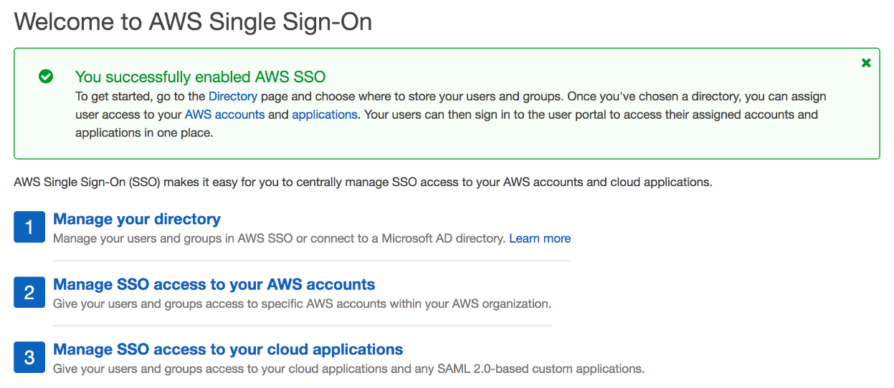
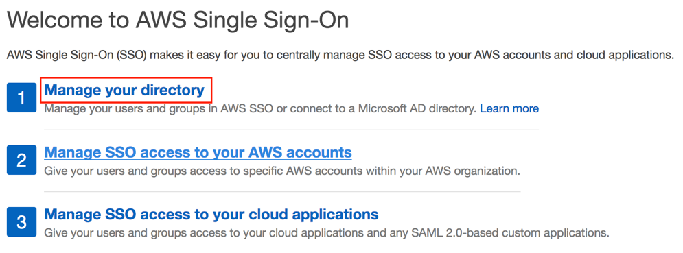
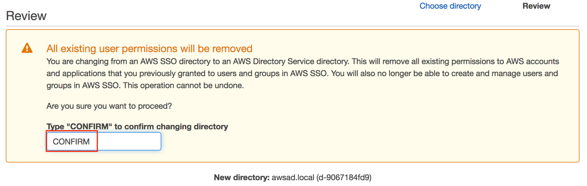
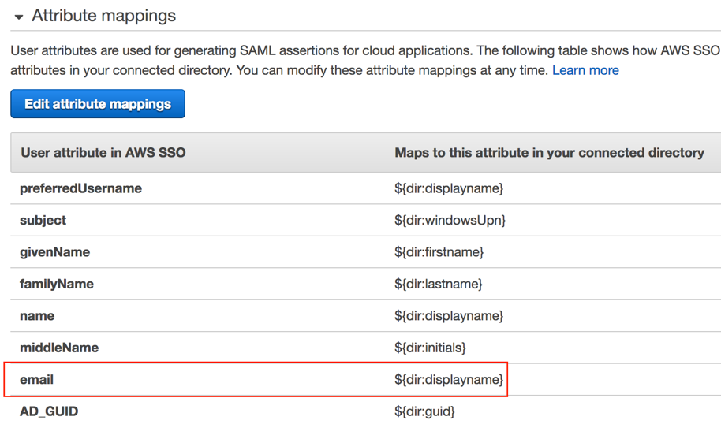
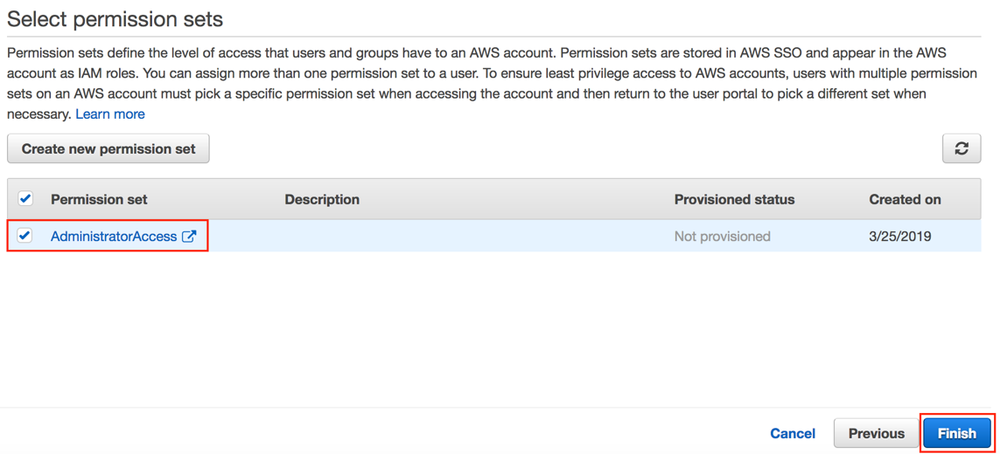

Author: Vinod Madabushi

Version: 1.0

Abstract

In this lab, you will connect the AWS Single Sign-On (SSO) service to your AWS
Managed AD that is already deployed in your account. Once you complete this
step, you can use the AWS SSO to login to AWS console using user accounts that
are in the Managed AD. In addition, you could leverage this AWS SSO to connect
to you SAML aware business applications. You will also setup Organizations as a
part of this lab since this is a requirement for AWS SSO.

Introduction

AWS Single Sign-On (SSO) is a cloud SSO service that makes it easy to centrally
manage SSO access to multiple AWS accounts and business applications. With just
a few clicks, you can enable a highly available SSO service without the upfront
investment and on-going maintenance costs of operating your own SSO
infrastructure. With AWS SSO, you can easily manage SSO access and user
permissions to all of your accounts in [AWS
Organizations](https://aws.amazon.com/organizations/) centrally.

AWS SSO makes it simple for you to manage SSO across all your AWS accounts,
cloud applications, and custom SAML 2.0–based applications. without custom
scripts or third-party SSO solutions. Use the AWS SSO console to quickly assign
which users should have one-click access to only the applications that you've
authorized for their personalized end-user portal.

For more information about AWS Single Sign-On, please visit our [developers
guide.](https://docs.aws.amazon.com/singlesignon/latest/userguide/what-is.html)

Prerequisites

To setup the AWS SSO for use with AWS Managed AD, you need the following:

-   An existing AWS Managed Microsoft AD directory set up in AWS Directory
    Service, and it must reside within your organization's master account.

-   An AWS account with an AWS IAM user / role with privileges to AWS Single
    Sign-On

-   A region where AWS SSO is available. Please refer to [Regional products and
    Services.](https://aws.amazon.com/about-aws/global-infrastructure/regional-product-services/)

-   Set up the AWS Organizations service and have **All features** set to
    enabled. If you haven’t done this before, we’ll do this in section 1.

-   Sign in with the AWS Organizations master account credentials before you
    begin setting up AWS SSO. These credentials are required to enable AWS SSO.

Section 1: Enable AWS Single Sign-On (SSO)

1.  Login to the AWS Console and navigate to AWS Single Sign-On.

2.  Make sure you are in the correct region by checking on the top right corner
    in the AWS Console.

3.  If this is the first time you are opening the Single Sign-On service in this
    region, you’ll be prompted with the following welcome screen. Click on
    “**Enable AWS SSO”.**

1.  If you don’t already have AWS Organization setup, you’ll see the following
    screen prompting you to create the AWS Organization first. Click on
    “**Create AWS organization”.**

1.  If you already have an AWS Organization that is setup only for billing
    consolidation and not with full features, you will see the message below. In
    this case, please delete the existing organization and try to enable the AWS
    SSO (which will create a new organization) or change the Organization
    features by clicking on **“AWS Organizations console”** link, then click on
    your existing organization, then click on settings on the right and click on
    **“Enable all features”**.

1.  The process for enabling AWS SSO will take about 30 seconds. Once it’s
    completed you will see the message below. You can now proceed to section 2.

Section 2: Configure AWS Single Sign-On (SSO)

1.  Login to the AWS Console and navigate to AWS Single Sign-On.

2.  Click on “Manage your Directory” as shown below.

1.  Currently the directory should be configured to AWS SSO directory. Click on
    **“Change Directory”.**

1.  Select “Microsoft AD Directory” and select the AWS Managed AD you already
    have in this region, then click **“Next:Review”.**

1.  In the following screen, type **“CONFIRM”** and click on **“Finish”** to
    complete the configuration.

1.  Once the configuration is complete, you can click on **“Proceed to the
    directory”** for next steps.

1.  Click on **“Customize”** to give your user portal URL a meaningful name. For
    the purpose of this lab, you could name it “awssso-\<initials\>” as shown
    below.

1.  Click on Edit attribute mappings, change the value for email to
    “\${dir:displayname} as shown below. We are changing this because, our
    directory does not currently contain email attributes for the user account.

    

Section 3: Enable AWS Console federation using AWS SSO

1.  Login to the AWS Console and navigate to AWS Single Sign-On.

2.  On the left click on “AWS accounts”.

3.  Select our AWS account you want to federate to and then click on “Assign
    Users”. For the purpose of this lab, we will select the existing account you
    are working with only.

    

4.  In the next screen, enter **“aws delegated admin”** and select the existing
    group in the AWS Managed AD called “AWS Delegated Administrators”, then
    click **“Next:Permission Sets”** to continue. For this lab, we are going to
    allow the AWS Managed AD admin to federate to this AWS account for the
    purpose of testing.

    

5.  Click on **“Create new permission set”** and then select
    “AdministratorAccess” as the job function and click on **“Create”.** Then
    check the **“AdministratorAccess”** permission set and click **“Finish”.**

    

Section 4: Testing AWS Console federation using AWS SSO

1.  In this section, we will use the AWS Managed AD admin credentials to login
    to our AWS Console using federation.

2.  Open a browser and go to your User Portal URL you customized in section 2,
    step 7.

3.  Enter the username and password for the Managed AD admin account and click
    **“Sign in”.**

    

4.  Once logged in, click on AWS Account, Click on your account then click on
    **“Management Console”** to login to the AWS Console.

    

5.  You have successfully logged into the AWS account using federated
    credentials from AWS Managed AD using AWS SSO.

Conclusion

Congratulations. You have successfully connected your AWS SSO with the AWS
Managed Active Directory and tested this setup by logging into AWS Console using
an account from your AWS managed AD. You can cleanup all the resources you
deployed in this lab to stop accruing AWS charges.
