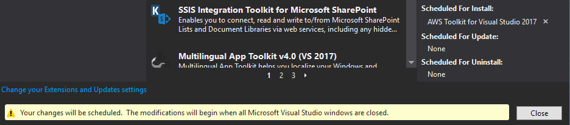
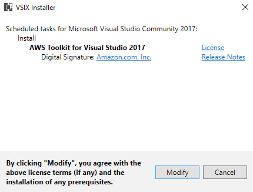
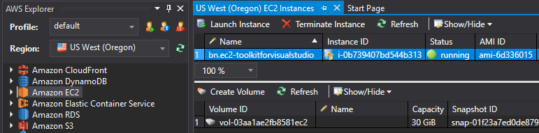

Deploy Base Resources & Intro to the AWS Toolkit for Visual Studio

Self-Paced Lab

Version 1.0

Duration: 45 minutes

Purpose & Background
====================

The purpose of this lab is to initially deploy the base AWS resources required
for the other portions of this Immersion Day, install and configure the AWS
Toolkit for Visual Studio, and to introduce the capabilities of the AWS Toolkit
for Visual Studio.

Lab Exercises
=============

The following exercises should be completed in order for this lab:

1.  Deploy the Base Resources CloudFormation Template [link](https://awsentworkshops.com/ImmersionDays/labs/lab1_baseline-setup_dotnet.yml "CloudFormation Template").

2.  Install the AWS Toolkit for Visual Studio

3.  Credential Setup with the AWS Toolkit for Visual Studio

4.  Work with AWS Services through the AWS Toolkit for Visual Studio

Prerequisites
=============

The following are the prerequisites required in order to complete the lab:

-   Microsoft Visual Studio 2017 or above installed on your computer

-   Internet connection

-   AWS Account

Part 1 – Deploy the Base Resources CloudFormation Template
==========================================================

Follow the steps below to deploy the base resources CloudFormation template

1.  Login to the CloudFormation page in the AWS Console. You can access this
    page by visiting <https://console.aws.amazon.com/cloudformation/home> in
    your internet browser.

2.  In the top-right corner of the Management Console, select the Region
    specified by the Immersion Day presenter. For example, “US East (N.
    Virginia)”.

3.  Click the Create Stack button. On the Select Template portion, click the
    Choose File button, select the provided “lab1_baseline-setup_dotnet.yml”
    file, and click the Next button.

4.  On the Specify Details portion, for Stack Name enter “dotnet” (without
    quotations). Later labs may reference this stack by name, so if you choose a
    different stack name you will need to note this for future labs. The
    Parameters are already prefilled, so you can simply click the Next button.

5.  On the Options portion, leave the defaults prefilled/preselected and click
    the Next button.

6.  On the Review portion, review the details of your stack, and then click the
    Create button to begin launching your CloudFormation Stack.

7.  You will be able to monitor the progress on the Stack creation back on the
    main CloudFormation console page. Once your dotnet Stack’s Status changed to
    “CREATE_COMPLETE”, you are ready to proceed.

8.  If you select your dotnet Stack and select the Outputs tab, you will see all
    the key resources that you will utilize in the other labs.

Part 2 – Install the AWS Toolkit for Visual Studio
==================================================

Follow the steps below to install the AWS Toolkit for Visual Studio

1.  In Visual Studio, go to Tools -\> Extensions and Updates. The Extensions and
    Updates dialog should open.

2.  Select the Online node in the left-panel and then in the search box enter:
    “AWS Toolkit” (without quotations). Then press ENTER to search.

3.  Click the Download button for the AWS Toolkit for Visual Studio 2017.

1.  Once the AWS Toolkit for Visual Studio has downloaded, a message will appear
    at the bottom of the Extensions and Updates dialog window letting you know
    that your changes will be scheduled. Proceed to close the Extensions and
    Updates dialog window and exit Visual Studio.

1.  Upon exiting Visual Studio, a VSIX Installer screen will appear to install
    the AWS Toolkit. To proceed with the installation, click Modify.

1.  Once the installation has successfully completed, close the VSIX Installer
    and re-launch Visual Studio. You will be greeted by a Getting Started with
    the AWS Toolkit for Visual Studio screen – this means that you successfully
    installed it, and are ready to move onto the next part.

Part 3 – Create AWS Credentials for use with the AWS Toolkit for Visual Studio 
===============================================================================

Follow the steps below to create AWS Credentials for use with the AWS Toolkit
for Visual Studio.

1.  Login to the IAM Users page in the AWS Console. You can access this page by
    visiting <https://console.aws.amazon.com/iam/home#/users> in your internet
    browser.

2.  Click the Add User button at the top of the page.

3.  On the initial Add User screen, set the User Name to your initials dot
    toolkitforvisualstudio (i.e. bn.toolkitforvisualstudio). For AWS Access
    Type, check the box for Programmatic Access, and then click the Next:
    Permissions button.

1.  On the Set Permissions screen, select Attach Existing Policies Directly, and
    search for: “PowerUserAccess” (no quotations). Put a checkmark in the Policy
    Name PowerUserAccess and click the Next: Review button.

2.  Review the details on the Review screen to ensure that everything is correct
    before clicking the Create User button.

    1.  Note: If you notice an errors or mistakes, use the Previous button to
        correct them before creating the user.

1.  On the Success screen, click the Download .csv button to download a CSV file
    containing your newly created Access Key ID and Secret Access Key.

1.  Back in Visual Studio, click the Import from csv File button under the
    Credential Setup section and select the credentials.csv file you just
    downloaded from IAM Management Console.

2.  You will see that the Access Key and Secret Key auto-fill. Click the Save
    and Close button at the bottom of the Credential Setup section.

1.  Congratulations! You have successfully configured the default Profile for
    authenticating and accessing AWS through the AWS Toolkit for Visual Studio.

Part 3 – Work with AWS Services through the AWS Toolkit for Visual Studio
=========================================================================

For this lab, we’ll access and work with AWS Services through the AWS Toolkit
for Visual Studio.

1.  Now that the AWS Toolkit for Visual Studio has been configured and has valid
    credentials for your AWS Account, you will be able to interact with AWS
    resources and services directly within Visual Studio. The AWS Explorer pane
    in Visual Studio consists of the following elements:

    1.  Profile: A list of configured and available AWS Credential Profiles
        (i.e. default)

    2.  Region: A list of available regional AWS service endpoints (i.e. US West
        (Oregon))

    3.  Services: A list of AWS services that you can interact with through the
        toolkit

2.  In the AWS Explorer pane, right-click on Amazon EC2 and select Launch
    Instance.

3.  In the Quick Launch window,

    1.  OS: Microsoft Windows Server 2016 Base

    2.  Type: t2.medium

    3.  Name: Set the name to your initials dot ec2-toolkitforvisualstudio (i.e.
        bn.ec2-toolkitforvisualstudio)

    4.  Key Pair: If you have an available Key Pair in your AWS Account, select
        it – otherwise, select \<No key pair\>.

    5.  VPC Subnet: Under the VPC your created in Part 1, select one of the
        Public Subnets created in Part 1.

    6.  Security Group: ingress-sg

    7.  IAM Role: None

    8.  Volume Type: General Purpose (SSD)

    9.  Size (GB): 30

4.  Once the above has been set, click Launch.

5.  In the Amazon EC2 Instances window, you will be able to see that your EC2
    instance has launched and is now Running. You can see information about the
    EC2 instance in the top portion, and beneath you will be able to see details
    about the EBS Volume attached to it.

1.  When you right-click on the newly launched EC2 instance, you are able to
    perform items such as Get Windows Passwords, Open Remote Desktop, and other
    instance related tasks. Let’s go ahead and Terminate this EC2 instance by
    selecting Terminate in the context menu. When prompted to confirm the
    terminate action, click Yes.

2.  In the AWS Explorer pane, right-click on Amazon RDS and select Launch
    Instance.

3.  In the Launch DB Instance window,

    1.  Engine Selection

        -   Database Engine: Microsoft SQL Server Express Edition

    2.  DB Engine Instance Options

        -   DB Engine Version: SQL Server 2017 (any version)

        -   DB Instance Class: db.t2.medium

        -   Perform a multi AZ deployment: Unchecked

        -   Upgrade minor versions automatically: Checked

        -   Allocated Storage: 20 GB

        -   DB Instance Identifier: Set the identifier to your initials dash
            rds-vs (i.e. bn-rds-vs)

        -   Master User Name: master

        -   Master User Password: password

        -   Confirm Password: password

    3.  Advanced Settings

        -   VPC: *Select the VPC you created in Part 1*

        -   Subnet Group: *Select the Public DB Subnet Group created in Part 1*

        -   Publicly Accessible: Checked

        -   Availability Zone: No Preference

        -   Security Group: *Select the Security Group with Ingress Rule created
            in Part 1*

        -   Database Name: *Leave Blank*

        -   Database Port: 1433

        -   DB Parameter Group: *Leave Blank*

        -   Option Group: *Leave Blank*

    4.  Backup and Maintenance

        -   Leave the default values, and just click Next

4.  On the Review portion of the Launch DB Instance window, review the details
    you have inputted and click Launch.

5.  In the Amazon RDS Instances window, you will be able to see that your RDS
    instance has launched and is now Available. You can see information about
    the RDS instance in the top portion, and beneath you will be able to see
    Recent Events concerning this RDS instance.

1.  When you right-click on the newly launched RDS instance, you are able to
    perform items such as Add to Server Explorer, Create SQL Server Database,
    and other instance related tasks. Let’s go ahead and Delete this RDS
    instance by selecting Delete DB Instance in the context menu. When prompted
    to confirm the delete action, ensure that Create Final Snapshot is
    unchecked, and click OK.
