>   **Database Migration Workshop**

>   Lab 2

>   AWS Database Migration Service (DMS) Microsoft SQL Server

November 2019

Overview 
=========

>   AWS Database Migration Service (DMS) helps you migrate databases to AWS
>   easily and securely. The source database remains fully operational during
>   the migration, minimizing downtime to applications that rely on the
>   database. AWS DMS can migrate your data to and from most widely used
>   commercial and open-source databases. The service supports homogenous
>   migrations such as SQL Server to SQL Server, as well as heterogeneous
>   migrations between different database platforms, such as SQL Server to
>   Amazon Aurora MySQL or Oracle to Amazon Aurora PostgreSQL. AWS DMS can also
>   be used for continuous data replication with high-availability.

>   This lab demonstrates how you can use AWS Database Migration Service (DMS)
>   to migrate data from the source Microsoft SQL Server running on an Amazon
>   EC2 instance to the target SQL Server running on Amazon RDS. Additionally,
>   you will use AWS DMS to continually replicate database changes from the
>   source database to the target database.

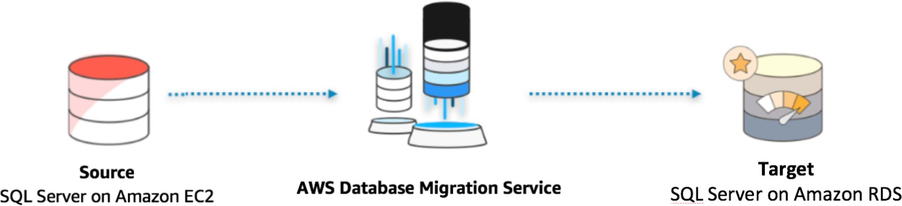

Connecting to the Environment
=============================

Sign in to your AWS Account provided by your facilitator and review the
CloudFormation stack within N Virginia Region [us-east-1].

>   <https://us-east-1.console.aws.amazon.com/cloudformation>

>   Review the important output values:

1.  SourceSQLPublicIP

2.  RDSJumpServerIP

3.  TargetRDSSQLEndpointDns

>   The following steps provide instructions to migrate existing data from the
>   source Microsoft SQL Server database running on an EC2 instance to a SQL
>   Server database running on Amazon RDS. In this exercise you perform the
>   following tasks:

-   Connect the source SQL Server running on an EC2 instance

-   Configure the source database for replication

-   Configure the target database for migration

-   Create an AWS DMS Replication Instance

-   Create AWS DMS source and target endpoints

-   Create and run your AWS DMS migration task

Connecting to Source SQL Server on EC2
======================================

Connecting to SQL 2008 via SSMS

1.  Go and click on the SSMS icon on the Desktop, or go to Start and click on
    the Microsoft SQL Server management studio.

    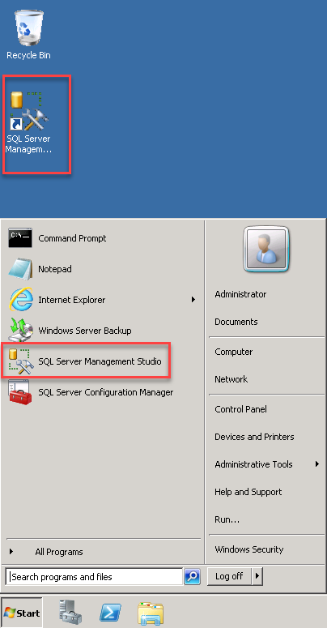

2.  The first time you run SSMS, the Connect to Server window opens. If it
    doesn't open, you can open it manually by selecting Object Explorer \>
    Connect \> Database Engine.

    

3.  In the *Connect to Server* window, do the following:

4.  For Server type, select *Database Engine* (usually the default option).

5.  For Server name, enter the name of your SQL Server instance. (For this demo,
    since the DB engine resides in the same server, you can specify
    "**localhost**", "**.**", or the **hostname**).

    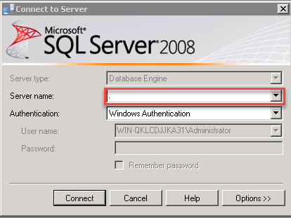

6.  For Authentication, select **Windows Authentication**.

7.  After you've completed all the fields, select **Connect**

8.  Example of successful connection

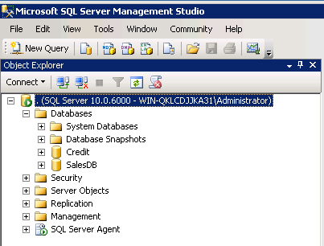

Configuring the Source database for replication
===============================================

>   When migrating your Microsoft SQL Server database using AWS DMS, you can
>   choose to **migrate existing data only**, migrate existing data and
>   replicate ongoing changes, or migrate existing data and use change data
>   capture (CDC) to replicate ongoing changes.

>   Migrating only the existing data does not require any configuration on the
>   source SQL Server database. However, to migrate existing data and replicate
>   ongoing changes, you need to either enable **MS-REPLICATION**, or
>   **MS-CDC**. For this lab , we will be using **migrate existing data only**

1.  Change sa account password

    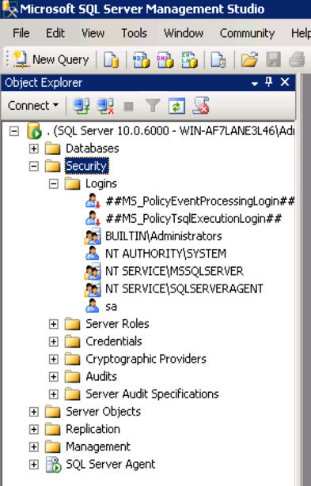

    1.  From within **SQL Server Management Studio**, navigate to **Security**

    2.  Expand Security.

    3.  Double click on sa account.

    4.  Change the password to NYCsql2019!!!

        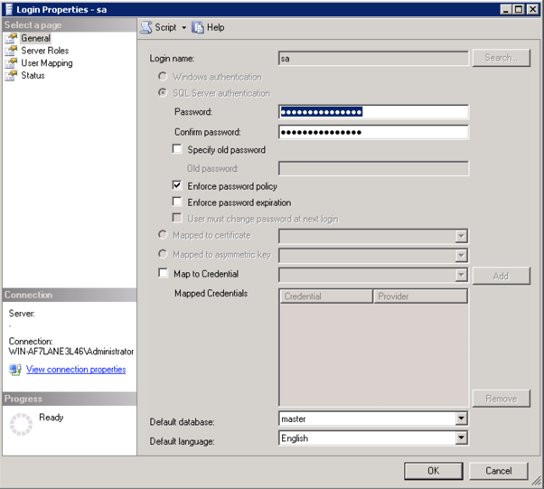

Configuring the Target database for migration
=============================================

**Use EC2 Jump Server to connect RDS Instance**

1.  Go to **Remote Desktop Connection**

2.  Specify the **Public IP** or **Public DNS** of the Target EC2 Jump Server as
    the **Computer Name**

3.  Username: *localhost\\administrator* 

4.  Password: *NYCsql2019!!!*

5.  Click on **Connect**

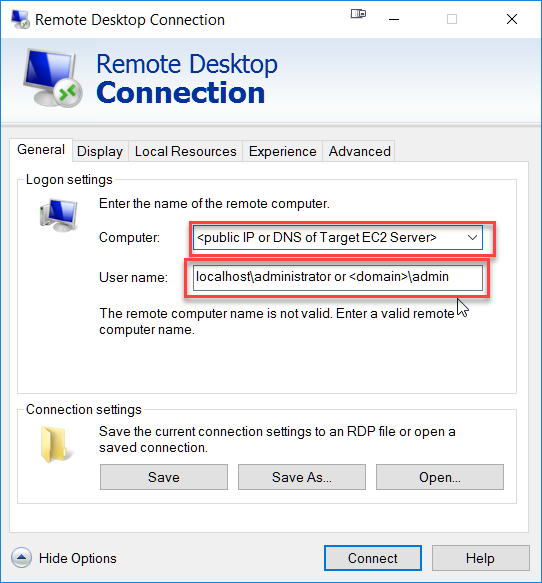

Connecting to RDS Instance via SSMS on Jump Server
==================================================

1.  Go and click on the SSMS icon on the Desktop, or go to Start and click on
    the Microsoft SQL Server management studio.

    

2.  The first time you run SSMS, the Connect to Server window opens. If it
    doesn't open, you can open it manually by selecting Object Explorer \>
    Connect \> Database Engine.

    

3.  In the *Connect to Server* window, do the following:

4.  For Server type, select *Database Engine* (usually the default option).

5.  For Server name, enter the name of your RDS SQL Server instance. ( RDS
    Endpoint)

    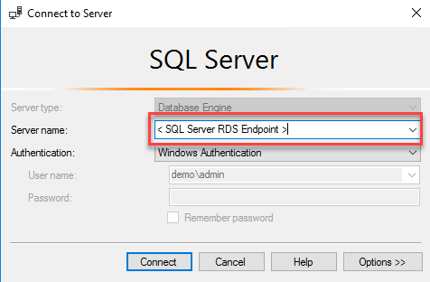

6.  For Authentication, select **SQL Authentication** and use
    Administrator/NYCsql2019!!!

    

7.  After you've completed all the fields, select **Connect**

8.  Example of successful connection

    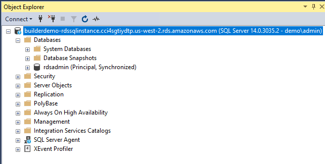

9.  Open a **New Query** window.

10. Run the following script to create a target database **dms_recovery** on RDS
    SQL Server.

>   The target database **(dms_recovery)** has now been created.

>   Please return to the **AWS Management Console**.

Create Replication Instance
===========================

>   The following illustration shows a high-level view of the migration process.

>   An AWS DMS replication instance performs the actual data migration between
>   source and target. The replication instance also caches the transaction logs
>   during the migration. The amount of CPU and memory capacity a replication
>   instance influences the overall time that is required for the migration.

1.  Click on *https://console.aws.amazon.com/dms/* to launch the Database
    Migration Service.

2.  On the left-hand menu click on **Replication Instances**. This will launch
    the Replication instance screen.

3.  Click on the Create replication instance button on the top right side.

4.  Enter the following information for the **Replication Instance**. Then,
    Click on **Create** button.

| **Parameter**                      | **Value**                          |
|------------------------------------|------------------------------------|
| Name                               | DMSReplication                     |
| Description                        | Replication server for the DMS Lab |
| Instance Class                     | dms.t2.medium                      |
| Engine version                     | Leave the default value            |
| Allocated storage (GB)             | 50                                 |
| VPC                                | **\< choose Target RDS VPC ID \>** |
| Multi-AZ                           | No                                 |
| Publicly accessible                | No                                 |
| Advanced -\> VPC Security Group(s) | \< RDSInstanceSecurityGroup \>     |

*NOTE: Creating replication instance will take several minutes. While waiting
for the replication instance to be created, you can specify the source and
target database endpoints in the next steps. However, test connectivity only
after the replication instance has been created, because the replication
instance is used in the connection.*

Create Source and Target Endpoints
==================================

>   Now that you have a replication instance, you need to create source and
>   target endpoints for the sample database.

1.  Click on the **Endpoints** link on the left, and then click on **Create
    endpoint** on the top right corner.

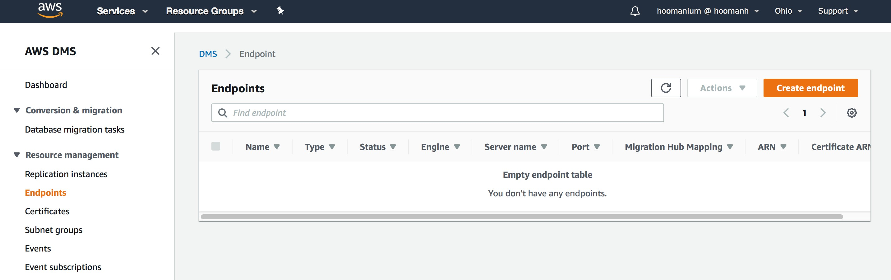

1.  Enter the following information to create an endpoint for the source
    **dms_sample**

>   database:

| **Parameter**        | **Value**                                         |
|----------------------|---------------------------------------------------|
| Endpoint Type        | Source endpoint                                   |
| Endpoint Identifier  | sqlserver-source                                  |
| Source Engine        | sqlserver                                         |
| Server Name          | **\< SourceSQLServerPrivateIP \> 10.0.0.x range** |
| Port                 | 1433                                              |
| SSL Mode             | none                                              |
| User Name            | sa                                                |
| Password             | NYCsql2019!!!                                     |
| Database Name        | Credit or Sales                                   |
| VPC                  | **\<VPC ID from Environment Setup Step\>**        |
| Replication Instance | DMSReplication                                    |

1.  Once the information has been entered, click **Run Test**. When the status
    turns to

>   **successful**, click **Save**.

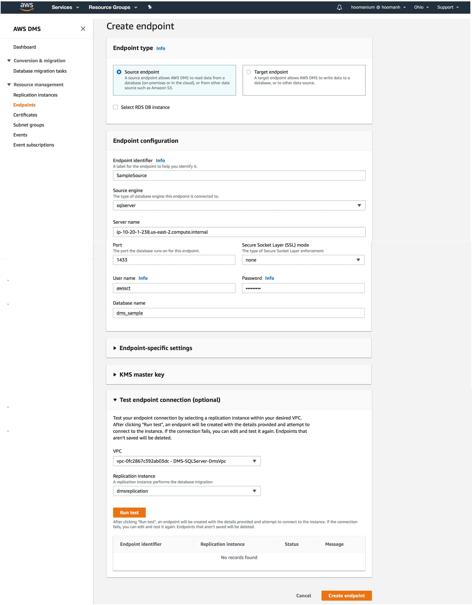

1.  Create another endpoint for the **Target RDS Database (dms_recovery)** using
    the following values:

| **Parameter**          | **Value**                                  |
|------------------------|--------------------------------------------|
| Endpoint Type          | Target endpoint                            |
| Select RDS DB instance | Check                                      |
| RDS Instance           | **\< Stack Name \>-TargetSQLServer**       |
| Endpoint Identifier    | sqlserver-target                           |
| Source Engine          | sqlserver                                  |
| Server Name            | **\< TargetSqlServerEndpoint \>**          |
| Port                   | 1433                                       |
| SSL Mode               | none                                       |
| User Name              | Administrator                              |
| Password               | NYCsql2019!!!                              |
| Database Name          | dms_recovery                               |
| VPC                    | **\< VPC ID for Target RDS SQL Server \>** |
| Replication Instance   | DMSReplication                             |

2.  Once the information has been entered, click **Run Test**. When the status
    turns to

>   **successful**, click **Create endpoint**.

Create a database migration task
================================

>   In order to migrate data from source database to target database you need to
>   create a transfer task.

1.  Click on **Database migration tasks** on the left-hand menu, then click on
    the **Create task**

>   button on the top right corner.

1.  Create a data migration task with the following values for migrating the
    **dms_sample**

>   database.

| **Parameter**                       | **Value**                      |
|-------------------------------------|--------------------------------|
| Task identifier                     | SampleMigrationTask            |
| Replication instance                | DMSReplication                 |
| Source database endpoint            | sqlserver-source               |
| Target database endpoint            | sqlserver-target               |
| Migration type                      | Migrate existing data only     |
| Start task on create                | Checked                        |
| CDC stop mode                       | Don’t use custom CDC stop mode |
| Target table preparation mode       | Do nothing                     |
| Stop task after full load completes | Don’t stop                     |
| Include LOB columns in replication  | Limited LOB mode               |
| Max LOB size (KB)                   | 32                             |
| Enable validation                   | Unchecked                      |
| Enable CloudWatch logs              | Checked                        |

1.  Expand the Table mappings section, and select **Guided UI** for the editing
    mode.

2.  Click on **Add new selection rule** button and enter the following values in
    the form:

| **Parameter** | **Value** |
|---------------|-----------|
| Schema        | dbo       |
| Table name    | %         |
| Action        | Include   |

>   NOTE: If the Create Task screen does not recognize any schemas, make sure to
>   go back to endpoints screen and click on your endpoint. Scroll to the bottom
>   of the page and click on **Refresh Button (⟳)** in the **Schemas** section.

>   If your schemas still do not show up on the Create Task screen, click on the
>   Guided tab and manually select **‘**dbo’ schema and all tables.

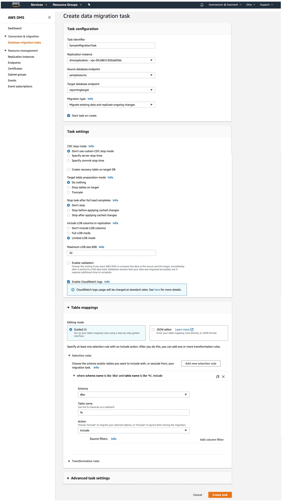

1.  After entering the values click on **Create task**.

2.  At this point, the task starts running and replicating data from the
    dms_sample database running on EC2 to the Amazon RDS SQL Server instance.

1.  Once it completes you will see the status **Load Complete.**

2.  **Inspect the content by connecting to target RDS instance using
    Jumpserver.**

Summary 
========

>   This lab demonstrated how easy it is to migrate the data from a Microsoft
>   SQL Server running to an Amazon RDS SQL Server using the AWS Database
>   Migration Service (DMS).

Document revisions
==================

| Date          | Change        |
|---------------|---------------|
| November 2019 | Initial Draft |
