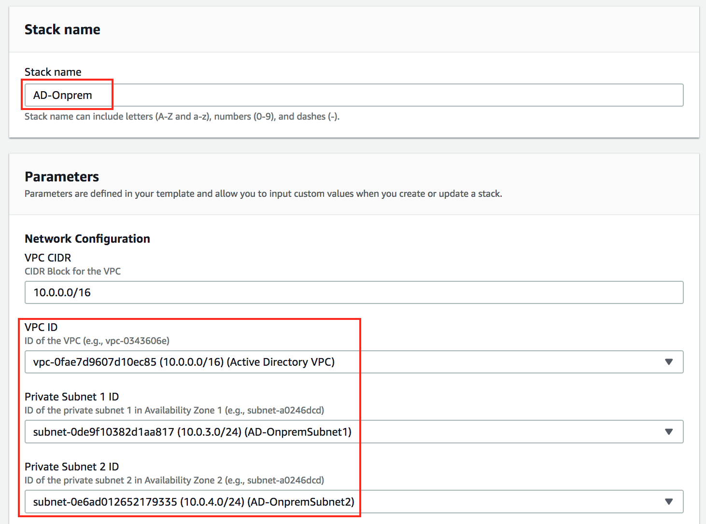
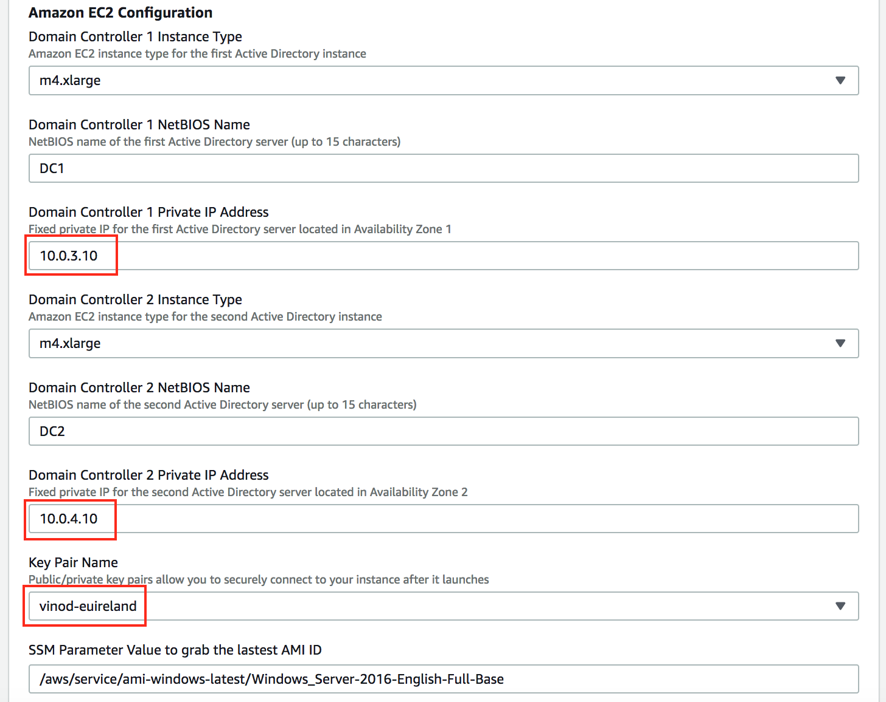
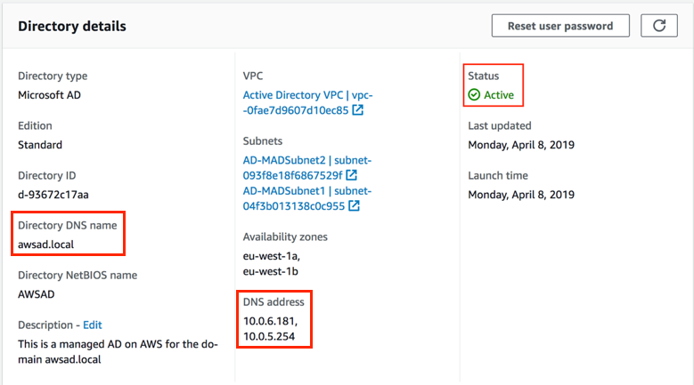
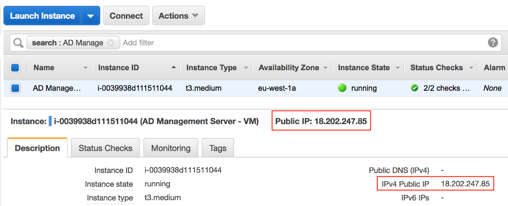
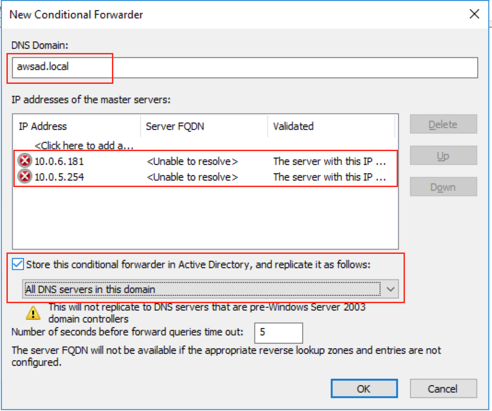

Author: Vinod Madabushi

Version: 1.0

Abstract

In this lab, you will deploy an AWS Managed Active Directory (AD) and setup
two-way trust with a simulated on-premises Active Directory. Because you might
not have access to an on-premises AD to use for this lab, we will deploy one in
AWS in the same VPC but on a different set of private subnets to keep them
separate. This simulated on-premises AD will run Active Directory on EC2
Instance similar to how you are running AD on-premises today.

Introduction

AWS Directory Service lets you run Microsoft Active Directory (AD) as a managed
service. AWS Directory Service for Microsoft Active Directory, also referred to
as AWS Managed Microsoft AD, is powered by Windows Server 2012 R2. With AWS
Managed Microsoft AD, you can run directory-aware workloads in the AWS Cloud,
including Microsoft SharePoint and custom .NET and SQL Server-based
applications. You can also configure a trust relationship between AWS Managed
Microsoft AD in the AWS Cloud and your existing on-premises Microsoft Active
Directory, providing users and groups with access to resources in either domain.

For more information on AWS Directory service, please visit our [developers
guide](https://docs.aws.amazon.com/directoryservice/latest/admin-guide/directory_microsoft_ad.html).

For more information on trust relationship, please visit [When to Create a Trust
Relationship](https://docs.aws.amazon.com/directoryservice/latest/admin-guide/ms_ad_setup_trust.html).

Prerequisites

To setup the management server for use with AWS Managed AD, you need the
following:

-   Please complete the Lab – Deploying AWS Managed Active Directory.

-   Please complete the Lab – Administering AWS Managed AD. We will use this
    server to login to on-premises DC’s and setup trust.

-   An AWS account and an AWS IAM user / role with privileges to Elastic Compute
    Cloud (EC2) service, Virtual Private Cloud (VPC) & AWS Managed AD

-   All the necessary TCP & UDP ports that are required for communication
    between DC’s should be open between AWS Managed AD and Active Directory
    running on EC2 Instances.

Section 1: Deploying AD-DC on EC2 to simulate on-premises AD

1.  Login to the AWS Console and navigate to the **CloudFormation (CFN)**
    console.

2.  Make sure you to select the **“N.Virginia”** region.

3.  Click on **Create stack**

4.  In the Create stack screen, enter the values as shown below and click on
    **Next**.

    -   Prepare Template: Template is ready

    -   Template Source: Amazon S3 URL

    -   Amazon S3 URL:
        https://s3.amazonaws.com/immersionday-labs/onprem-ad.template

        

5.  For stack name, enter **AD-Onprem**

6.  Provide the below inputs for the CloudFormation stack then click **Next** to
    continue.

-   VPC ID: **Active Directory VPC**

-   Private Subnet 1 ID: **AD-OnpremSubnet1**

-   Private Subnet 2 ID: **AD-OnpremSubnet2**

-   Domain Controller 1 Instance type: **m4.xlarge**

-   Domain Controller 1 Name: **DC1**

-   Domain Controller 1 IP Address: **10.0.3.10**

-   Domain Controller 2 Instance type: **m4.xlarge**

-   Domain Controller 2 Name: **DC2**

-   Domain Controller 2 IP Address: **10.0.4.10**

-   Key Pair Name: **Select your existing keypair**

-   Domain admin password: **Use a password that you can remember**

-   Domain DNS name: **onprem.local**

-   Domain NetBIOS name: **ONPREM**

1.  For the tags, enter “**Name”** for key and “**AD Lab**” for value and click
    Next.

2.  In this last page, **check** “I acknowledge that CloudFormation might create
    IAM resources”, then click on **Create Stack**.

3.  It will take a about 40 minutes to deploy the stack which will deploy the
    EC2 Instances and promote them as Domain Controllers for the onprem.local
    domain.

Section 2: Setup Trust between AWS Managed AD & AD-DC on EC2

Part 1: Allow necessary communication between the directories

1.  Log in to your AWS account and access the Security Group page under EC2.

2.  In the Filter/Search bar type Controller and hit enter. This will show you
    the AD/AWS Directory Service Security groups as shown:

    

    **Note:** Look at the descriptions, you will see a "Domain Controller"
    Security group. These correspond to the on-prem domain controllers built.
    You will also see the Security group that was created for your AWS Directory
    Service "AWS created security group with name d-xxxx_controllers". Take note
    of these security group ID's.

3.  Select the Security Group named "d-xxxxxxx_controllers" and click on
    Outbound Rules tab and click on Edit.

4.  You will need to create an Allow All Outbound rules, for Domain Controller
    Security group set as the destination as follows and click on **Save**.

    

5.  Select the Security Group "AD-Onprem-DomainControllerSG-xxxx" and click on
    Inbound Rules tab and click **Edit**.

6.  Create an Allow All inbound rule and specify the AWS Directory Service
    Security Group as the source as shows and click on **Save**.

Part 2: Configure Conditional Forwarder on On-Prem Domain Controller

1.  Sign into the AWS Management Console and open the [AWS Directory Service
    console](https://console.aws.amazon.com/directoryservicev2/).

2.  In the navigation pane, select Directories and **Click** on the directory ID
    of your AWS Managed Microsoft AD.

3.  On the Details page, take note of the values in Directory name and the DNS
    address of your directory as shown below.

    

4.  Open the Elastic Compute Cloud (EC2) console and locate the “**AD Management
    Server**” you created in the previous lab and note down the public IP
    address.

    

5.  Use Microsoft Remote Desktop to connect to this management server using the
    Public IP address you noted in the step above. Most Windows computers have
    RDP tool built in. If you are doing this lab from a Mac, please down the
    Microsoft Remote Desktop app first.

6.  When logging in to the management server, use “AWSAD\\admin” as the username
    and the admin password you created when you launched AWS Managed AD.

7.  Once you are logged in to the Management server, open Microsoft Remote
    Desktop again and connect to the IP address “10.0.3.10”. This is one of the
    Domain Controllers that is setup for the on-prem domain.

8.  When logging in to the DC1 (10.0.3.10), use “ONPREM\\admin” as the username
    and the password you created when you launched ONPREM domain in Section 1.

9.  Open Server Manager on DC1 (10.0.3.10) and under the Tools menu, open
    **DNS**.

10. In the DNS Manager Console, expand the DNS server for **DC1**.

11. Right click on “Conditional Forwarders” and click on “**New Conditional
    Forwarder**”

    

12. In DNS domain, type the fully qualified domain name (FQDN) of your AWS
    Managed Microsoft AD which should be **awsad.local**.

13. Under IP addresses of the master servers, add the IP's of your AWS Managed
    Microsoft AD directory, which you noted earlier in step 3. Check the option
    to “Store this conditional forwarder in AD” and select the option “**All DNS
    servers in this domain**”.

    

    **Note:** Note: After entering the DNS addresses, you may get a "timeout" or
    "unable to resolve" error. You can ignore these errors.

14. Click OK to close the conditional forwarder. You can also close the DNS
    server.

15. Keep the Remote Desktop connection open and continue with part 3 below.

Part 3: Configure Trust relationship in AD-DS on EC2

1.  Open Server Manager on the DC1 (10.0.3.10) and on the Tools menu, click on
    **Active Directory Domains and Trusts.**

2.  Right click on the domain which should be “**onprem.local**” and click on
    properties.

3.  Click on the Trusts tab and click on **New trust**. Type the name of your
    AWS Managed AD which should be **“awsad.local”** and click Next.

4.  Choose **Forest trust**. Click Next.

5.  Choose **Two-way**. Click Next.

6.  Choose **This domain only**. Click **Next**.

7.  Choose **Forest-wide authentication**. Click **Next**.

8.  Type a Trust password. Make sure to remember this password as you will need
    it when setting up the trust for your AWS Managed Microsoft AD.

9.  In the next dialog box, confirm your settings and choose Next. Confirm that
    the trust was created successfully and again choose Next.

10. Choose No, do not confirm the outgoing trust. Click **Next**.

11. Choose No, do not confirm the incoming trust. Click **Next**. Click
    **Finish** to close this wizard.

>   Part 4: Configure Trust relationship in AWS Managed AD

1.  Sign into the AWS Management Console and open the [AWS Directory Service
    console](https://console.aws.amazon.com/directoryservicev2/).

2.  On the Directories page, click on your AWS Managed AD **“awsad.local”.**

3.  On the Directory details page, select the **Networking & security tab**.

    

4.  In the Trust relationships section, click on **Add trust relationship**.

5.  On the Add a trust relationship page, use the following values as shown:

    -   Trust Type: **Forest Trust**

    -   Domain: **onprem.local**

    -   Trust Password: **Same trust password that you used when creating the
        trust on your on-premises domain.**

    -   Trust Direction: **Two-Way**

    -   Conditional Forwarder: **Enter 10.0.3.10; Click on Add additional IP and
        enter 10.0.4.10.**

1.  Click Add to continue.

2.  It will take a few minutes to configure the trust. Once it’s completed you
    should see the status change to **Verified** as shown below. Your trust
    relationship is now setup and ready to be used.

    

Conclusion

Congratulations. You have successfully deployed a simulated On-prem Active
Directory on EC2 Instances and performed necessary steps to setup a two-way
Forest trust between the AWS Managed AD and On-prem AD. If you are done with all
the labs, you can clean up the resources in the following order to stop
accumulating AWS charges.

1.  Open the CloudFormation Console and delete the Onprem-AD stack

2.  Open the EC2 Console and delete the AD Management Server

3.  Open the AWS Managed AD console and delete the directory awsad.local.

4.  Wait for the deletion to complete on steps 1-3 and then delete the AD-VPC
    stack in CloudFormation console.
