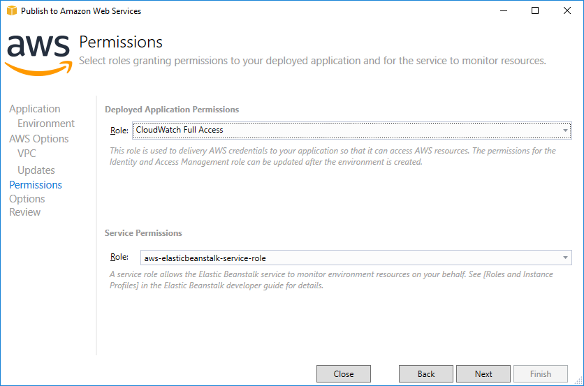
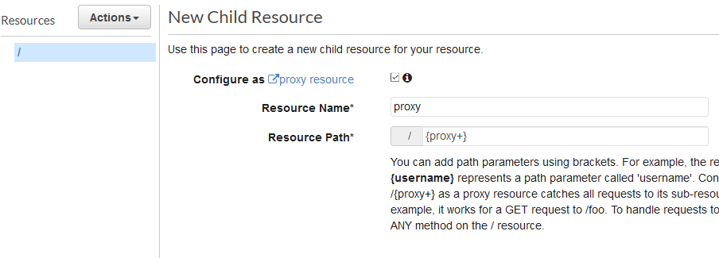
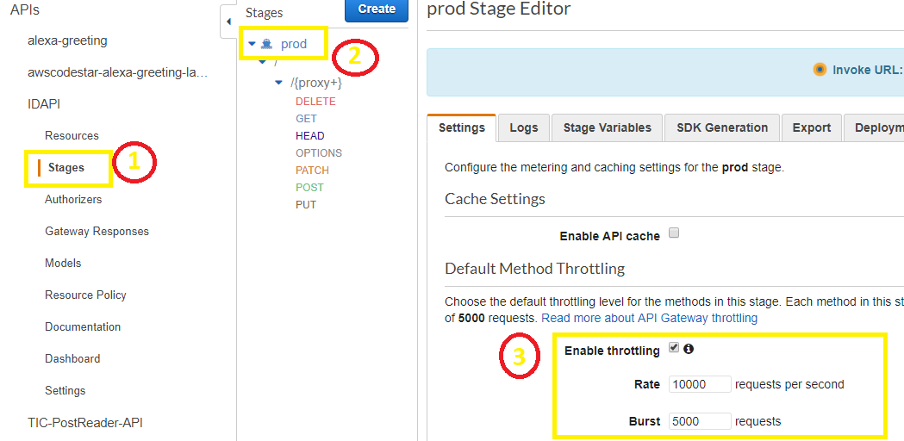

API Gateway and ASP.NET Web API with Elastic Beanstalk and CloudWatch Logs

Self-Paced Lab

Version 1.0

Duration: 60 minutes

Purpose & Background
====================

In this lab, you will create a simple ASP.NET Web API, deploy it with [Elastic
Beanstalk](https://aws.amazon.com/elasticbeanstalk/) to an EC2 instance, and
then configure [Amazon API Gateway](https://aws.amazon.com/api-gateway/) as a
proxy layer in front of the Web API endpoints.

Amazon API Gateway is a fully managed service that makes it easy for developers
to create, publish, maintain, monitor, and secure APIs at any scale. By using
API Gateway in front of your application’s API endpoints, you can apply
throttling, security, monitoring and logging, and improve performance by using
the service’s caching functionality, as well as handle versioning and developer
documentation (including Swagger support).

Lab Exercises
=============

You will complete the following exercises during this lab:

1.  Create an ASP.NET Web API Project

2.  Deploy to Amazon EC2 with Elastic Beanstalk

3.  Test the API with Browser and/or Postman

4.  Create and Configure API Gateway API

5.  Confirm Throttling with Load Test Script

6.  View Application Logs in CloudWatch Logs

Prerequisites
=============

The following prerequisites are required to complete the lab:

-   Microsoft Visual Studio 2017 or above installed on your computer

-   [AWS Toolkit for Visual Studio](https://aws.amazon.com/visualstudio/)

-   Internet connection

-   [Postman](https://www.getpostman.com/apps) (optional)

Part 1 – Create an ASP.NET Web API Project
==========================================

Follow the steps below to create and customize an ASP.NET Core Web API Project
in Visual Studio. AWS fully supports deploying .NET Framework applications on
Microsoft Windows with Elastic Beanstalk, but for this lab, you'll be using .NET
Core. You’ll also set up AWS CloudWatch Logs as the default logging target for
our application, so we can view the logs in case we need to troubleshoot.

1.  In Visual Studio, use File -\> New -\> Project to open the New Project
    dialog. Avoid using spaces in your project name as this causes issues with
    Elastic Beanstalk.

2.  Under the Web project node, select the "ASP.NET Core Web Application"
    template, choose a name for your project, then click the OK button.

1.  In the next dialog, select the "API" blueprint, leave "Enable Docker
    Support" unchecked, and click the OK button to generate the project.

2.  After the project has been generated, install the Nuget package,
    "*AWS.Logger.AspNetCore*" for the project. Note that the version will have
    changed from the following figure:

>   NugetPackage

1.  Install the Nuget package, "*AWSSDK.Extensions.NETCore.Setup*" for the
    project.

2.  Add the following AWS.Logging configuration node to the *appsettings.json*
    file to configure logging to CloudWatch Logs. If you are using something
    other than the default profile, change the Profile name in the settings to
    match your AWS Explorer profile name. Also, make sure your Region matches
    the region you will be deploying in. Adding them immediately before
    ‘Logging’ is fine:

>   "AWS.Logging": {

>   "Profile": "default",

>   "LogGroup": "DotNetWebApiLab",

>   "Region": "us-east-2",

>   "LogLevel": {

>   "Default": "Debug",

>   "System": "Information",

>   "Microsoft": "Information"

>   }

>   }

1.  Next, configure the Startup class (in Startup.cs) to use the AWS options in
    the appsettings.json by adding the following code to the ConfigureServices
    method. Typically, this is added after the boilerplate code:

>   services.AddDefaultAWSOptions(Configuration.GetAWSOptions());

1.  Inject an instance of ILoggerFactory into the Configure method by adding a
    new argument (after IHostingEnvironment env), "ILoggerFactory
    loggerFactory".

>   public void Configure(IApplicationBuilder app, IHostingEnvironment env,
>   ILoggerFactory loggerFactory)

1.  Set the AWS logging provider for CloudWatch Logs as the default logger by
    adding the following code to the end of the Configure method:

>   loggerFactory.AddAWSProvider(Configuration.GetAWSLoggingConfigSection());

1.  Finally, set up the ValuesController to log requests to the API methods by
    adding/updating the following code:

>   private ILogger\<ValuesController\> \_logger;

>   public ValuesController(ILogger\<ValuesController\> logger)

>   {

>   \_logger = logger; //inject logger

>   }

>   // GET api/values

>   [HttpGet]

>   public IEnumerable\<string\> Get()

>   {

>   \_logger.LogInformation(

>   string.Format(

>   "ValuesController Get() Request from {0}",

>   Request.HttpContext.Connection.RemoteIpAddress

>   )

>   );

>   return new string[] { "value1", "value2" };

>   }

1.  You will need to add the following using statement that is required for the
    above code:

>   using Microsoft.Extensions.Logging;

1.  Update the method Post([FromBody]string value) to log a message to
    CloudWatch also, using the same pattern as you did for the Get() method
    above. Change the message to make it clear in the logs that the Post()
    method was called.

>   // POST api/values

>   [HttpPost]

>   public void Post([FromBody] string value)

>   {

>   \_logger.LogInformation(

>   string.Format(

>   "ValuesController Post() Request from {0}",

>   Request.HttpContext.Connection.RemoteIpAddress

>   )

>   );

>   }

Ensure your application builds. If you have your AWS credentials configured in
the AWS Toolkit for Visual Studio, or else in a local *credentials* file, you
can run the application locally and it will log to CloudWatch Logs. Next, you'll
deploy your Web API application to a virtual machine (EC2 instance) running in
the AWS cloud.

Note: if you get an ‘’ exception, you will need to add a default region to your
credentials file. The credentials file is located at
%userprofile%/.aws/credentials

>   [default]

>   aws_access_key_id=\<access_key_id\>

>   aws_secret_access_key=\<secret_access_key\>

>   region=\<region\>

Part 2 – Deploy to Amazon EC2 with Elastic Beanstalk
====================================================

Follow the steps below to deploy the ASP.NET Core Web API application to an
Amazon EC2 instance running Windows Server Core.

1.  Right-click your project in Solution Explorer, and select "Publish to AWS
    Elastic Beanstalk" to launch the publishing wizard. See the figure below.

>   PublishToEB

1.  Ensure the "Account profile to use" drop-down and "Region" drop-down are set
    to the profile and region you are using for today's labs, and the deployment
    target is set to, "*Create a new application environment*", and click ‘Next’

2.  On the next step of the wizard, select a name for the application (or leave
    it set to the default), and then select a name for the environment. The
    pre-populated list will include environments ending in *-dev*, *-test* and
    *-prod* (or you can type your own).

3.  AWS Elastic Beanstalk application environments are accessible via a public
    domain name (a subdomain of elasticbeanstalk.com). On the same step of the
    wizard, choose a subdomain for your Web API application, and check to ensure
    it's available. Once you’ve confirmed a domain, click ‘Next’. See the figure
    below.

>   ApplicationEnvironmnet

1.  On the next step of the wizard, choose the application stack (called the
    "container type" in Elastic Beanstalk; it is not a Docker container,
    however). Choose the latest version of 64 bit **Windows Server Core**
    running IIS.

2.  Choose an instance type, and ensure "single instance environment" is
    checked. Elastic Beanstalk can also deploy fully load-balanced applications,
    along with the load-balancer, but for this lab, you will deploy a single EC2
    instance. For this application, the "t2.micro" instance type is sufficient.
    \`

3.  If you don't already have an EC2 key pair created (in the "Key pair"
    dropdown), select "\<Create new key pair...\>", and enter a name for the key
    pair. When finished, click ‘Next’.

>   *Note: The key pair is a cryptographic pair of keys, one public and one
>   private. Windows EC2 Administrator login credentials are encrypted with the
>   public key, which AWS stores, and can only be decrypted with the private
>   key, which you keep. In this case, the AWS Toolkit for Visual Studio will
>   store the private key for you.*

1.  On the next step of the wizard, you choose the permissions your application
    will inherit from the EC2 instance it's running on by selecting the IAM Role
    that the EC2 instance itself will have. In the role dropdown, select check
    the box next to "*CloudWatch Full Access*" (under Role Templates) at the top
    of the drop-down list. This will create a new IAM role that has permissions
    to write to CloudWatch Logs. See the figure below.

>   ApplicationPermissions

1.  The AWS Elastic Beanstalk service itself needs permissions in order to
    monitor and update your application environment. Select the role,
    "*aws-elasticbeanstalk-service-role*" from the Role dropdown under "Service
    Permissions".

1.  On the next step of the wizard, leave everything set to the defaults, with
    *netcoreapp2.1* (or higher) showing as the framework version.

2.  At the final step of the wizard, review your settings, and then click the
    "Deploy" button to begin deploying the app. After a few moments, the Elastic
    Beanstalk environment pane should automatically open in Visual Studio. If it
    doesn't, find your new environment under the AWS Elastic Beanstalk node in
    the AWS Explorer pane of Visual Studio, and double-click it.

You can view the progress of the deployment in the Output Window. Once it has
completed you are ready to move to the next part.

Part 3 – Test the API with Browser and/or Postman
=================================================

Once your Elastic Beanstalk environment is deployed and the status shows as
"Environment is healthy" on the environment pane, either click the URL shown at
the top of the pane to launch a browser, or type in the URL you set earlier
(*\<subdomain\>.\<region\>.elasticbeanstalk.com*). Follow the steps below to
test out the API with a browser, and then optionally using Postman.

1.  In your browser, append *"/api/values*" (no quotes) to the URL to call the
    default *Get()* method on the ValuesController. Your browser should display
    the JSON for "value1" and "value2" (some browsers may prompt you to download
    the file first).

2.  Next, you can (optionally) test your API with Postman. Create a simple
    request in Postman, using the same URL (including */api/values*), and test
    it using a GET request.

3.  To test your request using PUT and POST requests, you will need to add the
    *Content-Type* header to your request, with the value set to
    "*application-json*" (no quotes). The PUT request also requires an id value
    to be passed in the URL, of the form */api/values/id* (where id is an
    integer), so for example, */api/values/5* for a PUT request passing 5 as the
    id value.

>   *Note: If you're not familiar with Postman, refer to the* [Postman
>   documentation on sending
>   requests](https://www.getpostman.com/docs/v6/postman/sending_api_requests/requests)*.*

1.  Verify that for the GET request, the response includes the same json as when
    you tested with your browser. The PUT and POST requests won't return any
    data, but the response HTTP type should be "200 OK".

You have now tested your API by accessing it directly on the EC2 instance on
which it’s running.

Part 4 – Create and Configure API Gateway API
=============================================

With your Web API deployed on a t2.micro instance, the server could obviously be
overwhelmed by heavy traffic. You could set up horizontal scaling to deal with
the traffic, choose a larger instance type, or put your APIs behind an API
Gateway façade and implement throttling.

For this lab, we’ll implement the third option: throttling. Follow the steps
below to configure and deploy an API Gateway API in front of your REST API
application.

1.  In the AWS Management Console, type "api gateway" into the search box to
    navigate to the API Gateway console. See the figure below.

>   MngtConsoleApig

1.  Create a new API, assigning a meaningful name and description. This API will
    be regional, rather than edge optimized or private.

When you first create the API, there are no resources (URLs) or methods
(GET/POST/PUT/etc) created for it. API Gateway allows you to have different
resources (ULRs or paths) and methods assigned to different backend APIs. Since
all of the REST APIs are running on one server, we'll configure API Gateway to
proxy all requests to the same backend, using the [proxy resource and ANY method
pattern](https://docs.aws.amazon.com/apigateway/latest/developerguide/api-gateway-set-up-simple-proxy.html#api-gateway-proxy-resource?icmpid=docs_apigateway_console)

1.  In the left menu, under the name of the newly-created API, click the
    "*Resources*" link to view and create resources for your API.

1.  In the center pane, in the Actions dropdown, select "*Create resource*", and
    then check the box to configure the new resource as a proxy resource, which
    will automatically populate the resource name and path (see figure below).
    Click the *create* button to create the resource and display the method
    setup view.

>   ApigCreateResource

1.  In the method setup, choose *HTTP Proxy* as the integration type,
    *Passthough* as the content-handling type, and enter the domain name for the
    REST API backend, appending "*{proxy}*" to the end (no quotes) for the
    endpoint URL. Your URL should look something like
    *http://yourappname-prod.us-west-2.elasticbeanstalk.com/{proxy}*  
    See the figure below. Be sure to include the "*http://*" part of the URL.

>   ApigConfigMethod

1.  After you save your changes, the content pane will show a graphical-like
    view of the full round-trip path of requests, starting with the client in a
    box on the left, and the backend resource in a box on the right. In the
    client box is a "*Test*" link. Click that link.

2.  In the method test view, select "GET" as the method, */api/values* as the
    path, then click the test button. The response body (shown at upper-right of
    the pane) should show the same json response as we saw in the browser
    earlier. If you test the POST method, ensure you add
    "*Content-type:application/json*" to the headers box (no quotes).

3.  Now we'll deploy our API. In the center pane, click the Actions dropdown and
    select, "*Deploy API*".

4.  In the Deploy API dialog window that appears, select *"[New Stage]*" in the
    Deployment stage dropdown, enter "*prod*" (no quotes) as the stage name, a
    description for the stage (something like, "*My API production stage*") and
    a deployment description (something like, "*initial deployment*"). Then
    click the deploy button.

>   *Note: The stage editor view will show in the content pane, and the URL to
>   access your API Gateway API will be shown, linked, at the top. A stage is
>   the actual deployed API endpoint(s) that will be exposed for clients to
>   access.*

1.  Review the [API Gateway throttling
    documentation](https://docs.aws.amazon.com/apigateway/latest/developerguide/api-gateway-request-throttling.html?icmpid=docs_apigateway_console)
    for more information about how throttling works. You can access the Default
    Throttling through the 1) Stages, 2) click on the stage (eg ‘prod’), 3)
    Enable Throttling.

1.  Change the throttling values to 1 request/second, with a burst rate of 2
    requests. We’re choosing this low value to make it easier to test without
    load-testing software. Save your changes.

2.  Copy the Invoke URL, and create a new GET request in Postman for that URL
    plus "*/api/values*" (no quotes). Verify that you get back the same json
    response as earlier. The URL will look something like
    *https://abck123xy.execute-api.us-west-2.amazonaws.com/prod/api/values*.

You have now deployed an API Gateway API to proxy requests to your Web API,
implemented throttling, and verified the API Gateway API is accessible.

5 - Confirm Throttling with Load Test Script
============================================

There are several ways we can confirm that requests are now being throttled. If
you're familiar with Postman, you can run multiple iterations using the
Collection Runner feature to run multiple iterations with no delay between each
request. If you're not familiar with Postman's Collection Runner feature, you
can create a simple PowerShell script by following the steps below that will
demonstrate the throttling feature of the API Gateway API.

1.  Copy the below code to a text file, and save it with the extension ".ps1".
    Make sure you replace *\<your-api-gateway-invoke-url\>* with the actual
    Invoke URL of your API, so that the URL ends with */prod/api/values*.

>   Write-Output "Sending GET request to your REST endpoint 10 times"

>   for (\$i = 0; \$i -lt 10; \$i++) {

>   Invoke-WebRequest -Uri
>   https://*\<your-api-gateway-invoke-url\>*/prod/api/values -Method 'Get'

>   }

1.  Open PowerShell, and navigate to the folder where you saved the file. Run
    your PowerShell script by typing “*.\\\<file-name\>.ps1*” (no quotes) where
    *\<file-name\>* is the name you gave the file.

Depending on your network connection, and the speed at which your computer is
able to execute the requests, you will see some of the requests succeed with
status code 200 and the json payload, while others will fail with the response
json, *{"message":"Too Many Requests"}*.

If you are running the iterations in Postman, you will see that the response
HTTP status code is *429 (Too Many Requests)*.

6 - View Application Logs in CloudWatch Logs
============================================

Finally, view the logs that were generated with the code you added to the
*ValuesController* by following the steps below.

1.  In the AWS Management console, navigate to the CloudWatch console.

2.  On the CloudWatch console, click Logs in the left-side menu to view the log
    groups.

3.  Find the "*DotNetWebApiLab*" log group. If you have many log groups in your
    account, you can search for the group by name in the filter box.

4.  Click on the *DotNetWebApiLab* log group, and you should see one or more log
    streams. A log stream represents the sequence of events coming from an
    application instance or resource that you are monitoring; in this case, the
    EC2 instance running the Web API application.

5.  Click on one of the log streams, and find the log entries written by the
    *ValuesController*.

You should see log entries covering the lifetime of requests to the API, similar
to the below. Because the logging in *appsettings.json* is configured to
"information", many events were logged. Look for the messages logged from the
code you added, for the GET and POST requests.

Request starting HTTP/1.1 GET
http://webapichallenge-test.us-east-2.elasticbeanstalk.com/api/values

Executing action method WebApiChallenge.Controllers.ValuesController.Get
(WebApiChallenge) with arguments ((null)) - ModelState is Valid

ValuesController Get() Request from 52.95.4.22

Executing ObjectResult, writing value Microsoft.AspNetCore.Mvc.ControllerContext

Executed action WebApiChallenge.Controllers.ValuesController.Get
(WebApiChallenge)

Request finished in 193.22ms 200 application/json; charset=utf-8

Request starting HTTP/1.1 POST
http://webapichallenge-test.us-east-2.elasticbeanstalk.com/api/values

Executing action method WebApiChallenge.Controllers.ValuesController.Post
(WebApiChallenge) with arguments () - ModelState is Invalid

ValuesController Post() Request from 52.95.4.22

Executed action WebApiChallenge.Controllers.ValuesController.Post
(WebApiChallenge)

Request finished in 47.133ms 200

Congratulations, you have created and deployed an ASP.NET Web API application
using AWS Elastic Beanstalk, created and configured API Gateway as a proxy in
front of your API with throttling, and then confirmed that the throttling is
enforced using a PowerShell script or Postman.
