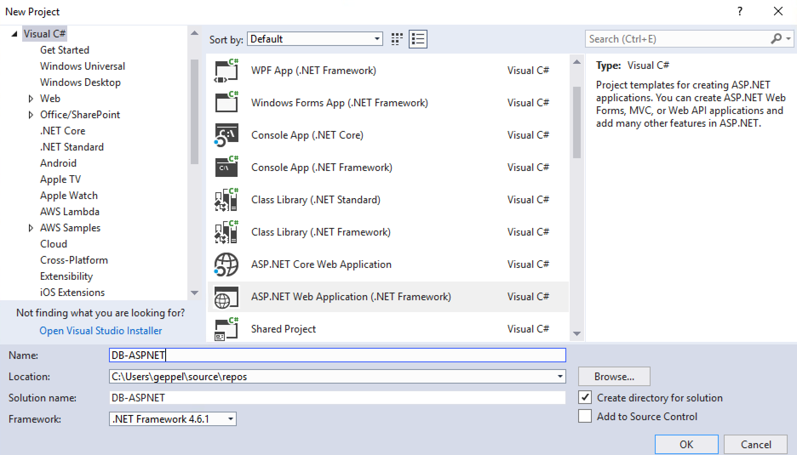
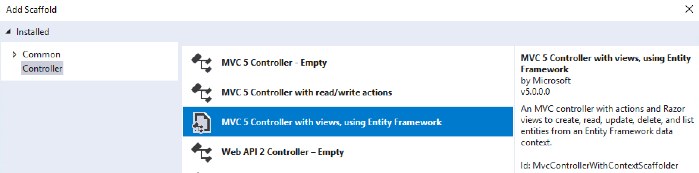
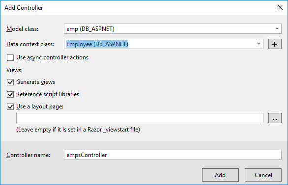
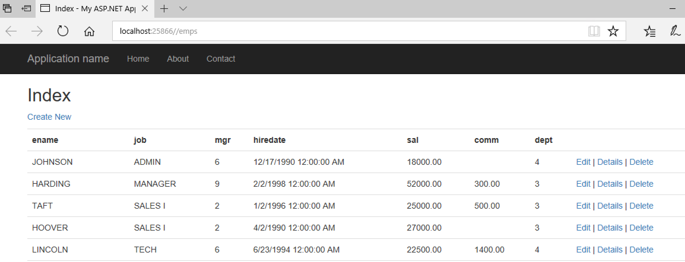

**ASP.NET and Amazon RDS**

Self-Paced Lab

Version 1.0

Duration: 60 minutes

Purpose & Background
====================

The purpose of this lab is to demonstrate how you can use Amazon RDS in an
ASP.NET Framework application. You will need to have a working AWS account to
use this lab.

In this lab we will launch an RDS instance, populate it with sample data, create
an ASP.NET MVC application, generate an Entity Framework data model and creating
a new MVC controller/view for the tables in the RDS database.

Lab Exercises
=============

The following exercises will be completed for this lab:

1.  Create an ASP.NET Framework application

2.  Create an RDS instance

3.  Connect the ASP.NET Framework application to an RDS database

Prerequisites
=============

The following are the prerequisites required in order to complete the lab:

-   Microsoft Visual Studio 2017 or above installed on your computer

-   AWS Toolkit for Visual Studio

-   SQL Server Express

-   Internet connection

Part 1 - Create an ASP.NET Framework application

Please follow the instructions below to create a new ASP.NET Framework
application using Visual Studio.

1.  Open Visual Studio and click ‘File’ and ‘New Project’

2.  Under Visual C\# and Web click ‘ASP.NET Web Application (.NET Framework)’
    and name the project ‘DB-ASPNET’.

3.  Change the Solution Name to ‘DB-ASPNET’ since we’ll be adding a second
    project to the solution.

>   Figure 1 – Creating a new ASP.NET Web Application (.NET Framework)

1.  Click ‘OK’.

2.  On the next screen select the ‘MVC’ project template, make sure you ‘Enable
    Docker support’ is checked. If you don’t have Docker installed on your
    development machine this will cause build errors.  
      
    

    

3.  Click OK.

Part 3 – Create the RDS Instance
================================

1.  Now we’re going to create our RDS instance through the AWS Explorer in
    Visual Studio, navigate to the AWS Explorer and expand the Amazon RDS node
    and right click on Instances and select “Launch Instance”

1.  Select “Microsoft SQL Server Express Edition” and click next.

2.  Select your DB Engine Version and DB Instance Class (db.t2.small) and
    specify RDS Database Instance details  
      
    

    

3.  Click next and select your VPC, Subnet Group and Availability Zone.

4.  If you are doing this lab on your local machine then ensure “Publicly
    Accessible” is checked. If you are running the lab on an EC2 instance in the
    same VPC leave “Publicly Accessible” unchecked.

5.  Click Next twice and Launch to create the RDS instance, after several
    minutes (perhaps even 15) you will see the status change to “Available” with
    a green circle icon.

1.  Right click on the RDS instance and select “Copy Address to Clipboard”

2.  Navigate to Server Explorer in Visual Studio and under Data Connections
    right click and click “Add Connection”. Select Microsoft SQL Server from the
    Data Source list and click continue.

3.  In the Server Name textbox paste in the address you copied to the clipboard
    in Step 7 and then enter your credentials you specified when you launched
    the RDS instance and click “Test Connection” and click OK to register the
    connection.

4.  Right click on the Data Connection you just created and click “New Query”
    and copy/paste this data into the query window and execute it

>   CREATE DATABASE TestDatabase;

>   GO

>   USE TestDatabase;

>   CREATE TABLE emp (

>   empno INT PRIMARY KEY,

>   ename VARCHAR(10),

>   job VARCHAR(9),

>   mgr INT NULL,

>   hiredate DATETIME,

>   sal NUMERIC(7,2),

>   comm NUMERIC(7,2) NULL,

>   dept INT)

>   begin

>   insert into emp values (1,'JOHNSON','ADMIN',6,'12-17-1990',18000,NULL,4)

>   insert into emp values (2,'HARDING','MANAGER',9,'02-02-1998',52000,300,3)

>   insert into emp values (3,'TAFT','SALES I',2,'01-02-1996',25000,500,3)

>   insert into emp values (4,'HOOVER','SALES I',2,'04-02-1990',27000,NULL,3)

>   insert into emp values (5,'LINCOLN','TECH',6,'06-23-1994',22500,1400,4)

>   insert into emp values (6,'GARFIELD','MANAGER',9,'05-01-1993',54000,NULL,4)

>   insert into emp values (7,'POLK','TECH',6,'09-22-1997',25000,NULL,4)

>   insert into emp values (8,'GRANT','ENGINEER',10,'03-30-1997',32000,NULL,2)

>   insert into emp values (9,'JACKSON','CEO',NULL,'01-01-1990',75000,NULL,4)

>   insert into emp values (10,'FILLMORE','MANAGER',9,'08-09-1994',56000,NULL,2)

>   insert into emp values (11,'ADAMS','ENGINEER',10,'03-15-1996',34000,NULL,2)

>   insert into emp values (12,'WASHINGTON','ADMIN',6,'04-16-1998',18000,NULL,4)

>   insert into emp values (13,'MONROE','ENGINEER',10,'12-03-2000',30000,NULL,2)

>   insert into emp values (14,'ROOSEVELT','CPA',9,'10-12-1995',35000,NULL,1)

>   end

>   CREATE TABLE dept (

>   deptno INT NOT NULL,

>   dname VARCHAR(14),

>   loc VARCHAR(13))

>   begin

>   insert into dept values (1,'ACCOUNTING','ST LOUIS')

>   insert into dept values (2,'RESEARCH','NEW YORK')

>   insert into dept values (3,'SALES','ATLANTA')

>   end

1.  Now that you have created a database in the RDS instance update the Database
    name in the Data Connection in Server Explorer to “TestDatabase”

 Part 3 – Connect the ASP.NET Framework application to RDS
=============================================================

1.  Right click on the DB-ASPNET project and click “New Item” and navigate to
    Data and select ADO.NET Entity Data Model and in the name textbox change to
    Employee and click Add. This will start the Entity Data Model Wizard.

2.  In the Entity Data Model Wizard select “Code First from database” and click
    Next

3.  On the next screen you should see the Data Connection you created earlier in
    the lab. Check “Yes, include sensitive data in the connection string” since
    this is a lab setting. For a production application you can use AWS Secret
    Manager to store sensitive data and retrieve it programmatically with the
    AWS SDK for .NET.

4.  Select your version of Entity Framework and click Next. On the next screen
    select the emp table in the TestDatabase database and click Finish.

5.  Wait for the Scaffolding to finish and then Build the solution.

6.  In your DB-ASPNET project in Solution Explorer right click on the
    Controllers folder and click Add \> Controller and choose “MVC 5 Controller
    with views, using Entity Framework” and click Add.  
      
    

    

7.  Configure the dialog to look like the following, note for the Model Class we
    selected emp (DB_ASPNET) and for the Data context class the Data Connection
    we created is being referenced.

1.  Right click on the ASP.NET Framework application and click Properties and
    navigate to the “Web” section and under “Start Action” select “Specific
    Page” and specify “/emps”  
      
    

    

2.  Save your changes and close the Properties window and click Debug in the
    menu bar and Start Without Debugging. In a few seconds you should see a list
    of the employees you created in the Amazon RDS database earlier in the lab.

    

Conclusion
==========

In this lab, you learned how to create an Amazon RDS instance in Visual Studio,
create a new ASP.NET MVC application and connect it to the RDS SQL Server
database using native tools in Visual Studio (i.e. Entity Framework).
