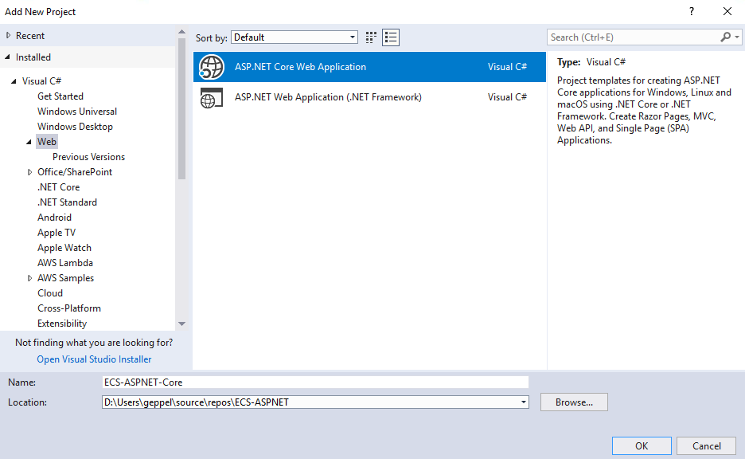
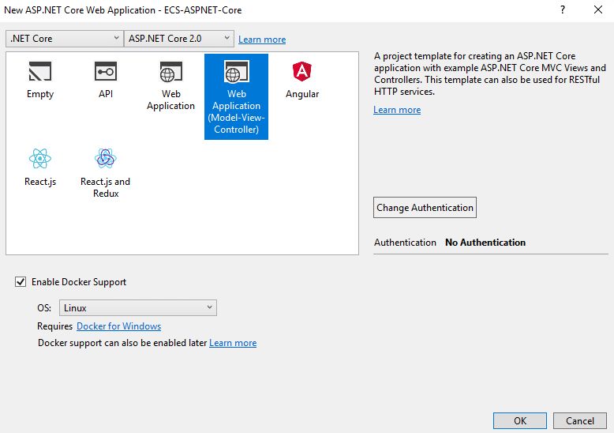
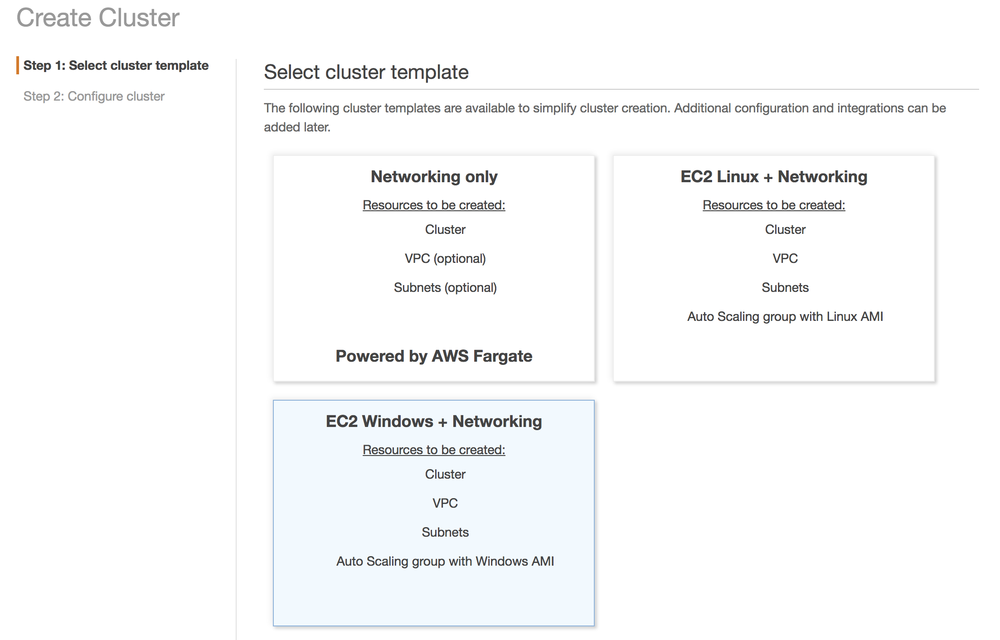

**Deploy ASP.NET Apps to Containers**

Self-Paced Lab

Version 1.0

Duration: 60 minutes

Purpose & Background
====================

The purpose of this lab is to demonstrate how you can deploy ASP.NET Framework
and ASP.NET Core applications to Amazon ECS. You will need to have a working AWS
account to use this lab.

In this lab we will create two ASP. NET applications, the first is an ASP.NET
Framework application which we will deploy to Windows Containers and the second
is an ASP.NET Core application which we will deploy to Linux Containers and
Fargate.

Lab Exercises
=============

The following exercises should be completed in order for this lab:

1.  Create an ASP.NET Framework application

2.  Create an ASP.NET Core application

3.  Create the ECS Cluster

4.  Publish ASP.NET Core to ECS

5.  Public ASP.NET Framework to ECS

Prerequisites
=============

The following are the prerequisites required in order to complete the lab:

-   Microsoft Visual Studio 2017 or above installed on your computer

-   AWS Toolkit for Visual Studio

-   Docker for Windows or Docker

-   Internet connection

Part 1 - Create an ASP.NET Framework application

Please follow the instructions below to create a new ASP.NET Framework
application using Visual Studio.

1.  Open Visual Studio and click ‘File’ and ‘New Project’

2.  Under Visual C\# and Web click ‘ASP.NET Web Application (.NET Framework)’
    and name the project ‘ECS-ASPNET-Framework’.

3.  Change the Solution Name to ‘ECS-ASPNET’ since we’ll be adding a second
    project to the solution.

>   Figure 1 – Creating a new ASP.NET Web Application (.NET Framework)

1.  Click ‘OK’.

2.  On the next screen select the ‘MVC’ project template, make sure you ‘Enable
    Docker support’ is checked. If you don’t have Docker installed on your
    development machine this will cause build errors.  
      
    

    

3.  Click OK.

>   *Part 1 of this exercise is complete. Continue to Part 2.*

Part 2 – Create an ASP.NET Core application
===========================================

1.  Right click on the Solution ‘ECS-ASPNET’ in Solution Explorer and click
    ‘Add’ \> ‘New Project’

2.  Under Visual C\# and Web click ‘ASP.NET Core Web Application’ and name the
    project ‘ECS-ASPNET-Core’.

>   Figure 1 – Creating a new ASP.NET Core Web

1.  Click OK

2.  On the next screen select the ‘Web Application (Model-View-Controller)’
    template, make sure you ‘Enable Docker support’ is checked. If you don’t
    have Docker installed on your development machine this will cause build
    errors.

    

3.  Ensure your OS is set to Linux and click OK

4.  Your Solution Explorer should be named ‘ECS-ASPNET’ and have two projects
    ‘ECS-ASPNET-Core’ and ‘ECS-ASPNET-Framework’

1.  Build and run both projects to ensure they startup without error.

>   *Part 2 of this exercise is complete. Continue to Part 3.*

Part 3 – Create the ECS Clusters
================================

1.  Now we’re going to create our ECS cluster so open the AWS Management Console
    and navigate to ‘Elastic Container Service’.

2.  If this is the first time running the ‘Elastic Container Service’, you will
    see the following screen.

    

3.  Click ‘Clusters’ on the Left-Hand menu and then ‘Create Cluster’.

4.  Select ‘EC2 Windows + Networking’ and click ‘Next Step’

1.  For Cluster name specify ‘ECS-ASPNET-Framework’ and leave the rest of the
    settings to their defaults and click ‘Create’.

2.  Wait several minutes while the ECS Cluster is being created

    

3.  You will know that the cluster is created when all boxes are green, and the
    ‘View Cluster’ button is enabled. Click on ‘View Cluster’ and you will see
    the details of the new cluster.

1.  Click on ‘Clusters’ in the left-hand menu and ‘create cluster’ button. This
    time, select EC2 Linux + Networking and click Next

    

2.  For Cluster name specify ‘ECS-ASPNET-Core and leave the rest of the settings
    to their defaults and click ‘Create’.

3.  Wait several minutes while the ECS Cluster is being created

4.  You should now have two ECS Clusters running, one for Windows and one for
    Linux

Part 4 – Publish ASP.NET Core to ECS

1.  Once the ECS Cluster is created switch back to Visual Studio and go to the
    ‘ECS-ASPNET-Core project in ‘Solution Explorer’ and right click and click
    ‘Publish Container to AWS…’. If you don’t have this option, then you don’t
    have docker support for the project. You can dockerize the project by
    right-clicking and selecting Add \> Docker Support.

2.  On the ‘Launch Configuration’ window you should see a screen similar to this  
      
    

    

3.  Keep the defaults, click Next and select the ‘ECS-ASPNET-Core’ ECS Cluster
    from the dropdown and click Next.

    

4.  Click Next twice and under ‘Application Load Balancer Configuration’ click
    the ‘Configure Application Load Balancer’ checkbox and select ‘Create New’
    under the ‘Load Balancer’ dropdown and click Next.

1.  On the next screen under ‘Task Definition’ select ‘Create New’ in the
    dropdown and click ‘Publish’.

1.  The publishing process will create the necessary resources in AWS, build the
    project and publish an image to Amazon ECR. The first time it publishes the
    project it may take several minutes as it has to ‘pull’ the Docker
    containers to the local machine.

>   Congratulations, you have completed part 4 and created a new ASP.NET Core
>   MVC web application and published it to ECS.

Optional (for bonus credit) - View the containerized web site
-------------------------------------------------------------

1.  You’ve uploaded the container and it is running. As part of that process you
    created an elastic load balancer. For a production website, you would use
    Route53 and attach a domain to access the website. For today, we will use
    the ELB’s URL to access the site.

2.  In the AWS Console, navigate to the EC2 Service.

3.  In the left-hand menu, select Load Balancers (near the bottom).

4.  You will have a list of Load Balancers and select the one named
    ‘ECSASPNETCore’.

5.  Under Description, you will find the DNS name entry. Copy the address.

6.  Paste the address into your browser and you will see your website’s home
    page.

Part 5 – Publish ASP.NET Framework to ECS

We will now publish the ASP.NET Framework application to ECS. Because we will
use a Windows Container, the publishing process is very different from that used
by .Net Core and Linux containers.

1.  Navigate to your ECS-ASPNET-Framework project in Solution Explorer and right
    click and click Publish... (this is typically the button used to publish
    directly to Azure).

2.  If this is the first time publishing the project, you will get the following
    window. Under Publish Target select ‘Container Registry’ and choose the
    Custom radio button and click Publish. If prompted for a registry URL simply
    put localhost.

    

3.  If you’ve previously published the project, you will get the following
    window. Simply click ‘publish’ to start.

1.  Once the publish process starts, you can track its progress in the build
    window. You will likely get an error, but you can ignore it.

1.  Open a Command Prompt and execute the following command ‘docker images’ and
    look for your recently published image. It should be named
    ‘ecs-aspnet-framework-sample’ and created just a few minutes ago:

2.  Now run your container locally with the following command

    docker run -d --name ecs-aspnet-framework-sample
    example/ecs-aspnet-framework:latest

3.  To get the IP address of the Docker container execute the following command:  
      
    docker inspect -f "{{ .NetworkSettings.Networks.nat.IPAddress }}"
    ecs-aspnet-framework-sample

4.  Copy and paste the IP address into the browser on the same server and you
    should see your ASP.NET application.

5.  At this point we have a ASP.NET Framework app running in a contatiner
    locally on the workstation now we need to get it running Amazon ECS.

6.  The first step is to create an EC2 Container Registry. Each container image
    should be stored in its own repository on Amazon ECR. Use the AWS console to
    create a new Amazon ECR repository for your image:

    

7.  After you create the repository, the AWS console will show you pre-filled
    code to authenticate to the repository with Docker, tag the image, and push
    the image to Amazon ECR.

8.  Now you need to log-in to ECR. The docker log in command needs to be
    retrieved to authenticate the Docker client into the registry. You will need
    to modify this code to reflect the region you created your Amazon ECR
    repository in.

9.  aws ecr get-login --no-include-email --region us-east-1

    

10. Enter the Docker log-in command from the last step 

    

11. You should see a similar input when the login is successful.

12. Now we have to tag the container image was built in the local development
    environment with the ECR repository. For this example, we’ll use :latest if
    you are pushing many versions of an image, consider using a numerical tag
    structure.

>   docker tag ecs-aspnet-framework:latest
>   awsaccountnumber.dkr.ecr.awsregion.amazonaws.com/containerimagename:latest

1.  Now we need to run the docker push command to push the newly created image
    to the ECR repository.

    docker push
    awsaccountnumber.dkr.ecr.awsregion.amazonaws.com/ecs-aspnet-framework:latest

    

2.  The container image is encrypted and compressed in the Amazon ECR
    repository.

    

3.  Now we need to configure the Cluster to run the container image we just
    pushed to the Amazon ECR repository.

Conclusion
==========

In this lab, you learned how to create an ASP.NET application ready and deploy
it to Amazon ECS using the AWS Toolkit for Visual Studio.
