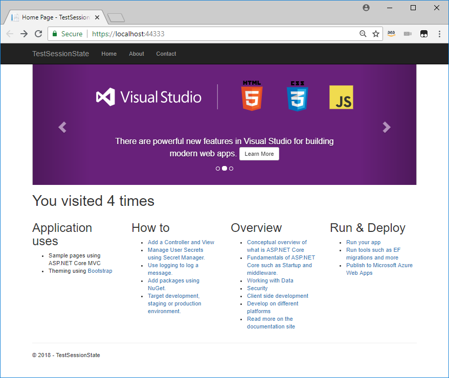

**Implement DynamoDB for ASP.NET Core Session State**

Self-Paced Lab

Version 1.0

Duration: 60 minutes

Purpose & Background
====================

The purpose of the lab is to implement [Amazon
DynamoDB](https://docs.aws.amazon.com/amazondynamodb/latest/developerguide/Introduction.html)
as the backing store for session state in an ASP.NET Core application.
Optionally (given time) add support for session state in distributed
applications by storing cookie encryption keys in AWS Parameter Store.

The ASP.NET Core Session middleware stores session information in memory (in
process) with the default implementation of IDistributedCache. Storing session
in memory has drawbacks, including a lack of durability, the inability of
session state to survive failure of the process or the underlying hardware, and
no way to query session information for analytics. Additionally, when scaling
out an application horizontally (using a web-farm, containers or serverless
platforms), having the state tied to the web-application requires implementing
“sticky sessions”, which introduces complexity and load-balancing problems.

Amazon DynamoDB is an ideal store for session state – it’s durable, scalable and
has single-digit millisecond response times. By storing the cookie-encryption
keys used by the Session middleware in [AWS Parameter
store](https://docs.aws.amazon.com/systems-manager/latest/userguide/systems-manager-paramstore.html),
we can also scale out our solution horizontally without using sticky sessions.

Lab Exercises
=============

The following exercises should be completed in order for this lab:

1.  Create an Amazon DynamoDB table using the AWS Management Console

2.  Create an ASP.NET Core MVC web-application project and add Session support

3.  Implement IDistributedCache that reads/writes to DynamoDB, configure it in
    Startup, and test locally.

4.  (Optional) Add support for distributed applications by implementing
    IXmlRepository and test locally.

Prerequisites
=============

The following are the prerequisites required in order to complete the lab:

-   Microsoft Visual Studio 2017 or above installed on your computer

-   AWS Toolkit for Visual Studio

-   Internet connection

Part 1 – Create an Amazon DynamoDB table
========================================

Please follow the instructions below to create an Amazon DynamoDB table using
the management console.

1.  Log into the AWS Management console at https://console.aws.amazon.com/

2.  Click on “DynamoDB” under the Database category, or alternatively type
    “Dynamo” into the search box then click “DynamoDB”. See Figure 1.

>   Figure 1 – DynamoDB in Database category of AWS Management Console

1.  Click the “Create Table” button to display the Create DynamoDB page.

2.  On the Create DynamoDB table page, enter “LabSessionState” (no quotes) for
    the table name, and “SessionId” (no quotes) as the partition key (leave the
    dropdown for data type as “string”).

3.  Leave Sort Key unchecked and leave the “Use default settings” checked, and
    click the “Create” button to create the table. It will take a few moments
    for your table to be ready for the next step.

4.  Once the table is created, on the “Overview” tab, under “Table details”,
    click “Manage TTL” next to “Time to live attribute”. See Figure 2.

>   Figure 2 – DynamoDB Overview Tab

1.  In the, “Enable TTL” dialog, enter “TTL” (no quotes) as the TTL attribute
    (see Figure 3). This is the JSON attribute that DynamoDB will use to expire
    items from our table. This attribute will be set for each session state bag
    we store in DynamoDB in the IDistributedCache implementation we create in
    Part 3 of this lab.

>   Figure 3 – Setting TTL Attribute

Part 1 of this exercise is complete. Continue to Part 2.

Part 2 – Create an ASP.NET Core MVC Project
===========================================

Follow the instructions below to create an ASP.NET Core MVC web-application
project and add support for sessions by configuring the ASP.NET Core Session
middleware, and then add some code that stores and retrieves objects using
session state.

1.  In Visual Studio, select *File New New Project* from the menu to launch the
    New Project dialog.

2.  In the New Project dialog, select the ASP.NET Core Web Application project
    type. See Figure below.

Figure 4 – Visual Studio New Project Dialog

1.  Select a name for the project, and then click the “Ok” button.

2.  In the New ASP.NET Core Web Application dialog, select Web Application
    (Model-View-Controller), ensuring that ASP.NET Core 2.0 (or higher) is
    selected for the .NET Core version. See Figure 4 below.

Figure 5 – Web Project Options Dialog

1.  After the project is created, in Solution Explorer, find and open
    Startup.cs. The Startup class is where middleware is added and configured.

2.  In the ConfigureServices method, add the following line of code just before
    the call to services.AddMvc. The line you’re adding will add services
    required for session state using default options (session expiry of 20
    minutes, etc).

| services.AddSession(); |
|------------------------|

3.  In the Configure method, add the following line as the first line of the
    method. The line you’re adding adds the session middleware to the request
    pipeline for the application.

| app.UseSession(); |
|-------------------|

4.  Now that we’ve added support for session state, let’s add some code that
    uses it. Find the HomeController.cs file in the Controllers folder in
    Solution Explorer, and open it.

5.  Add the following lines to the Index method, before the return statement,
    which will read the number of current views for a user from session,
    increment it and store it in ViewData it (as well as writing the new value
    back to session):

| var views = (HttpContext.Session.GetInt32("ViewCount") ?? 0) + 1; HttpContext.Session.SetInt32("ViewCount", views); ViewData["Message"] = string.Format("You visited {0} times", views); |
|------------------------------------------------------------------------------------------------------------------------------------------------------------------------------------------|

6.  Add the following using statement to the top of the file:

| using Microsoft.AspNetCore.Http; |
|----------------------------------|

7.  In Solution Explorer, find and open Index.cshtml (in */Views/Home/* folder),
    and collapse the first div tag (which has the id attribute of myCarousel).

8.  Add the following line after the collapsed div, on its own line, in order to
    display the value we set in the controller:

| \<h1\>\@ViewData["Message"]\</h1\> |
|------------------------------------|

1.  Save your changes, and then right-click your project and choose, Debug Start
    new instance to launch the web application locally using IIS Express.

2.  When the browser displays the home page, note that the message says, “You
    visited 1 times”. Click home a few more times to increase the counter. The
    Black Menu bar might be hidden behind the site’s cookie policy. Simply click
    ‘accept’.

>   Figure 5 – ASP.NET Core MVC Web Application with Session State

You have now created an ASP.NET Core MVC web application that uses the Session
middleware with its default (in memory) storage of session state, to track how
many times you visit the home page.

Continue to Part 3.

Part 3 – Implement IDistributedCache for DynamoDB
=================================================

Now we’re going to add our own implementation of IDistributedCache in order to
store session data in DynamoDB rather than in memory, so that it will survive an
instance or process failure, and be available to other applications. It’s also
useful to share session state between multiple copies of the same web
application, which can be enable by completing the optional lab exercise after
completing this section.

Follow the steps below to add an implementation of IDistributedCache and wire it
up:

1.  Download and unzip the file from the link below:  
    <https://s3-us-west-2.amazonaws.com/dotnet-immersionday/DynamoDbCacheDotNetCore.zip>  
      
    The zipped file contains the following three files:  
    • DynamoDbCache.cs  
    • DynamoDbCacheOptions.cs  
    • DynamoDbCacheServiceCollectionExtensions.cs

2.  In the Visual Studio Solution Explorer, right-click your project and choose,
    Add New Folder. Name the new folder, “Session” (no quotes).

3.  Still in Solution Explorer, right-click the new Session folder and choose,
    Open Folder in File Explorer to display the folder in Windows Explorer.

4.  Copy the three files you extracted from the zipped file earlier into the
    Session folder. Verify that they show up in Solution Explorer.

5.  Open the DynamoDbCache.cs file, and you will notice that some types (such as
    IAmazonDynamoDB) used in the DynamoDbCache class are underlined in red,
    because the assemblies they depend on aren’t added to our project yet.

6.  Right-click your project in Solution Explorer and choose, “Manage NuGet
    Packages” to open the NuGet package pane.

7.  Click the “Browse” tab, and search for, “AWSSDK.DynamoDBv2”. Select that
    package in the results list, then click the “Install” button in the details
    view on the right. Click “Accept” at the license prompt. See Figure 6.

>   Figure 6 – NuGet Package Manager with DynamoDBv2 Package

1.  Follow the same steps to add the package *AWSSDK.Extensions.NETCore.Setup.*

2.  After the AWSSDK.DynamoDBv2 package has installed, return to the code view
    of DynamoDbCache.cs. There should be no code warnings now as the
    dependencies are now present. If you still see code warnings, try rebuilding
    the project.

3.  Review the code in each of the three files to see what it does:

    1.  *DynamoDbCache.cs*  
        This class implements the interface IDistributedCache. In the
        constructor, it instantiates a DynamoDB client, and a Table, and loads
        that Table with the table definition from DynamoDB. The constructor also
        reads options, if any, for the TTL field, table name, and session
        timeout.  
          
        The class implements methods for Get, Set, Remove, Refresh, and async
        versions of each of them also. In fact, the non-async versions
        (synchronous versions) merely wrap the async versions and wait for the
        result (if not void).  
          
        The method GetAsync shows how easy it is to read an item from DynamoDB
        using table.GetItemAsync(key) where key is the partition key of the item
        we’re fetching.  
          
        It’s important to remember that calls to Get/GetAsync, Set/SetAsync and
        the other methods are made by the Session middleware, not by our own
        code. The Session middleware base64-encodes the state bag (which is
        serialized as JSON) and passes it as byte arrays. In the SetAsync
        method, you can see we store that byte array as a single attribute, and
        add attributes for the partition key (we are using the session ID for
        this), the TTL, and a CreateDate (which may be useful for analytics or
        other purposes).  
          
        *Note: This is example code for use with this lab, and should not be
        considered production-ready. There is no error handling, testing, or
        other features required for production applications.*

    2.  *DynamoDbCacheOptions.cs*  
        This class provides a way to pass options from the Startup class, where
        we wire it up, to the actual DynamoDbCache class. This sample code for
        our lab has options for the table name, the TTL attribute, and the
        session timeout in minutes, with default values for each.

    3.  *DynamoDbCacheServiceCollectionExtensions.cs*  
        This class has a single extension method that we can call on the
        services collection in Startup to add a singleton instance of
        DynamoDbCache.

4.  Open the Startup.cs file again, and find the ConfigureServices method.

5.  Add the following code just before the call to services.AddSession. The code
    below which will add a singleton instance of DynamoDbCache to the services
    collection, as well as register the type IAmazonDynamoDB with the ASP.NET
    Core dependency injection middleware:

| services.AddDistributedDynamoDbCache(o =\> { o.TableName = "LabSessionState"; }); services.AddAWSService\<IAmazonDynamoDB\>(); |
|--------------------------------------------------------------------------------------------------------------------------------|

6.  Add the using statement, using Amazon.DynamoDBv2; to the top of the file.

7.  Build and run the application again locally. Assuming your local AWS profile
    has permissions to read and write to the DynamoDB table LabSessionState, the
    view counter should work as before.

>   *Note: If the services.AddAWSService\<IAmazonDynamoDB\> line is underlined
>   in red, ensure you have added the NuGet package from step 8 of this
>   section.*

1.  In your browser, navigate back to the AWS DynamoDB console, and click on the
    table you created earlier, LabSessionState.

2.  Click the “Items” tab to display the items in the table. If nothing appears,
    try clicking the refresh button:

    

3.  You should see one item in the table, with attributes for SessionId,
    CreateDate, ExpiryType, Session, and TTL. Hover over the TTL attribute to
    see the translation to UTC and local times.

4.  Click the item (click the SessionId value for the item) to display all the
    attributes and their values. See Figure 7 for an example.

Figure 7 – DynamoDB Item in Edit dialog

>   Note: You can use the base64 decode function at
>   [www.base64decode.org](http://www.base64decode.org) to see some of the
>   contents of the “Session” attribute. You should be able to see “ViewCount”,
>   along with unprintable characters from the byte array.

1.  If you wait until after the time shown for the TTL attribute (step 17), and
    refresh the items list (after closing the edit dialog), the item will
    eventually disappear. This can take anywhere from a few seconds to an hour
    or more (typically a few minutes at most).

>   Congratulations, you have created a new ASP.NET Core MVC web application,
>   added support for session state, and then implemented DynamoDB as the
>   storage for that session state, and tested out the solution locally.

>   If you have time, you can complete the bonus section below to add support
>   for distributed web applications.

Part 4 – Implement IXmlRepository for Parameter Store
=====================================================

>   In the previous sections, you set up the ASP.NET Core MVC project to use
>   DynamoDB as the backing store for the Session middleware. However, the
>   Session middleware encrypts the session cookie it uses to track users with
>   encryption keys that are generated locally and not shared by default. This
>   means that if you have multiple copies of your web application running – on
>   multiple EC2 instances, containers or Lambda functions for example – they
>   cannot decrypt each other’s session cookies. This will break session state
>   unless you configure a load balancer to use “sticky sessions”, which is not
>   always feasible, nor desirable.

>   Luckily, we can configure ASP.NET Core to use whatever repository we choose
>   to store the encryption keys, so that they can be shared across multiple
>   running instances of an application. You could choose, for instance, to
>   store the keys in a DynamoDB table. However, AWS has a service, called
>   [Parameter
>   Store](https://docs.aws.amazon.com/systems-manager/latest/userguide/systems-manager-paramstore.html)
>   (part of Simple Systems Manager) that can store parameters up to 4K in
>   length, and retrieve them by path. You can optionally choose to encrypt
>   values stored in Parameter Store with AWS Key Management Service (KMS) to
>   keep them secure (recommended for any production environment). For this lab,
>   we’ll just store them as plaintext in order to view them.

>   Follow the steps below to add an implementation of IXmlRespository that
>   stores cookie encryption keys in AWS Parameter Store.

1.  Add the NuGet package, “AWSSDK.SimpleSystemsManagement” to your project.

2.  Download the file PsXmlRepository.cs from  
    <https://s3-us-west-2.amazonaws.com/dotnet-immersionday/PsXmlRepository.cs>

3.  Copy the file to the Session folder of your project, and open it in the
    Visual Studio editor.

>   *Note: This is example code for use with this lab, and should not be
>   considered production-ready. There is no error handling, testing, or other
>   features required for production applications.*

1.  Review the PsXmlRepository class (in the above file), which implements
    IXmlRepository. Note that it only has two methods: GetAllElements and
    StoreElement, plus a constructor. Both methods are called by the Session
    middleware, not by our own code.  
      
    StoreElement takes in a XElement and stores it as a parameter in Parameter
    Store, with the name set to “/CookieEncryptionKey/” plus the friendly name
    (a GUID) passed in by the middleware.  
      
    GetAllElements uses the GetParametersByPathAsync method of Parameter Store
    to get all parameters that begin with, “/CookieEncryptionKey”, and returns
    them as a collection of XElement.

2.  Open the Startup.cs file, and add the following four using statements to the
    top of the file:

| using Amazon.SimpleSystemsManagement;                                                                                                                |
| using Microsoft.AspNetCore.DataProtection;                                                                                                           |
| using Microsoft.AspNetCore.DataProtection.Repositories;                                                                                              |
| using Session;                                                                                                                                       |
|------------------------------------------------------------------------------------------------------------------------------------------------------|

3.  Find the ConfigureServices method, and add the following lines of code after
    the call to services.AddMvc.

| services.AddAWSService\<IAmazonSimpleSystemsManagement\>();                                                                                                                                                                                                                     |
| services.AddSingleton\<IXmlRepository, PsXmlRepository\>();                                                                                                                                                                                                                     |
| var sp = services.BuildServiceProvider();                                                                                                                                                                                                                                       |
| services.AddDataProtection()                                                                                                                                                                                                                                                    |
| .AddKeyManagementOptions(                                                                                                                                                                                                                                                       |
| o =\> o.XmlRepository = sp.GetService\<IXmlRepository\>());                                                                                                                                                                                                                     |
|---------------------------------------------------------------------------------------------------------------------------------------------------------------------------------------------------------------------------------------------------------------------------------|

4.  Review the code you just added. It registers the
    IAmazonSimpleSystemsManagement type with the ASP.NET Core dependency
    injection framework, it adds a singleton copy of PsXmlRepository to the
    services middleware collection, and configures the Data Protection options
    to use that repository to store the encryption keys as XML.

5.  Build and run the application locally. Click the “Home” link a few times to
    increase the counter, demonstrating that the session state is still working.

6.  In the AWS Management Console, navigate to the AWS Systems Manager console
    (search for “ssm”), and then click “Parameter Store” at the bottom of the
    left-navigation menu.

7.  You should see a new parameter of type String with a name beginning with
    “/CookieEncryptionKey/”. Click on that parameter name to view the contents.

8.  Note that the value of the key is XML, which includes a comment warning that
    the encryption key itself is not encrypted. In a production environment, you
    would use a parameter of type SecureString, and then assign permissions to
    the role used by your application to decrypt it.

>   You could not deploy this web application to a web-server farm, or as
>   multiple containers in Amazon ECS or EKS, or add Lambda support to the
>   project and deploy it to Lambda, and the session state would work across the
>   multiple copies. Also, note that the code you

>   Actually deploying it to those environments is outside the scope of this
>   lab, but feel free to try it out at home!

Conclusion
==========

In this lab, you learned how to use DynamoDB as the backing store for ASP.NET
Core’s Session middleware, and optionally, to use Parameter Store to enable
using the solution for a distributed web application.

You also tested out your solution running locally on your laptop or PC, and
looked at the session item(s) in DynamoDB, and optionally looked the encryption
key XML as stored in AWS Parameter Store.
