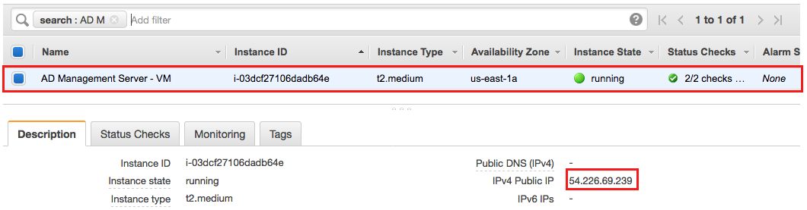
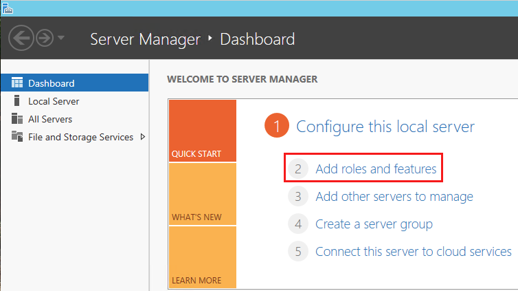
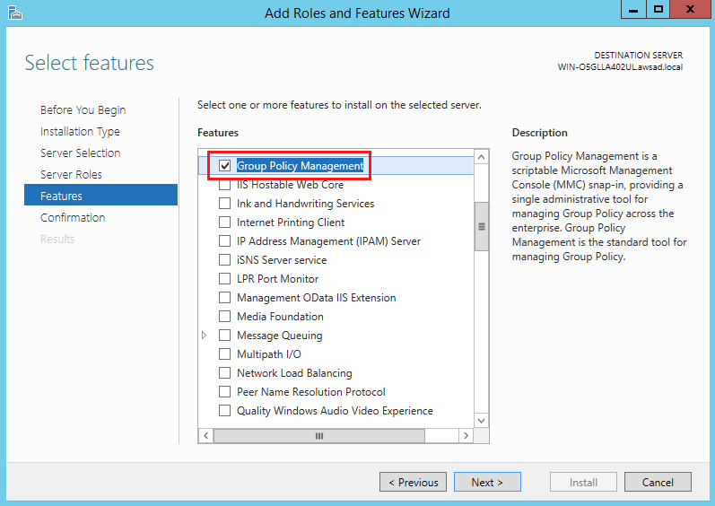

Author: Vinod Madabushi

Version: 1.0

Abstract

In this lab, you will deploy a management server in your VPC and install the
necessary Active Directory tools to manage the data within your AD running on
AWS. We will also demonstrate seamless domain join feature in this lab as you
will use this feature to automatically add the new management server to AD as a
domain member when you deploy it.

Introduction

AWS Directory Service lets you run Microsoft Active Directory (AD) as a managed
service. AWS Directory Service for Microsoft Active Directory, also referred to
as AWS Managed Microsoft AD, is powered by Windows Server 2012 R2. When you
select and launch this directory type, it is created as a highly available pair
of domain controllers connected to your virtual private cloud (VPC).

Since the Domain Controllers (DC’s) are managed by AWS, you cannot login to the
DC’s using Remote Desktop Protocol (RDP). In order to manage the data within the
AWS Managed AD like users, computers, group policy, sites, sitelinks, DNS etc.
you need to login to a management server and perform all the operations from
this server. This management server can be placed anywhere on the network as
long as necessary network connectivity exist between the Domain Controllers and
the member server but typically this is placed on AWS VPC close to the Domain
Controllers.

For more information on AWS Directory service, please visit our [developers
guide](https://docs.aws.amazon.com/directoryservice/latest/admin-guide/directory_microsoft_ad.html).

Prerequisites

To setup the management server for use with AWS Managed AD, you need the
following:

-   Please complete the Lab – Deploying AWS Managed Active Directory.

-   An AWS account with an AWS IAM user / role with privileges to Elastic
    Compute Cloud (EC2) service.

-   If you plan to login to the management server from the Internet, you need to
    deploy the management server in a public subnet in your VPC.

-   All the necessary Active Directory TCP & UDP ports that are required for
    communication between DC’s and member server should be open between AWS
    Managed AD and the management server.

Section 1: Create IAM role for seamless domain join

1.  Login to your AWS Account and open the IAM service.

2.  Under Roles, click on “Create Role”.

3.  Select the AWS service and select EC2 as shown below and click on “Next:
    Permissions”.

    

4.  Under policies, search for “**AmazonEC2RoleforSSM”,** select this policy and
    click **“Next: Tags”.**

    

5.  Enter **“Name”** for the Key and any value you want to use for the tags.
    Click **“Next: Review”.**

6.  For the role name, use **“DomainJoinEC2”** and click on **“Create Role”** to
    complete the role creation.

    

Section 2: Deploying the Management Server

1.  Before you begin the lab, make sure you are in the correct AWS region. For
    this lab, you should deploy the management server in the same VPC as Managed
    AD.

2.  Login to the AWS Console and navigate to Elastic Compute Cloud (EC2).

3.  Click on “Launch Instance”.

4.  For the Amazon Machine Image (AMI), search for “Windows 2012” and select the
    “Microsoft Windows Server 2012 R2 Base” as shown below.

    

5.  For the Instance type, please select an instance type. For this lab, we will
    use **“t2.medium”** for the management server. Click **“Next: Configure
    Instance Details”** after you select the instance type.

    

6.  For the Instance configuration, select your VPC and a public subnet where
    you will deploy this instance as shown. To seamlessly join this domain to
    the AD, select the Domain join directory and IAM role as shown below. Click
    **“Next: Add Storage".**

1.  Leave all the values in the storage page as defaults and click on **“Next:
    Add Tags”.**

2.  Click on **“Add tag”** and enter **“Name”** for the key and **“AD Management
    Server - \<initials\>”** for the value. Click **“Next: Configure Security
    Group”.**

    

3.  Click on **“Create a new security group”** and create the group with values
    as shown below. For this lab, we will allow all traffic from the Internet.
    In your VPC, you should always lock this down to specific IP addresses.

    

4.  Once you verify all the details on this page, click on **“Launch”** to
    launch the EC2 Instance.

5.  Before you can launch the instance, you will need to either create a new key
    pair or select your existing key pair. If you already have a key pair,
    select that key pair and click on **“Launch Instances”.**

Section 3: Installing the Active Directory Tools

1.  You will need to login to the management server using Remote Desktop
    Protocol (RDP) you deployed in the last section to install the Active
    Directory Tools. If you connecting from a Windows computer, RDP should be
    already present. If you are using a mac, please download the RDP client
    [here](https://docs.microsoft.com/en-us/windows-server/remote/remote-desktop-services/clients/remote-desktop-mac).

2.  Log in to the AWS Console and go to Elastic Compute Cloud (EC2).

3.  You can find the public IP / DNS name of your management server as shown
    below.

    

4.  Open your RDP client and connect to the server above. Since our instance is
    already domain joined to the AWS Managed AD, we can directly login to our
    instance with our admin credentials. For the user name use
    **“DOMAIN\\username”** format.

5.  Once you are logged in, open the **“Server Manager Dashboard”** and click on
    **“Add roles and features”.**

    

6.  Click **“Next”** (4 times) till you get to the Features screen and select
    the following features to be installed as shown. Click **“Next”** then click
    **“Install”** to start the install.

    

7.  Once you finish installing the AD DS & DNS tools, follow the same process to
    install the Group Policy Management tool as shown.

    

8.  Once the installation is completed, you can close the Server Manager. The
    Active Directory tools can be found under **Control Panel -\> System and
    Security -\> Administrative Tools** as follows. You can open any of these
    Active Directory tools and start administering your AWS Managed AD.

Conclusion

Congratulations. You have successfully launched a management server that you can
use to administer your AWS Managed AD. For high availability purposes, you can
launch multiple management servers in different availability zones as required.
If you are completed with the lab, you can cleanup all the resources you
deployed in this lab to stop accruing AWS charges.
