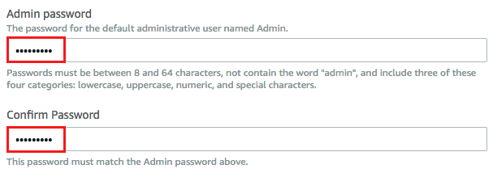

Author: Vinod Madabushi

Version: 1.0

Abstract

In this lab, you will deploy AWS Managed Microsoft AD into an existing VPC you
have already configured for this purpose. Once you finish deploying AWS Managed
Microsoft AD, you will be ready to deploy Windows servers on AWS, and add them
seamlessly to AWS Managed Microsoft AD, setup one or two-way trusts to your
on-premises Active Directory or to another AWS Managed Microsoft AD.

Introduction

AWS Directory Service lets you run Microsoft Active Directory (AD) as a managed
service. AWS Directory Service for Microsoft Active Directory, also referred to
as AWS Managed Microsoft AD, is powered by Windows Server 2012 R2. When you
select and launch this directory type, it is created as a highly available pair
of domain controllers connected to your virtual private cloud (VPC). The domain
controllers run in different Availability Zones in a region of your choice.

With AWS Managed Microsoft AD, you can run directory-aware workloads in the AWS
Cloud, including Microsoft SharePoint and custom .NET and SQL Server-based
applications. You can also configure a trust relationship between AWS Managed
Microsoft AD in the AWS Cloud and your existing on-premises Microsoft Active
Directory, providing users and groups with access to resources in either domain,
using single sign-on (SSO).

For more information on AWS Directory service, please visit our [developers
guide](https://docs.aws.amazon.com/directoryservice/latest/admin-guide/directory_microsoft_ad.html).

Prerequisites

To create an AWS Managed Microsoft AD directory, you need the following:

-   An AWS account with an AWS IAM user / role with privileges to create AWS
    Directory Services and deploy Cloud Formation Templates.

-   A region where AWS Directory service is available. Please refer to [Regional
    products and
    Services.](https://aws.amazon.com/about-aws/global-infrastructure/regional-product-services/)

-   The following ports must be open between the two subnets that you deploy
    your directory into to allow the AWS Managed AD domain to communicate with
    each other. A security group will be created and attached to your directory
    to enable communication between the DC’s.

    -   TCP/UDP 53 - DNS

    -   TCP/UDP 88 - Kerberos authentication

    -   UDP 123 - NTP

    -   TCP 135 - RPC

    -   UDP 137-138 - Netlogon

    -   TCP 139 - Netlogon

    -   TCP/UDP 389 - LDAP

    -   TCP/UDP 445 - SMB

    -   TCP 636 - LDAPS (LDAP over TLS/SSL)

    -   TCP 873 - Rsync

    -   TCP 3268 - Global Catalog

    -   TCP/UDP 1024-65535 - Ephemeral ports for RPC

-   The VPC must have default hardware tenancy.

-   AWS Directory Service does not support using Network Address Translation
    (NAT) with Active Directory. Using NAT can result in replication errors.

Section 1: Deploy new VPC with Subnets

1.  Login to the AWS Console and navigate to the **CloudFormation (CFN)**
    console.

2.  Make sure you are selecting the **us-east-1 “N.Virginia”** region.

3.  Click on **Create stack**

4.  In the Create stack screen, enter the values as shown below and click on
    **Next**.

    -   Prepare Template: Template is ready

    -   Template Source: Amazon S3 URL

    -   Amazon S3 URL: https://s3.amazonaws.com/immersionday-labs/ad-vpc.json

1.  For the stack name, enter **ActiveDirectoryVPC**. Leave the other values as
    is and click **Next**.

2.  For the tags, enter “**Name”** for key and “**AD Lab**” for value and click
    **Next**.

3.  Leave all the values as is in this page and click on **Create Stack**.

4.  It will take a few minutes to deploy the stack. Once stack creation is
    completed, you can look at the VPC’s, Subnets, IGW and Route tables that was
    created in the VPC Console.

>   Section 2: Deploying AWS Managed Active Directory (MAD)

1.  Login to the AWS Console and navigate to Directory Services.

2.  Make sure you are in the correct region by checking on the top right corner
    in the AWS Console.

3.  If this is the first time you are opening the Directory Services in this
    region, you’ll be prompted with a welcome screen. Select “AWS Managed
    Microsoft AD” and click on Set up directory.

1.  If you’ve already worked with the Directory Service in this region, you may
    see the screen below. If you do, please click on **Set up directory**.

1.  In the next screen, select “**AWS Managed Microsoft AD**” and click
    **Next**.

1.  In the Enter Directory Information screen, enter the following information
    as shown below in the screenshot and click **Next.**

    1.  Edition: **Standard Edition**

    2.  Directory DNS name: **awsad.local** [Make this DNS name unique from your
        other directories so you can establish trusts in the future if
        required.]

    3.  Directory NetBIOS name: **AWSAD**

    4.  Directory Description: **This is a managed AD on AWS for the domain
        awsad.local**

    5.  Admin password: **\<use a password you can remember. You will use this
        in future labs\>**

    6.  Confirm password: **\<confirm the password again\>**

1.  For the VPC and subnets, please select the **Active Directory VPC** you
    created in Section 1 and select the two private subnets **AD-MADSubnet1**
    and **AD-MADSubnet2**.

    

2.  Once you click **Next** after selecting the VPC and Subnets, check to make
    sure everything looks correct and click on **Create Directory.**

    

3.  The directory will be in the creating status for about 20-45 minutes as
    shown below:

    

4.  Once the directory is created, you can see the details of the by click on
    the **Directory ID.** The two DNS IP addresses you see here are also the
    Domain Controllers.

Conclusion

Congratulations. You have successfully created a new AWS Managed AD in your VPC.
If you are working on additional labs, the Managed AD you created may be a
pre-requisite. If not, you can go ahead and delete the Managed AD Directory you
created as a part of the cleanup and also delete the **ActiveDirectoryVPC**
CloudFormation stack that you created in section 1.
