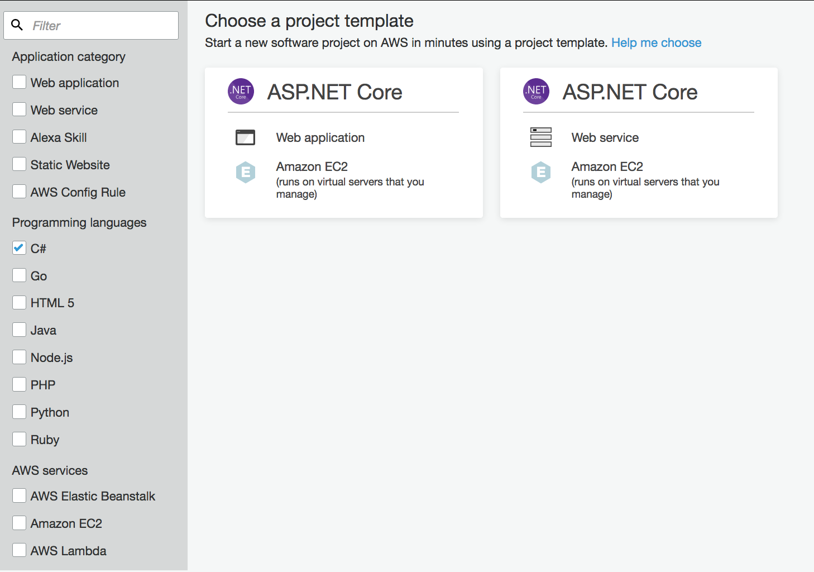
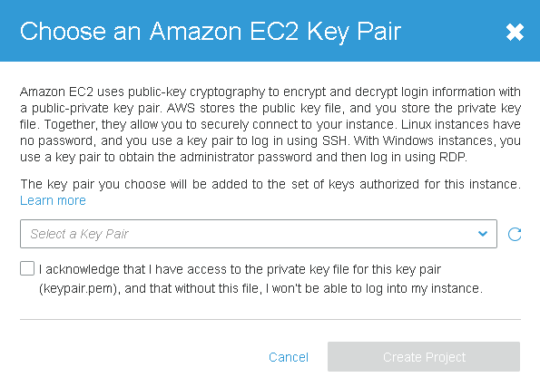
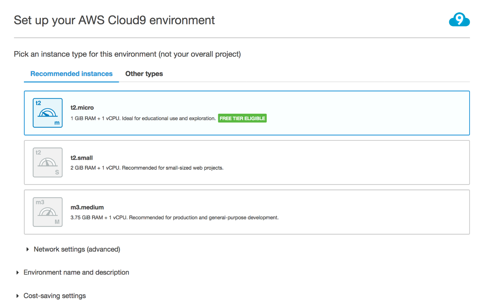
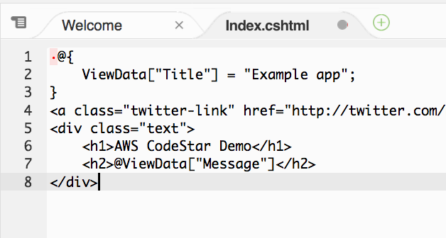

Lab: Deploying a .NET Core App with CodeStar

Author: Baris Furtinalar

Draft version 0.1

Abstract

In this lab, you will use AWS CodeStar and AWS Cloud9 to deploy and configure a
traditional ASP.NET Core web application to Amazon EC2.

Introduction

An AWS CodeStar project creates and integrates AWS services for your project
development toolchain. Depending on your choice of AWS CodeStar project
template, that toolchain might include source control, build, deployment,
virtual servers or serverless resources, and more.

AWS Cloud9 is a cloud-based integrated development environment (IDE) that lets
you write, run, and debug your code with just a browser. It includes a code
editor, debugger, and terminal.

The source code will be stored in AWS CodeCommit which is a fully-managed source
control service that hosts secure Git-based repositories.

With AWS CodeStar you will deploy a sample ASP.NET web application and then
using AWS Cloud9 you will update the content and this will trigger the CI/CD
pipeline created by AWS CodeStar.

Prerequisites

To complete the lab, you need the following requirements:

-   An AWS Account

-   An AWS IAM user with privileges to create/modify AWS CodeStar/Cloud9
    environments

-   Amazon EC2 key pair created for the selected region

Setting Up the AWS Toolkit for Visual Studio

Creating a Sample Web Application Project

In this section, you will be creating a new ASP.NET Web Application in AWS
CodeStar using sample projects.

-   On AWS Console choose AWS CodeStar to open the landing page for the service

-   Choose “Create a new project”

-   In the left pane under programing languages, choose C\#, and then choose
    ASP.NET Core Web Application

    

-   Give your project a name. In this lab we use “myapp” name for the Project
    name and Repository name sections.

-   Choose AWS CodeCommit as your source control system.

    

-   On Review project details; you can see the services that will be configured
    and used by AWS CodeStar.

    

-   Click “Edit Amazon EC2 Configuration” button at the top right corner which
    allows you to choose Amazon EC2 instance type, VPC and Subnet for your
    deployment.

    

-   After reviewing EC2 configuration you can save and hit Create Project to
    deploy your AWS CodeStar project.

-   Choose the key pair and click the acknowledge checkbox to create your
    project

    

-   When you hit Create Project, the deployment process will start and you will
    be presented with the IDE selection page.

-   While deployment is underway, on the “Pick how you want to edit your code”
    page: Choose AWS Cloud9 and wait until “Clone repository URL” is populated
    with the URL of your source control system. (in this example:
    https://git-codecommit.eu-west-1.amazonaws.com/v1/repos/myapp )

    

-   On Set up your AWS Cloud9 environment page choose t2.micro and accept the
    defaults. Click Next.

    

-   It will take a while for your application and IDE environment to be
    deployed.

    

-   When completed you can review all the services and tools from the AWS
    CodeStar Dashboard.

-   Navigate through the AWS CodeStar dashboard which is a single pane of glass
    for the deployed application and all the supporting AWS tools and services
    used.

    

-   You can see the application endpoint on the right side of the dashboard,
    click and visit the default page.

Updating the Sample ASP.NET Core Web Application Project

This part of the lab we will use AWS Cloud9 IDE to update the project source
code. These updates will trigger your continuous deployment pipeline and your
changes will be reflected once the pipeline successfully completes.

-   On AWS CodeStar go to IDE section and choose Open IDE link. Alternatively
    you can go to AWS Cloud9 page on AWS Console.

    

-   On AWS Cloud9 main page for myapp, make sure myapp root directory is chosen
    and then go to console

    

-   AWS Cloud9 command line guides you about how to work with your source
    control system. As shown in the picture below, change the working directory
    from environment to myapp by copy & pasting the part highlighted below.

    

-   Type “git status” to ensure no changes to be committed to the code
    repository.

-   On left pane navigate to the directory shown below and double click
    Index.cshtml document

    

-   The contents of the document is opened on the right side of the editor.
    Change the text within \<h1\> tags and make is something different than “AWS
    CodeStar Demo”.

    

-   Go back to AWS CodeStar command line and type “Git Status” again. See that
    your changes created a delta with the source control system.

    

-   On the command line type the following:

-   Now you pushed the changes to your source control (AWS CodeCommit) this will
    trigger your pipeline. Go back to AWS CodeStar dashboard. On the left review
    the Continuous deployment section.

-   Once the pipeline completes successfully visit the Application endpoint
    again to see that the changes are deployed to your server.

