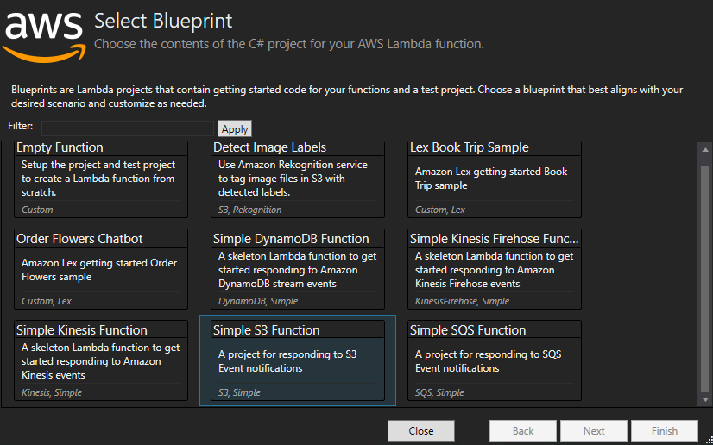
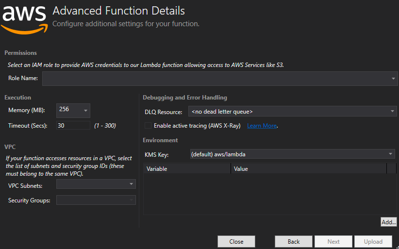

.NET Core Serverless for resize images

Self-Paced Lab

Version 1.0

Duration: 45 minutes

Purpose & Background
====================

In this lab, you will create a simple AWS Lambda project using the Visual Studio
to create a lambda function that will resize a jpg file saved in a bucket into a
different folder in the same bucket. It shows how to configure and associate an
event to a lambda function as well as how to troubleshoot using the CloudWatch
logs.

>   *Note: This Lab includes a small amount of sample code illustrating a
>   pattern for lazily generate resized images. For deploying a service to
>   resize images to production, consider using the* [Serverless Image
>   Handler](https://aws.amazon.com/answers/web-applications/serverless-image-handler/)*,
>   which is a robust solution to handle image manipulation.*

Lab Exercises
=============

The following exercises should be completed in order for this lab:

1.  Create an AWS Lambda Project

2.  Create an S3 bucket and a role

3.  Deploy to AWS Lambda

4.  Create and Associate the S3 Event to your Lambda

5.  Upload files and check the lambda execution

Prerequisites
=============

The following are the prerequisites required in order to complete the lab:

-   Microsoft Visual Studio 2017 or above installed on your computer

-   [AWS Toolkit for Visual Studio](https://aws.amazon.com/visualstudio/)

-   Internet connection

-   AWS Account

Part 1 – Create an AWS Lambda Project
=====================================

Follow the steps below to create and customize an ASP.NET Web Project in Visual
Studio.

1.  In Visual Studio, use File -\> New -\> Project to open the New Project
    dialog.

2.  Under the Web project node, select AWS Lambda and the "AWS Lambda Project
    with Tests (.Net Core)" template, type **Resize-Lambda-Userid** as the name
    for your project, then click the OK button.

1.  In the next dialog, select the "API" blueprint, and select "Simple S3
    Function", then click the Finish button to generate the project.

1.  Right-click on the solution that you have create and select *Manage NuGet
    Packages*:

>   *Note: In this Lab we will use an open-source image library to resize the
>   picture as .net core doesn’t have any built-in classes to work with the
>   images.*

1.  For this Lab we will install an open-source third-party library called
    [ImageSharp](https://github.com/SixLabors/ImageSharp) that is only available
    at the NuGet pre-release. Please, search **SixLabors** selecting the
    **pre-release** check-box.

1.  Select and install the **SixLabors.ImageSharp** and
    **SixLabors.ImageSharp.Drawing** packages.

2.  Replace the Function Handler Method with the code below (code available at
    link):

>   // Copyright \<YEAR\> Amazon.com, Inc. or its affiliates. All Rights
>   Reserved.

>   // SPDX-License-Identifier: MIT-0

>   public async Task\<string\> FunctionHandler(S3Event evnt, ILambdaContext
>   context)

>   {

>   string[] fileExtentions = new string[] { ".jpg", ".jpeg" };

>   var s3Event = evnt.Records?[0].S3;

>   if(s3Event == null)

>   {

>   return null;

>   }

>   try

>   {

>   foreach (var record in evnt.Records)

>   {

>   LambdaLogger.Log("----\> File: " + record.S3.Object.Key);

>   if
>   (!fileExtentions.Contains(Path.GetExtension(record.S3.Object.Key).ToLower()))

>   {

>   LambdaLogger.Log("File Extention is not supported - " + s3Event.Object.Key);

>   continue;

>   }

>   string suffix = Path.GetExtension(record.S3.Object.Key).ToLower();

>   Stream imageStream = new MemoryStream();

>   using (var objectResponse = await
>   S3Client.GetObjectAsync(record.S3.Bucket.Name, record.S3.Object.Key))

>   using (Stream responseStream = objectResponse.ResponseStream)

>   {

>   using (Image\<Rgba32\> image = Image.Load(responseStream))

>   {

>   image.Mutate(ctx =\> ctx.Resize(image.Width / 4, image.Height / 4));

>   image.Save(imageStream, new JpegEncoder());

>   imageStream.Seek(0, SeekOrigin.Begin);

>   }

>   }

>   // Creating a new S3 ObjectKey for the resized objects

>   string resizedObjectKey = null;

>   int endSlash = record.S3.Object.Key.ToLower().LastIndexOf("/");

>   if (endSlash \> 0)

>   {

>   string S3ObjectName = record.S3.Object.Key.ToLower().Substring(endSlash+1);

>   int beginSlash = 0;

>   if (endSlash \> 0)

>   {

>   beginSlash = record.S3.Object.Key.ToLower().Substring(0, endSlash -
>   1).LastIndexOf("/");

>   if (beginSlash \> 0)

>   {

>   resizedObjectKey = record.S3.Object.Key.ToLower().Substring(0, beginSlash) +
>   "resized-images/" + S3ObjectName;

>   }

>   else

>   {

>   resizedObjectKey = "resized-images/" + S3ObjectName;

>   }

>   }

>   }

>   else

>   {

>   resizedObjectKey = "resized-images/" + record.S3.Object.Key.ToLower();

>   }

>   LambdaLogger.Log("----\> Resized filed Key: " + resizedObjectKey);

>   await S3Client.PutObjectAsync(new PutObjectRequest

>   {

>   BucketName = record.S3.Bucket.Name,

>   Key = resizedObjectKey,

>   InputStream = imageStream

>   });

>   }

>   LambdaLogger.Log("Processed " + evnt.Records.Count.ToString());

>   return null;

>   }

>   catch(Exception e)

>   {

>   context.Logger.LogLine(\$"Error getting object {s3Event.Object.Key} from
>   bucket {s3Event.Bucket.Name}. Make sure they exist and your bucket is in the
>   same region as this function.");

>   context.Logger.LogLine(e.Message);

>   context.Logger.LogLine(e.StackTrace);

>   throw;

>   }

>   }

Part 2 – Create an S3 bucket and the Lambda Role
================================================

Follow the steps to create a S3 bucket on the same region that the lambda
function will be created using the AWS Management Console.

1.  Sign in to the AWS Management Console and open the S3 service at
    <https://console.aws.amazon.com/s3>

2.  Please, name you bucket as **dotnet-immersionday-lambda-userid** using the
    region that you have been using during this lab following the steps
    described on the *To create an S3 bucket* at the URL:
    <https://docs.aws.amazon.com/AmazonS3/latest/gsg/CreatingABucket.html>

3.  To create the Lambda role, open the Access Management Access Service by
    accessing <https://console.aws.amazon.com/iam>

4.  In the navigation pane of the IAM console, choose *Roles*, and then choose
    *Create role*.

5.  For *Select type of trusted entity*, choose *AWS service*, select *Lambda*,
    and select *Next: Permissions.*

    

6.  On the filter policies search, type “**LambdaBasic**” and select the
    *AWSLambdaBasicExecutionRole* policy. Also, type “S3Full” at the search
    field and select the *AmazonS3FullAccess* policy. Click on *Next: Review*
    button.

7.  On the *Review* page name your role as “**LambdaBasicAndS3FullRole**”, make
    sure you seeing the two policies added on the step above and click on the
    *Create Role* button.

Part 3 – Deploy to AWS Lambda
=============================

Follow the steps below to deploy the Lambda function.

1.  Right-click your project in Solution Explorer, and select "Publish to AWS
    Lambda" to launch the publishing wizard. See the figure below.

1.  Ensure the "Account profile to use" drop-down and "Region" drop-down are set
    to the profile and region you are using for today's labs. Name your Lambda
    Function as **Resize-Lambda-Userid,** and click **Next**.

1.  Select the Role Name that you have created at the Part 2 of this LAB and
    click on **Upload**.

Part 4 – Create and Associate the S3 Event to your Lambda.
==========================================================

For this lab, we’ll access the AWS Management Console to associate a S3 event to
your lambda function.

1.  Sign in to the AWS Management Console and open the Lambda service at
    <https://console.aws.amazon.com/lambda>

2.  Click on the lambda function name you have published

3.  Add a S3 trigger to the lambda function by clicking on S3 on the left panel.

1.  Configure the Trigger, which you can reach by rolling down the screen;
    select the bucket you have created on the Part 2 on the bucket drop-down,
    select the **PUT** as event type, and enter **images/** as the prefix the
    lambda will be watching, and press **Add**.

>   *Note: The lambda function will save the resized image in a new folder
>   called resized-images within the same bucket. If you don’t define a prefix
>   you lambda function will enter in a recursive loop as every time you save an
>   image in the bucket the lambda function will be triggered.*

1.  Click on **Save** on the top-right corner of the lambda console.

Part 5 – Uploading files and check the lambda function execution.
=================================================================

Now it is time to upload a jpg file to the S3 bucket to test its execution.

1.  Sign in to the AWS Management Console and open the S3 service at
    <https://console.aws.amazon.com/s3>

2.  Click on the S3 bucket you have created.

3.  Create a folder called images, but selecting the **Create Folder** button,
    with no encryption, at the top right of the S3 console. Once you create the
    folder, select the folder.

4.  Upload a test image into your bucket for testing. The blue marble -
    <https://upload.wikimedia.org/wikipedia/commons/9/97/The_Earth_seen_from_Apollo_17.jpg>
    is a great sample image for testing. Please, download the image to your
    local computer.

5.  Click on the **Upload** button at the S3 console. In the dialog box, click
    on **Add files**, select the file above and click **Upload** at the dialog.

1.  After a few seconds, you will notice that a new folder got created in the
    bucket called resized-images. Go to this folder and download the file that
    was resized. It should have gone from 6.2 MB to 93.2KB.

1.  To check the lambda function execution, open the Lambda service at
    <https://console.aws.amazon.com/lambda>

2.  Click on the lambda function that you have created for resizing the image

3.  Select the **Monitoring** tab and click on the **View logs in CloudWatch**

1.  Select the first log stream listed in the Log Group and you will see the
    lambda output and logs; similar to the picture below:

Congratulations! You have deployed a lambda function that is trigger by an S3
event, which performs a task defined into your lambda function. Now go build on
AWS.

Part 6 – Removing all the resources.
====================================

In this part we will remove all the resources that we created in this LAB.

1.  Sign in to the AWS Management Console and open the S3 service at
    <https://console.aws.amazon.com/s3>

2.  Click on the row of the **dotnet-immersionday-lambda-userid** S3 bucket you
    have created, not on the S3 bucket name.

3.  Select **Delete** on the top right of the S3 Console

4.  Type the bucket name on the Delete dialog and confirm.

5.  Open the Lambda service at <https://console.aws.amazon.com/lambda>

6.  Click on the **Resize-Lambda-Userid** Lambda function name you have
    published

7.  On the **Action** Dropdown Button select **Delete**

8.  Confirm that you want to delete the Function

9.  Open the IAM service at <https://console.aws.amazon.com/iam>

10. Click on roles on the left panel

11. Check the **LambdaBasicAndS3FullRole**

12. Click on **Delete role** button on the top left
