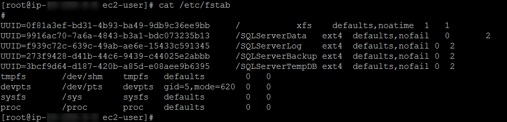

Create your VPC and subnets with CIDR blocks of your choice:
<https://docs.aws.amazon.com/AmazonVPC/latest/GettingStartedGuide/getting-started-ipv4.html>

Create your Windows EC2 instance in the public subnet of your choice, this will
act as the jump server between your public subnet and the sql server 2017
instance running on AWS Linux 2.0 in the private subnet. It is recommended that
you install SQL Server Management Studio onto the Windows jump server so you can
manage db's and such through the UI if need be. You can find the bits at the
following link:
<https://docs.microsoft.com/en-us/sql/ssms/download-sql-server-management-studio-ssms>

Use the following as a reference for connecting to your Linux Instance from
Windows: <https://docs.aws.amazon.com/AWSEC2/latest/UserGuide/putty.html>

Configuring SQL Server while it's running on Linux has changed from SQL Server
running on Windows. In the traditional Windows environment you'd use the SQL
Server Configuration Manager to manage changes to SQL Server services, TCP
ports, startup parameters, or any other instance level configuration
modifications. Microsoft has made configuration a script available named,
"mssql-conf" for Linux based SQL Server workloads. The "mssql-conf" script is
used to set parameters for things such as the default data and log file
location, TCP ports, etc.

1.  When you've successfully connected to the Linux ec2 instance running SQL
    Server, execute the following so you can run commands using the root user
    account:  
      
    sudo su

>   To view volumes/devices you've added to the linux instance, run 'lsblk' and
>   you'll see a list of all EBS volumes you attached during launch.

1.  Because this is an AMI which includes SQL Server 2017, you'll have to reset
    the SA password for the SQL Server instance. To do this, follow the
    instructions below.  
      
    First step, stop the SQL Server instance:  
      
    sudo systemctl stop mssql-server  
      
    Second step, run the following 'mssql-conf' script to reset the SA password:

    **Note**: You'll be asked for the edition, then you'll be prompted to set an
    SA password, then confirm the SA password

sudo /opt/mssql/bin/mssql-conf setup

>   As a best practice, it's recommended to isolate data files from log files
>   for the given SQL Server instance. Before you can change the default
>   directory location(s), you'll have to first create a target directory for
>   new database data and log files. The following example creates a new
>   directory named, **/SQLServerData**. But before doing so, a file system
>   needs to be formatted, a directory created, and that directory mounted to
>   the device (volume).

1.  Format the volume of your choice to use the ext4 filesystem using the
    following:

sudo mkfs –t ext4 /dev/devicename

>   For example: sudo mkfs -t ext4 /dev/xvdc

1.  After the above is complete, create your directory. This example uses
    **/SQLServerData**

sudo mkdir /SQLServerData

1.  Mount the volume to the "/SQLServerData" directory using the following (the
    /dev/xvdc volume for this example):  
      
    sudo mount /dev/xvdc /SQLServerData

2.  Once the volume is mounted on the directory, change the owner and group of
    the directory to the **mssql** user:  
      
    sudo chown mssql /SQLServerData  
    sudo chgrp mssql /SQLServerData

3.  Now that we have the file system configured, directory created/set, volume
    mounted, and permissions granted to the mssql user, we can change the
    default data directory using the 'set' command. The
    **filelocation.defaultdatadir** and **filelocation.defaultlogdir** settings
    change the location where the new database and log files are created. By
    default, this location is /var/opt/mssql/data. To change the settings, use
    the following steps (the example uses /SQLServerData as the default data
    directory):  
      
    sudo /opt/mssql/bin/mssql-conf set filelocation.defaultdatadir
    /SQLServerData  
      
    When you've completed the above step, you'll notice SQL Server needing to be
    restarted in order to apply the new settings. Before doing so, lets also
    mount a different volume to a directory specifically for db log files.

4.  Execute the following command to list the disk(s) you attached to your
    instance  
      
    lsblk  
    

    

      
      
    You can see from the screen shot above that the /dev/xvdc has the
    /SQLServerData mount point.

5.  Once you set the default data directory, you'll be prompted to restart the
    mssql-server service. Do this by executing the following:  
      
    sudo systemctl restart mssql-server

6.  Automount steps –

    Automouting your mount points ensures that they live through a system
    reboot, unlike Windows, Linux requires the fstab file to be updated with the
    mount points you'd like to ensure persist.

7.  Run 'df' to get a list of all mountpoint information in regards to their
    device names, space used, etc.:

    

8.  You can use the system's current device name (/dev/sda1, /dev/xvda1, etc.)
    in /etc/fstab, but it is recommended to use the device's 128-bit universally
    unique identifier (UUID) instead. System-declared block-device names may
    change under a variety of circumstances, but the UUID is assigned to a
    volume partition when it is formatted and persists throughout the
    partition's service life. By using the UUID, you reduce the chances of the
    block-device mapping in /etc/fstab leaving the system unbootable after a
    hardware reconfiguration.

9.  Run 'file –s /devicename' to get the UUID…This example uses the /dev/xvdb
    device name to extract the UUID so we can add it to the fstab file (be sure
    to run 'sudo su' before the file command to elevate your rights):

1.  When you've got the UUID saved onto your clipboard, open the fstab file by
    running the following command: 'nano /etc/fstab'

1.  Add a new line to the top of the fstab file, paste in the specific UUID for
    the device, add the mount point (this example uses /SQLServerData), enter
    the filesystem type (ext4 for this example), and the mount options
    (reference step 7c for more information in
    <https://docs.aws.amazon.com/AWSEC2/latest/UserGuide/ebs-using-volumes.html>):

    

2.  To save the change(s), Control X, and then type 'Y' to confirm to save. Nano
    will prompt you what file name to save to, but if you hit the enter key,
    it'll save it to the same file name (fstab).

3.  Repeat the above steps for every mount point and device you wish to persist
    through reboots. To confirm that the devices have been successfully saved
    onto the /etc/fstab file, run 'cat /etc/fstab':

    

>   To get a list of how to apply all of the SQL Server best practices
>   (separating all database files, TempDB, backup file directory, along with
>   setting trace flags), please follow steps outlined in the following blog:
>   <https://aws.amazon.com/blogs/database/configuring-sql-server-2017-on-amazon-linux-2-and-ubuntu-amis/>
