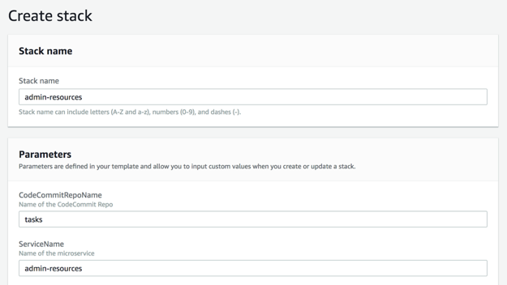
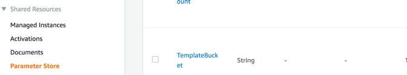

# Admin: Deploy IAM policies, roles and KMS keys

In this section, you will deploy all the IAM policies, roles and KMS keys to be used later with deployment pipelines. You need admin privileges for this section.

1. Go to CloudFormation service
2. Deploy this template from this Amazon S3 URL:
<https://s3-us-west-2.amazonaws.com/vending-pipelines-reinvent/admin-resources-single.yml>
3. Provide a stack name and press Next

4. Click Next and again and then select the checkbox on review page. Click Create Stack

5. When the stack creation is complete navigate to AWS Systems Manager console and note the parameters created in the Parameter Store. Click on TemplateBucket parameter and copy the value. This will be referred to as your “TemplateBucket”.

6. Download this [zip](https://s3-us-west-2.amazonaws.com/vending-pipelines-reinvent/template-bucket.zip) file, expand its content and copy them all to the root of your TemplateBucket

## What we accomplished:

- As a Tooling team, we created the necessary resources for Application Teams to create and use the CI/CD pipeline