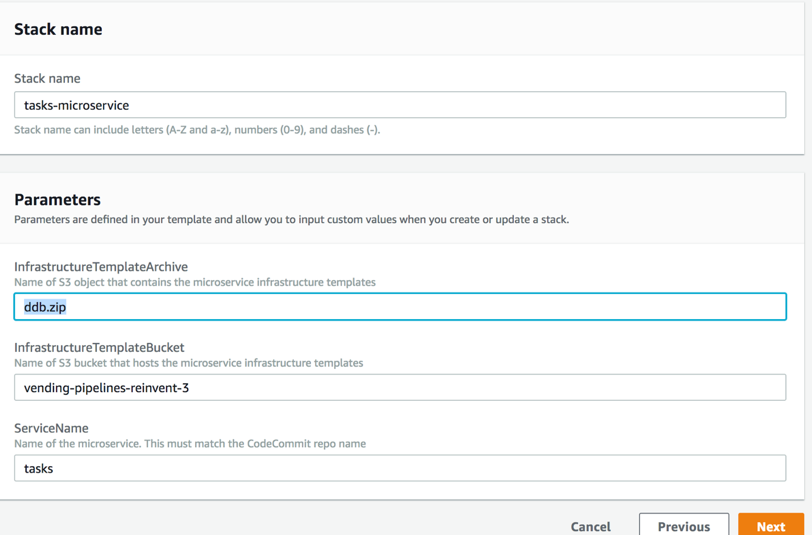
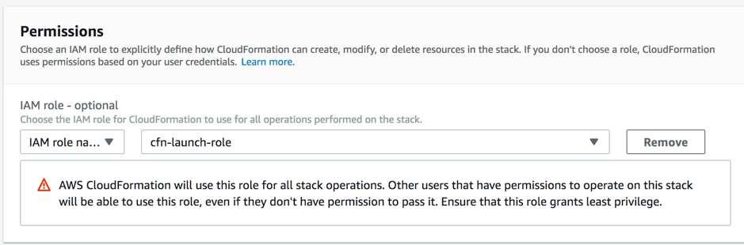
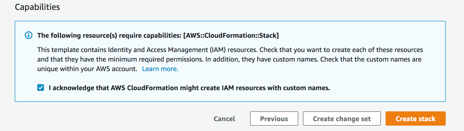

# Developer: Create and deploy centrally provide pipeline

In the previous section, we created all the necessary IAM policies/roles, CodeCommit repository and KMS keys. Developers have been authorized to use a central CloudFormation template to deploy pipelines. Suggested permissions for developer role can be found in Appendix A. You will deploy a sample application using the deployment pipeline product. For the purposes of this session, you can continue using the Admin privileges. 

1. Go to CloudFormation service
2. Deploy this template from this Amazon S3 URL:
<https://s3-us-west-2.amazonaws.com/vending-pipelines-reinvent/sc-microservice-serverless-single.yml>
3. Pass the following parameters and then click Next. Provide TemplateBucket value noted in section 1 as the InfrastructureTemplateBucket parameter

4. In the permissions sections, use this IAM Role: cfn-launch-role. Click Next

5. Select the checkbox on review page and click Create Stack

1. Go to AWS CodePipeline service and watch the pipelines being created.  

If  you see two newly created pipelines, you have successfully completed this section. 

## What we accomplished:

- As Application team, we used the CI/CD pipeline provided by the Tooling team to build, test and deploy code
- In the next section, we will push code and see the pipeline in action