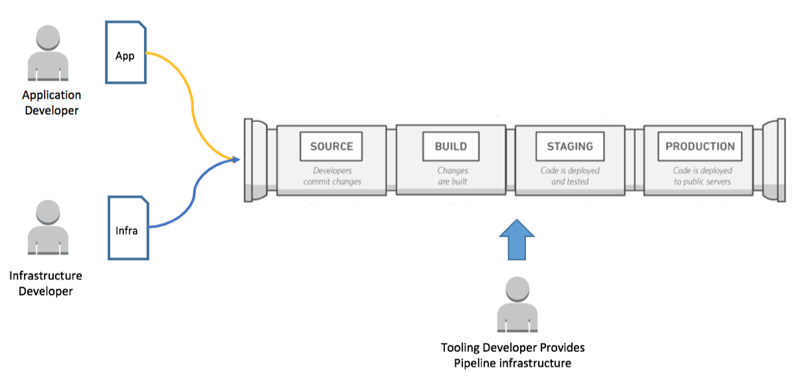

# DEV332-R 

**Session: Empower Lean Teams with Centrally Governed CI/CD Pipelines Using AWS CodePipeline & AWS Service Catalog**

AWS recommends organizing three developer teams for implementing a CI/CD environment: an application team, an infrastructure team, and a tools team. 

This session will describe how to centrally provide a pipeline product for Application team to deploy a serverless application. Similar pipeline products can be built for other deployment options such as container deployments.

The guide has four sections:

1.	Deploy IAM policies, roles and KMS keys
2.	Cloud Admin: Centrally vend deployment pipelines
3.	Developer: Deploy a sample serverless application using the provided pipelines
4.	Developer: Push sample code and check the pipeline activity

Let's look at the prerequisites before we proceed. 

