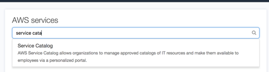
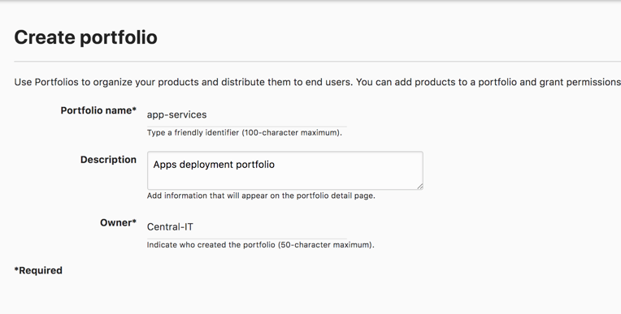
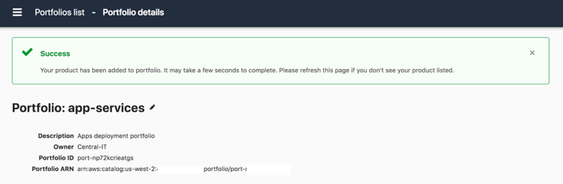
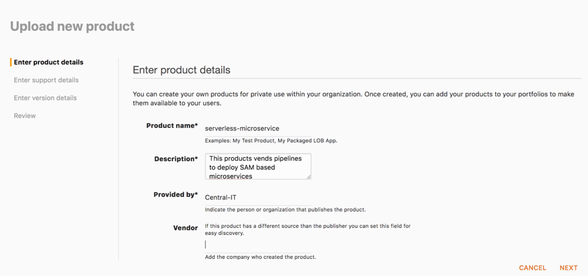
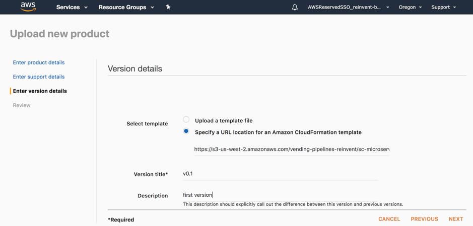
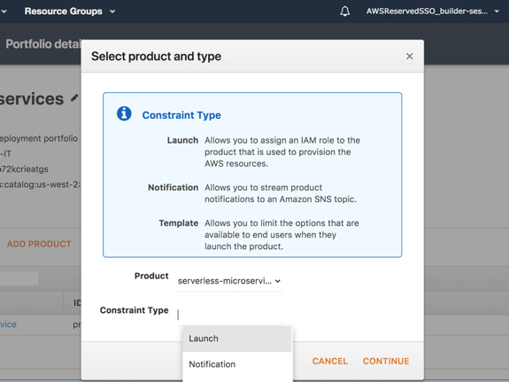
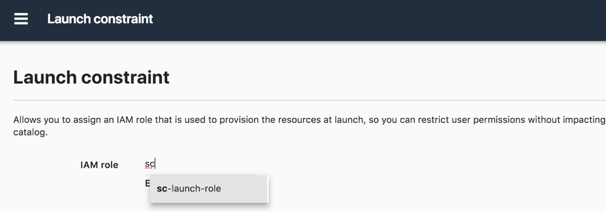
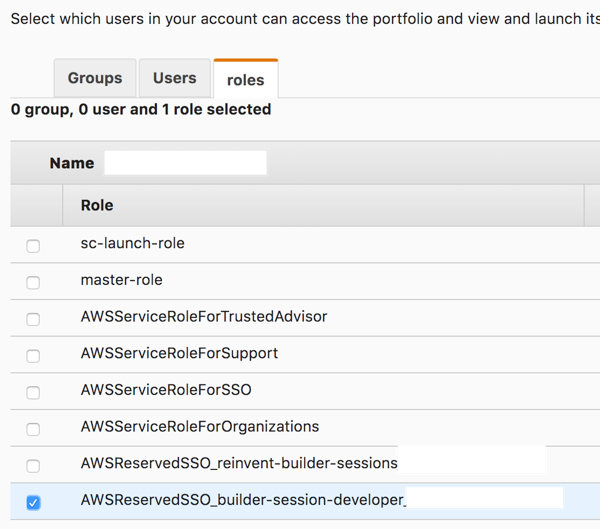

# Cloud Admin: Centrally vend deployment pipelines

A Cloud Admin is part of a Tooling team that provides latest tools to empower developers releasing
their applications. The Cloud Admin will create CloudFormation templates that incorporate all best
practices and security controls. (S)he will then have to distribute those templates effectively to
developers ensuring they can get latest versions of those templates once available.
Service Catalog is one AWS service that might help in sharing those templates as “Products” with
version and permissions management options. 

1. Search for "Service Catalog" on the top

2. To create a new Portfolio – a collection of products- provide the following details:
    1. Portfolio name: ‘App-Services’
    2. Description: *Enter a description to your portfolio*
    3. Owner: ‘Central IT’

3. Click **Create**. The portfolio should now be created, ready for you to upload products

4. Click on the portfolio name and when redirected click on **UPLOAD NEW PRODUCT**. Enter
product details as below:

5. Click Next and Next again. Select Specify a URL location for an Amazon CloudFormation
template. Specify the following URL for the template:
<https://s3-us-west-2.amazonaws.com/vending-pipelines-reinvent/sc-microservice-serverless-single.yml>
6. Enter a version for example ‘v0.1’

7. On the Review page, verify that the information is correct, and then choose **Create**
8. In the Portfolio page, expand the **Constraints** section. Here you will add a Launch Constraint
that will ensure when a developer deploys the product, the specified IAM Role will be used
with those predefined permissions. An IAM Role called “sc-launch-role” has already been
created for you. Click **ADD CONSTRAINTS** and then select the product you just created.
Select **Launch** as the Constraint Type then click **Continue**

9. Enter ‘sc-launch-role’ for the IAM Role and then click **Submit**

10. Again on the portfolio page, expand the **Users, groups and roles** section and click **ADD USER,
GROUP or ROLE**. Click the ‘roles’ tab and select the IAM role starting with
‘AWSReservedSSO_builder_session_developer’ and click **ADD ACCESS**. Now you have
authorized developers to provision this product

*Your Service Catalog configuration is now ready! Proceed to next section...*

