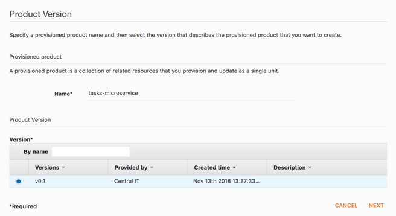
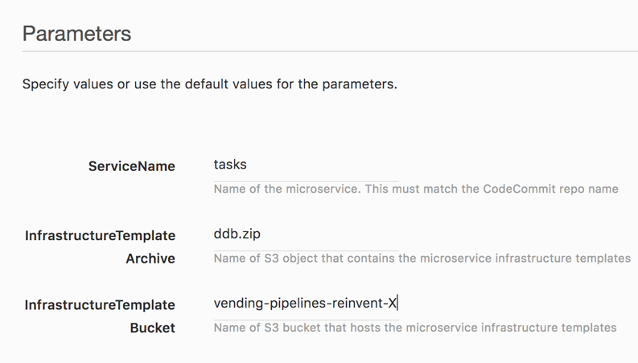

# Developer: Deploy a sample serverless application using the provided pipelines

Now the cloudformation template used to create a deployment pipeline can be provisioned using
Service Catalog. Developers have been authorized to use this template. You will now login again to
the AWS console but this time using a developer role. You will deploy a sample application using the
deployment pipeline product. 

1. Go to ‘Service Catalog’ and click on the product with the same name you created in section 1
2. Click **LAUNCH PRODUCT** and enter product details as below. In this section, we are
deploying an API called ‘tasks’. We will call the product ‘tasks-microservice’. Click **Next**

3. Pass the following parameters and then click Next. Provide TemplateBucket value noted in
section 1 as the InfrastructureTemplateBucket parameter:

4. Keep clicking **Next** till you reach the Review page and then click **Launch**
5. The product launch will take at least 10 minutes. Go to AWS CodePipeline service and watch
the pipeline being created. Notice that a second pipeline will be created eventually. 

*Note: Ignore error messages like “not authorized’ on the console as the developer role does not have all permissions*

