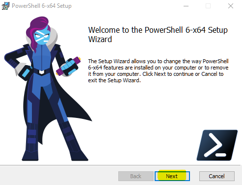
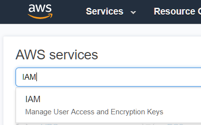
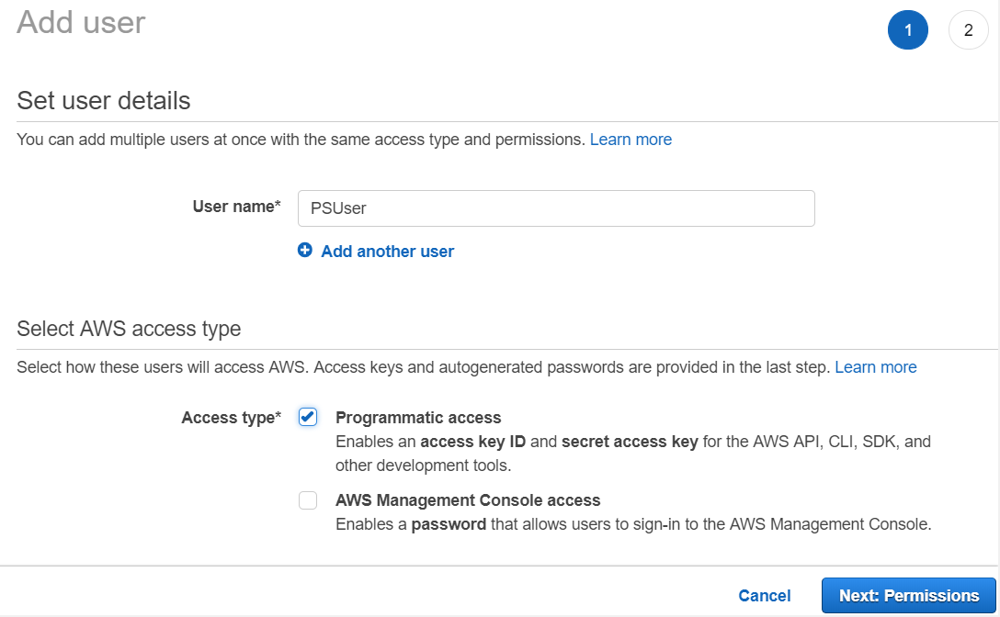

# Requirements

For this session you will need a laptop with **Remote Desktop Services client**. If you are running Windows, you will already have one installed, but if you are on a Mac, you will need to install a client. You can download the Microsoft Remote Desktop Services client by clicking [here](https://itunes.apple.com/us/app/microsoft-remote-desktop-10/id1295203466) (or navigate to https://itunes.apple.com/us/app/microsoft-remote-desktop-10/id1295203466).

## Downloading and installing PowerShell Core

AWS Tools for Powershell Core depend on presence of Powershell Core on the machine. PowerShell Core is a distinct set of tools and components that is shipped, installed, and configured separately from Windows PowerShell and does not come pre-installed. Thus the first thing we need to do is to Install Powershell Core.

1. To install PowerShell on a Windows client or Windows Server (works on Windows 7 SP1, Server 2008 R2, and later), download the MSI package from Microsoft GitHub [releases](https://github.com/PowerShell/PowerShell/releases/download/v6.1.0/PowerShell-6.1.0-win-x64.msi) page (or navigate to URL https://github.com/PowerShell/PowerShell/releases/download/v6.1.0/PowerShell-6.1.0-win-x64.msi). The **Save As** dialog will pop-up - navigate to some folder (usually, **Downloads**) And click **Save** button:

   

2. Navigate to the downloaded MSI file, right-click the ```PowerShell-6.1.0-win-x64.msi``` file and select ```Install``` from the context menu. Click ```Next``` in the Powershell setup dialog:

    

   and proceed with the installation.

3. Following successful installation, a new icon  will appear in the ```Windows``` menu - righ-click this icon and select 

4. If you have Mac laptop, please follow installation instructions at this **[link](https://docs.microsoft.com/en-us/powershell/scripting/setup/installing-powershell-core-on-macos?view=powershell-6)**

To verify Powershell Core installation, click on the  button and in the command window enter the following command: ```$psversiontable``` - if installation is successful, you should get the following reply in the window:

    

## Installing AWS Tools for Powershell Core

To install  open Powershell Core console in Administrative mode (right-click PowershAWS Tools for Powershell Coreell Core icon and select **`Run as Administrator`** from the context menu) and execute the following script

> Start your powershell as Administrator.

> MacOS and Linux don't support `Set-ExecutionPolicy` cmdlet, they run "unrestricted" by default, so please ignore respective line in the script below


```powershell
Set-ExecutionPolicy Bypass -Scope Process -Force
Set-PSRepository PSGallery -InstallationPolicy Trusted
Install-Module -Name AWSPowerShell.NetCore
```
To verify installation of AWS Powwershel Core, run the following command

```powershell
Get-InstalledModule AWSPowerShell.NetCore
```

If installation is successful, you will see the following screen:


## Configuring credentials for AWS Tools for Powershell Core

All **`AWSPowerShell.NetCore`** cmdlets accept AWS Access and Secret keys or the names of credential profiles when they run. When running on Windows, **`AWSPowerShell.NetCore`** module have access to the AWS SDK for .NET credential store file (stored per-user in **`AppDataLocalAWSToolkitRegisteredAccounts.json`** file). This file stores credentials in encrypted format by using Windows crypto APIs and cannot be used on a different machine. This file is the first to be inspected by the **`AWSPowerShell.NetCore`** module when looking for a credential profile, and is also where it stores new credential profiles. 

As Windows crypto API is not available on other platforms, a different mechanism for managing **`AWSPowerShell.NetCore`** credentials is used on MAC and Unix platforms. For details on how to set up credentials for **`AWSPowerShell.NetCore`** module on other platforms please check this **[link](https://aws.amazon.com/blogs/developer/introducing-aws-tools-for-powershell-core-edition/)**

To obtain AWS Access and Secret keys to establish **`AWSPowerShell.NetCore`** credentials, you will have to connect to AWS account and create a user that will provide credentials for **`AWSPowerShell.NetCore`** module.

For this session, we have provisioned an AWS account, which you will be using to create various AWS resources using AWS Tools for Powershell Core. You will have been handed account details by the Builder Session staff; this information contains an AWS account ID, as well as a username and password to connect to the account. Locate this information; if you do not have this information, indicate to the event staff that you need assistance.

1. Navigate your Web browser to https://console.aws.amazon.com. If you have an existing account, you will need to log out of this account.

2. In the “Sign in” dialog that appears, enter the account ID and click Next

    

3. You will then be prompted for an IAM user name and password. Enter this information and click “Sign In.”

     

4. In the AWS console navigate to Identity and Access Management (IAM) service:

     

5. In the IAM Console select **`Users`** and then click **`Add user`**

    

6. Enter user name (e.g. **`PSUser`**), check the checkbox near the **`Programmatic access`**, and then click **`Next: Permissions`** button:

    

7. On the next screen select **`Attach existing policies directly`**, check the checkbox next to **`AdministratorAccess`** policy (**NOTE:** *In real life you should select or configure policies specific to the tasks that this user will be allowed to perform, but for this Builder session we will not go into these details*), and then click **`Next: Review`** button:

    
    
8. Review your settings and click **`Create User`** button:
    
    
    
9. It is very important that on the following screen you click **`Download .csv`** button - this is your only chance to view or save **`Access key ID`** and **`Secret access key`** for just created user:
    
    
    
10. In the pop-up dialog navigate to some folder (e.g. **`Downloads`**) and click **`Save`** button:
    
    
    

## Setup AWS Powershell environment

#### Import Powershell Core into your session

Through the rest of the session you will be working with AWS cmdlets; to make them available, they need to be imported into your Powershell session using the following command:

```powershell
Import-Module AWSPowerShell.NetCore
```

#### Set AWS Credentials on your Powershell console. Insert your own AccessKey and SecretKey

The **`.csv`** file downloaded in step 10 above contains **`Access key ID`** and **`Secret access key`** that will be used to provide credentials for **`AWSPowerShell.NetCore`** module. Open this file and copy your **`Access key ID`** and **`Secret access key`** into the following script:

```Powershell
Set-AWSCredential -AccessKey <access-key> -SecretKey <secret-key> -StoreAs default
```
After you execute this script, your credentials will be saved as default AWS Powershell Core credentials and can be used in subsequent scripts.

#### Set Profile, Region and Execution Policy

```powershell
Initialize-AWSDefaults -region us-west-2
Set-DefaultAWSRegion -Region us-west-2
```