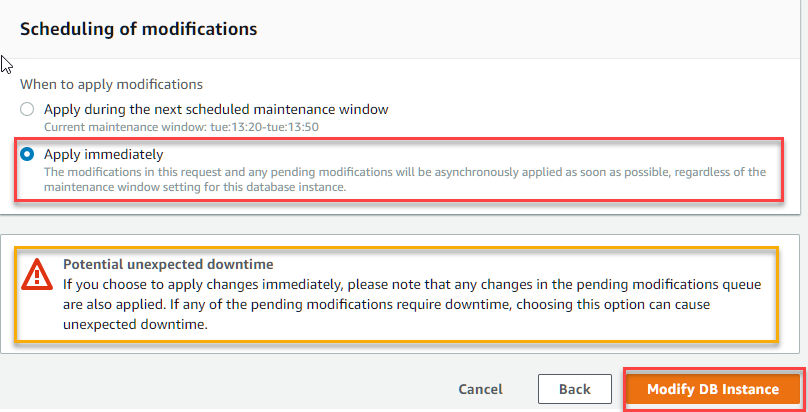

1.	In the RDS navigation pane, choose **Instances**, and then select the **Instance** that you want to modify  
  
2.	Choose  **Modify**. The Modify DB Instance page appears  
  
3.	In Option Group section, select the newly created option group  
  
4.  Click **Continue** to proceed to the next page  
  
5.	For the purposes of the demo, choose **Apply Immediately** so the changes are immediately applied to the **Instance**  
6.	Click on Modify DB Instance to Continue.
  
7.	If you go back to the **Instances Section**, you would be able to see that the status of the Instace is **Modifying**, which should change back to **Available** once complete  
  