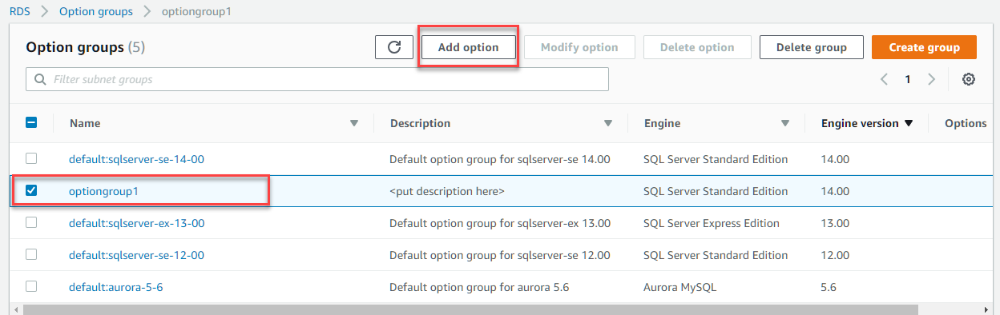
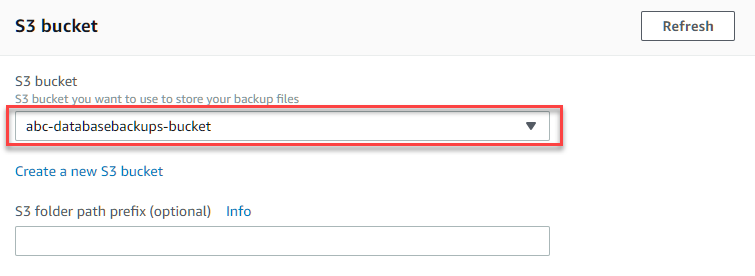
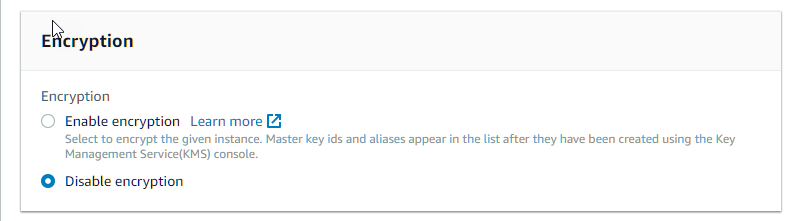

1.	Select the **Option Group** that you want to modify, and then choose **Add Option**  
  
2.	Add the **SQLSERVER_BACKUP_RESTORE** option to the Option Group  
  
3.  For **IAM Role**, for the purposes of the demo, **Choose New Role**  
 
4.  For the **S3 Bucket**, select the bucket that was recently created, that stores the backup files.
 
5.  For **Encryption**, you can choose either  
 
6.	Select **Yes** on **_Apply Immediately_**, and continue on to **Add Option**  
 