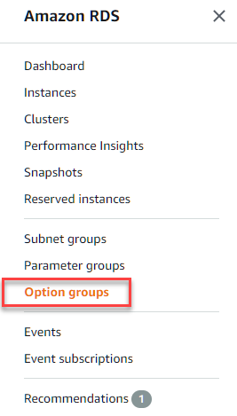
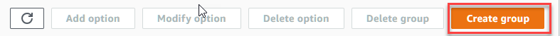

1.	**Sign In** to the AWS Management Console and open the Amazon RDS console at [https://console.aws.amazon.com/rds/](https://console.aws.amazon.com/rds/)
2.	In the navigation pane, choose **Option Groups**  

3.	Choose **Create Group**  

4.	In the Create option group window, do the following:
	1.  For **Name**, type a name for the option group that is **_Unique_** within your AWS account. The name can contain only letters, digits, and hyphens.
	2.  For **Description**, type a brief description of the option group. The description is used for display purposes.
	3.  For **Engine**, choose the DB engine that _matches the target RDS SQL Instance_
	4.  For **Major Engine Version**, choose the major version that _matches the target RDS SQL Instance_  

5.	To continue, choose **Create**  