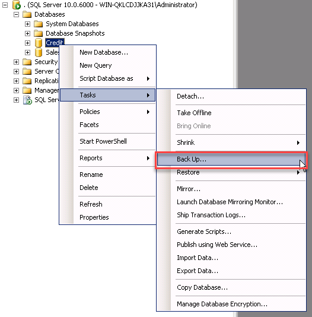

1.	After connecting to the SQL Server instance in **Object Explorer**, click the server name to expand the server tree.
2.	Expand **Databases**, and either select a user database (**SalesDB** or **Credit**) 
3.	Right-click the database, point to **Tasks**, and then click **Back Up**. The **Back Up Database** dialog box appears.  

4.	In the **Database** drop-down list, verify the database name. Optionally, you can select a different database from the list.  
  
5.	In the **Backup Type** drop-down list, select **Full**.
6.	For **Backup Component**, select the **Database** radio button.
7.	In the **Destination** section, use the **Back Up** to drop-down list to select the backup destination. Please keep a note of the backup up location as in the next step you have to upload the backup file to S3.
8.	Click OK to take the Full backup of the database.
