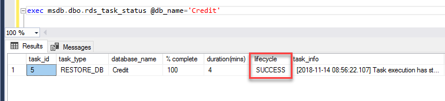

##Reference - [_Importing and Exporting SQL Server Databases_](https://docs.aws.amazon.com/AmazonRDS/latest/UserGuide/SQLServer.Procedural.Importing.html)##

###Restoring a Database###

To restore a **Database** from S3, we will be utilizing the **_msdb.dbo.rds_restore_database_** stored procedure located under the **msdb** system database.

For the purposes of the demo, we will be Restoring **without** Encryption  
Syntax:  
```
exec msdb.dbo.rds_restore_database 
     @restore_db_name='database', 
     @s3_arn_to_restore_from='arn:aws:s3:::bucket_name/file_name_and_extension';
```  

1.  Open up a **New Query Window**, and using the example above, execute the aforementioned stored procedure under the **_msdb_** database:  
  

2.  Once executed, the task will be queued, you can then check the status by using the **_msdb.dbo.rds_task_status_** stored procedure:  
Syntax:  
	`exec msdb.dbo.rds_task_status @db_name='database_name';`  
	
  
	- To cancel any given task, you can use the **_msdb.dbo.rds_cancel_task_** stored procedure  
    Syntax:  
		`exec msdb.dbo.rds_cancel_task @task_id=1234;`  
	- Restore times vary (from a few minutes, to around 30 minutes)  
	- **For more on the different statuses, please see the Reference link above**  

3.  Once the task status shows **SUCCESS**, the Restore is complete.

    - To Verify, you can see the new restored database on the **Object Explorer** pane on the left  
	