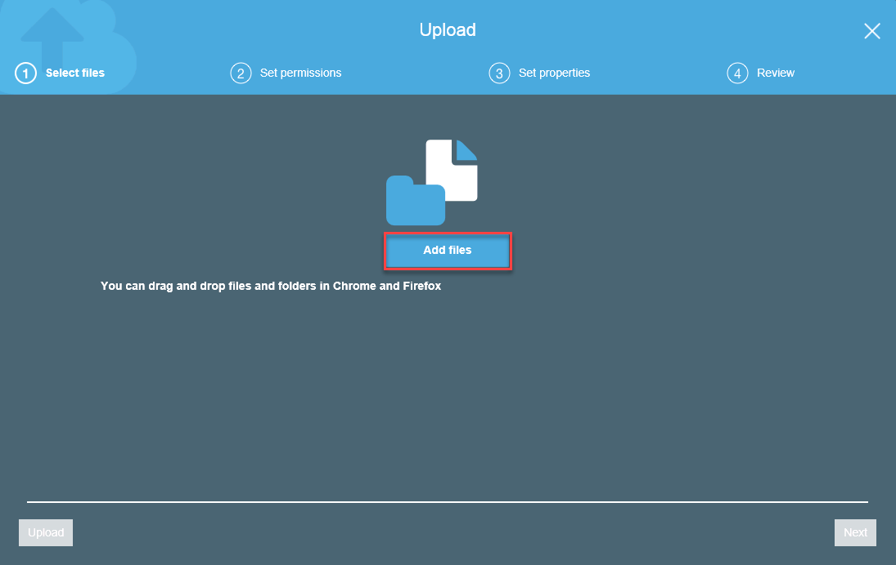

1.  While logged in the Source EC2 Server, sign back in to the AWS Management Console and open the Amazon S3 console at [https://console.aws.amazon.com/s3/](https://console.aws.amazon.com/s3/).
2.  In the **Bucket Name** list, choose the name of the bucket that you want to upload your object to:  
  
3.  5.	Choose **Upload**
  
4.  In the **Upload** dialog box, choose **Add files** to choose the file to upload.
  
5.	Choose a file to upload _(in this case, our backup file/s .bak)_, and then choose **Open**
  
6.  Choose **Upload**  
  