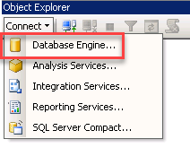

1. Go and click on the SSMS icon on the Desktop, or go to Start and click on the Microsoft SQL Server management studio.  

2. The first time you run SSMS, the _Connect to Server_ window opens. If it doesn't open, you can open it manually by selecting **Object Explorer** > **Connect** > **Database Engine**.  

3.	In the **_Connect to Server_** window, do the following:
 * For Server type, select **_Database Engine_** (usually the default option).
 * For Server name, enter the name of your SQL Server instance. (For this demo, since the DB engine resides in the same server, you can specify "**localhost**", "**.**", or the **hostname**)  

 * For Authentication, select **Windows Authentication**.  
 * After you've completed all the fields, select **Connect**  
 * Example of successful connection  
