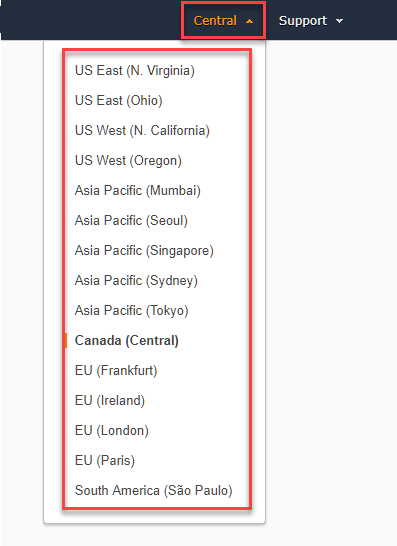
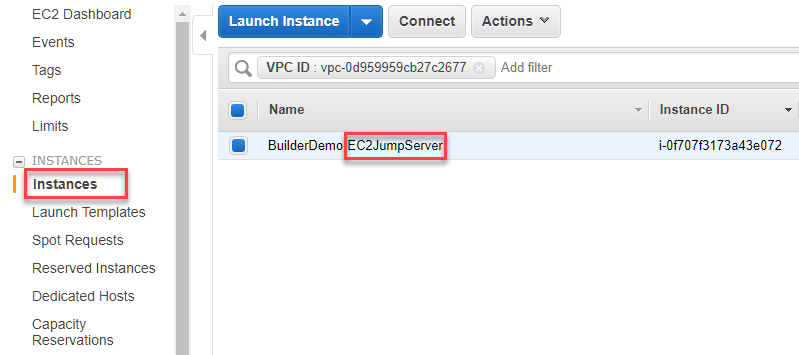
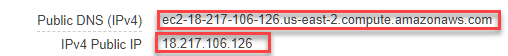

1.	**Sign In** to the AWS Management Console and open the Amazon EC2 console at [https://console.aws.amazon.com/ec2/](https://console.aws.amazon.com/ec2/)  
2.  Choose the **Region** on the upper-right hand side, where the _**_Target_** EC2 Instance resides_
  
2.  On the left navigation pane, go to **Instances** and select the EC2 Instance (for this demo, Name Tag should have **_EC2JumpServer_** suffix)  
  
3.  Grab either the **Public DNS** or the **Public IP** as your primary connection info
  
4.  **Password** will be given by **Facilitator**