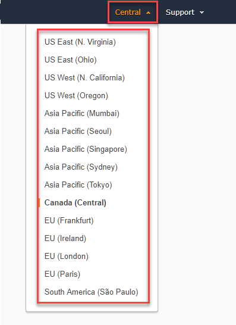
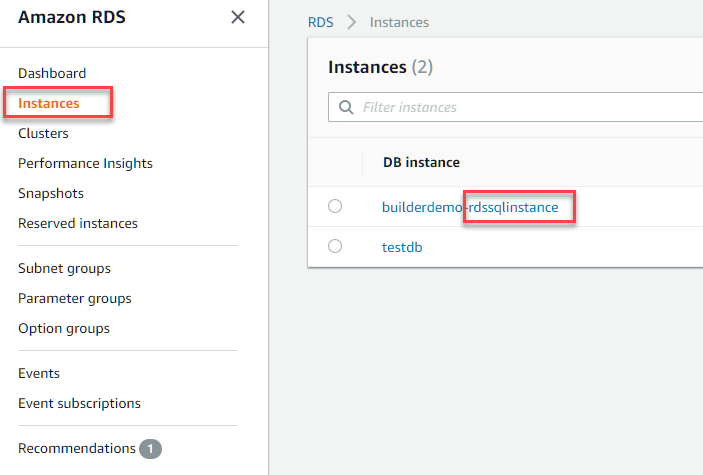
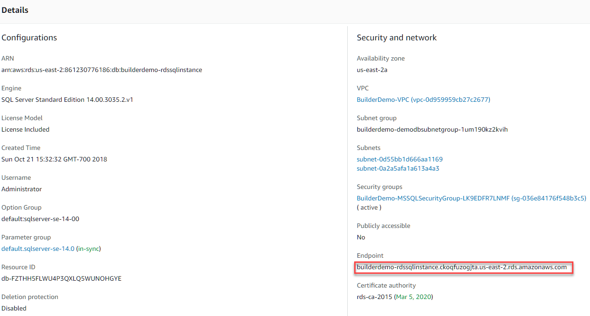

1.	**Sign In** to the AWS Management Console and open the Amazon RDS console at [https://console.aws.amazon.com/rds/](https://console.aws.amazon.com/rds/)  
2.  Choose the **Region** on the upper-right hand side, where the _**_Target_** RDS Instance resides_
  
2.  On the left navigation pane, go to **Instances** and click on the RDS Instance (for this demo, Name Tag should have **_rdssqlinstance_** suffix)  
  
3.  Under the **Details** Section, grab the **EndPoint** information, which will serve as the primary connection info for your RDS Instance
  
4.  **Password** will be given by **Facilitator**