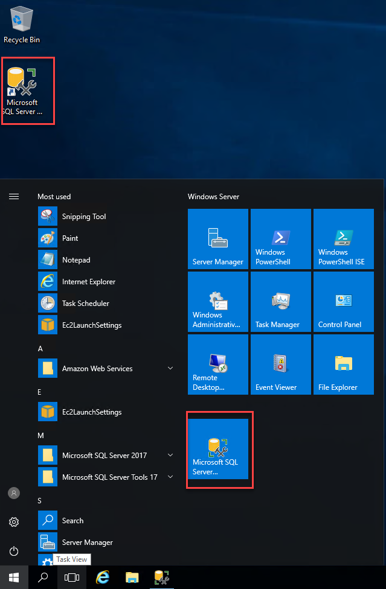
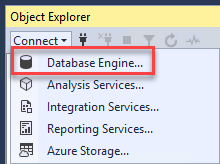
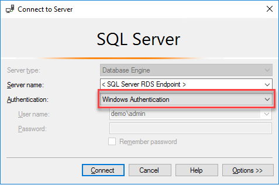

1. Go and click on the SSMS icon on the Desktop, or go to Start and click on the Microsoft SQL Server management studio.  

2. The first time you run SSMS, the _Connect to Server_ window opens. If it doesn't open, you can open it manually by selecting **Object Explorer** > **Connect** > **Database Engine**.  

3.	In the **_Connect to Server_** window, do the following:
    * For Server type, select **_Database Engine_** (usually the default option).
    * For Server name, enter the **_Endpoint_** of your **SQL Server RDS Instance**.
    
    * For Authentication, you have 2 methods:
        * **Windows Authentication** - You can use the **domain\admin** account and password
        
        * **SQL Server Authentication** - You can use the local admin credentials
        
4.  After you've completed all the fields, select **Connect**  
    * Example of successful connection  
    