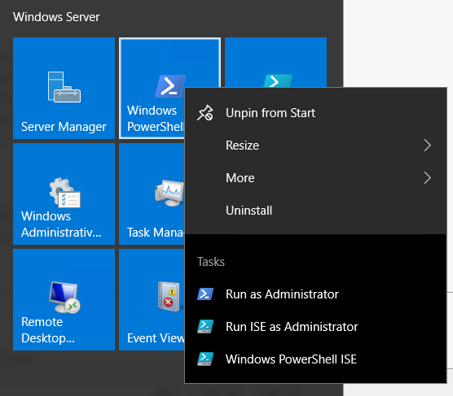

Connect and Verify the Cluster
==============================

1. Using the credentials and IP provided, connect to your assigned STDxADM server via RDP.  
2. Launch PowerShell as Administrator

  
3. Set your nodes to the `$nodes` variable with the command `$nodes = "STDxSQL1", "STDxSQL2"`  
4. Launch the Failover Cluster Manager, if needed connect to your cluster 'STDxWSFC'
	- Launch the Failover Cluster Manager using comand 'Cluadmin.msc'  
5. Verify the Cluster is online and healthy. Note the passive Cluster IP will be offline and is expected.

