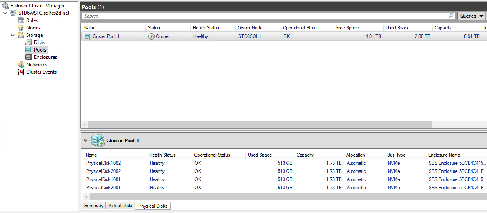
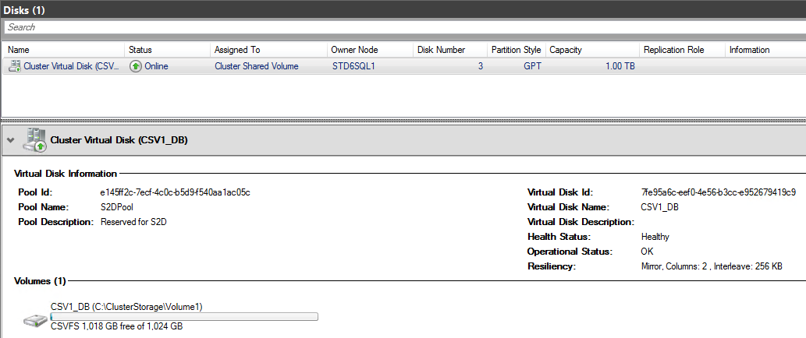

Enable S2D and Provision Storage
================================

Since we are using I3.4xlarge and only have one type of disk in our setup (localNVMe), we won't use any disks as a cache disk.  

By default, the enable-ClusterS2D command creates a pool using all of the disks available in the cluster. This command configures a storage pool name of "S2DPool".  

1. Enable S2D using PowerShell.
	- Enable storage space direct on i3 with the command `Enable-ClusterS2D -PoolFriendlyName S2DPool -Confirm:$false -CimSession $nodes[0]`
	- Note: If using m5d or r5d instance types with a mix of NVMe and EBS. NVMe disks would be used as cache disks and the command would be different.

  
2. Create a 1TB Cluster Shared Volume (CSV) using the [New-Volume](https://docs.microsoft.com/en-us/powershell/module/storage/new-volume?view=win10-ps) command.  

```
### create CSV - 1TB - fixed - ReFS - 64k
$Params = @{
FriendlyName = 'CSV1';
FileSystem = 'CSVFS_ReFS';
StoragePoolFriendlyName = 'S2DPool';
Size = 1TB;
AllocationUnitSize = 65536;
ProvisioningType = 'Fixed';
CimSession = $nodes[0];
}
New-Volume @Params
```  
The S2D resources will show up in the *Failover Cluster Manager* for you to manage and review. The volume will list the friendly name, capacity, and the node currently hosting the CSV in addition to other data.  
  
To view your Cluster Shared Volume, go back to or open the cluadmin.
	- Expand the Cluster
	- Expand Storage
	- Select “Disks”
  
