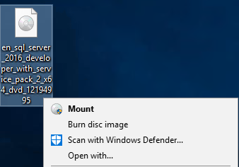
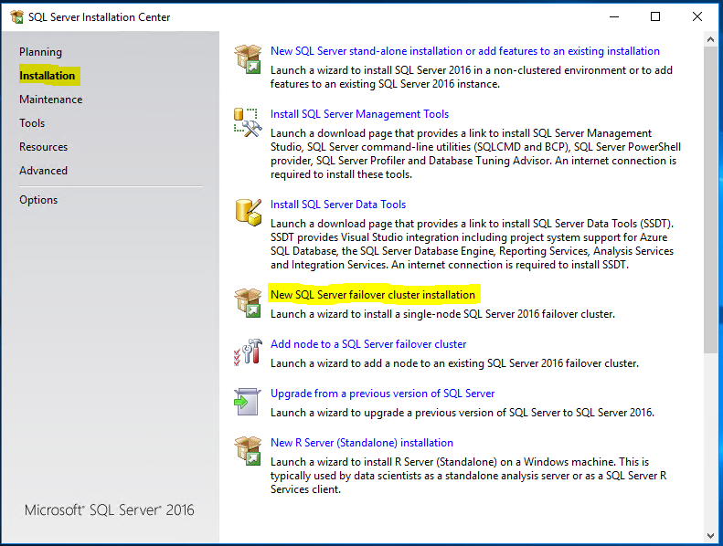
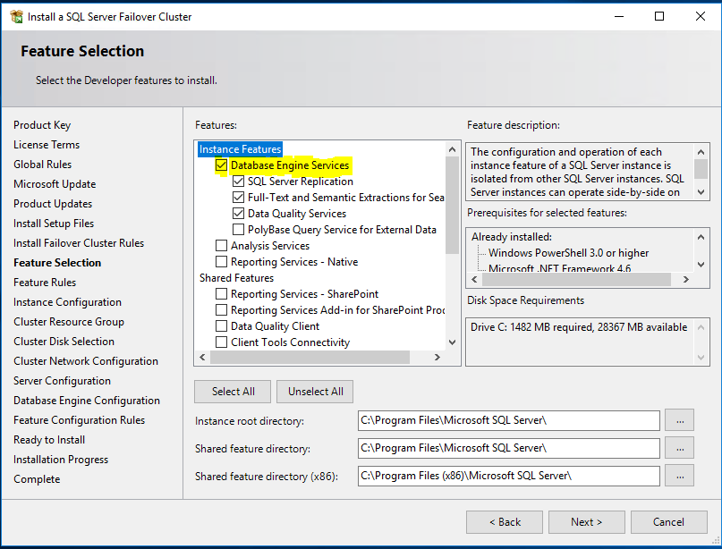
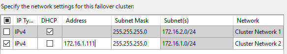
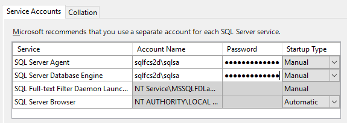
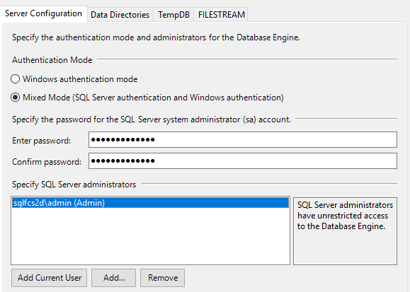
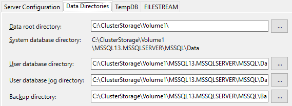
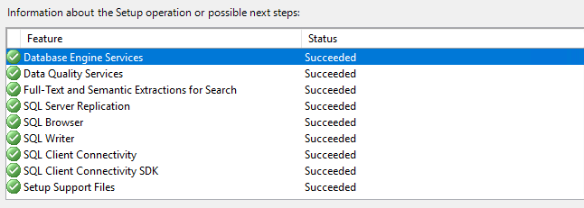

Install SQL as a Failover Cluster
===========

Now that Storage Spaces Direct is enabled on the Cluster and a Cluster Shared Volume has been created, we can start the installation of a SQL Failover Cluster.  

1. Connect to STDxSQL1 via RDP from STDxADM using the credentials provided  
2. The SQL media (iso) will be on STDxADM accessible via `\\stdxadm\isos`
	-   Copy the ISO into `c:\ClusterStorage\Volume1`
	-   Now simply double click or right click and mount the iso.  

  
3. Launch the SQL setup.  
4. From the Installation Menu, Select “New SQL Server Failover Cluster”  

  
5. Specify a Free Edition "Developer", no product key. Click Next  
6. Accept the License Terms and Click Next  
7. Skip checking for updates (Do not check the box) Click Next  
8. Review the Cluster rules have passed (warnings are okay) Click Next  
9. Check the box to Install just the Database Engine, leaving the directory locations default, Click Next  

  
10. Use Default Instance and specify the SQL Server Network Name “STDxSQLFCI”, click Next  

  
11. Click next past the Cluster resource Page. You will have at least one qualified resource.  
12. Click Next past the Cluster Disk Selection. The only available CSV will be checked  
13. Select the 172.16.1.x network, deselect the DHCP box, and enter in the secondary IP provided for STDxSQL1, click next  

  
14. Specify the SQL Service account credentials provided (Clicking the Collation tab then back will confirm credentials are valid.) Click Next  

  
15. Enable Mixed mode and specify a SQL account password, add the current user as a SQL administrator as well. Click the Data Directories Tab.  

  
16. Confirm the CSV is being used as the root directory “C:\\ClusterStorage\\Volume1\\”, Click Next
	- Note: if additional CSV are created you can separate the logs from the databases.  

  
17. Review the configuration and finally Click Install.  
18. The Install should take roughly 5 minutes. If everything was configured correctly, you will see success.  

