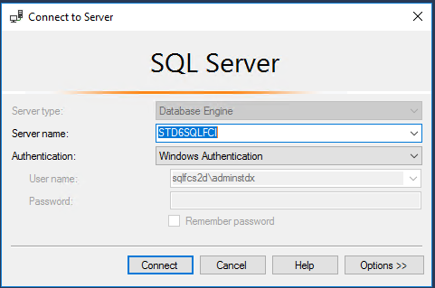
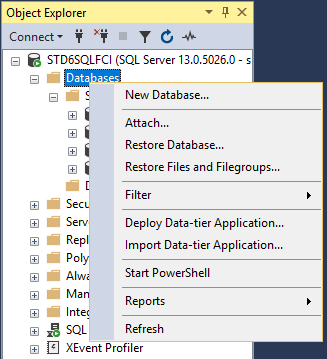
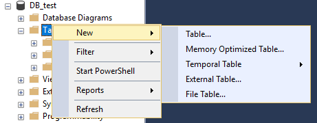

Connect to SQL and test Failover
================================

1.  Disconnect or minimize your RDP session to the SQL nodes.  
2.  From the STDxADM desktop, launch SQL Server Management Studio.
	-   SSMS can be quickly launched from run command/powershell using the command `SSMS`  
3.  Connect to Server name "STDxSQLFCI" using Windows Authentication  

  
4.  Right click Databases and select "New Database"  
	-   Create a new database named "DB_test"  

  
5.  Create a test Table in the new database  
	-   Refresh and expand DB_test
	-   Right click Tables, and create a New Table named "table_test"  
	
  
	-   Column Name will be "Name" Data Type will be "varchar(50)"  

  
	-   ctrl + s to save  

6.  Insert a few rows in the test table.  
	-   Refresh Tables
	-   Right click on "dbo.table_test" and select "Edit Top 200 Rows"
	-   Add 3 rows named "row 1", "row 2", "row 3" and save  

  
7.  Simulate a failure/failover by rebooting the active SQL node.  
	-   You can confirm the active node from the SQL Server FC Role in cluadmin or by running the PS command `“Display active SQL nodeGet-ClusterGroup "SQL Server (MSSQLSERVER)"”`
	-   Connect to the active Cluster (most likely STDxSQL1) and restart the computer.  
8.  From the Cluster Manager you can watch the SQL Server Role and Resources go offline, pending, and finally back to online. The owner or current active node should be SQL2 if you rebooted SQL1.  
9.  Using SSMS, connect back to the SQl FC Instance (STDxSQLFCI)  
	-   Expand Databases and verify DB_test is online.
	-   Expand Tables, right click "dbo.table_test".
	-   Select Top 1000 Rows  

  
	-   You will see the previously created rows.  

