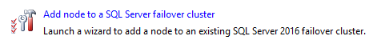
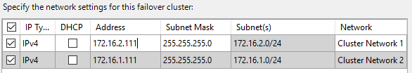
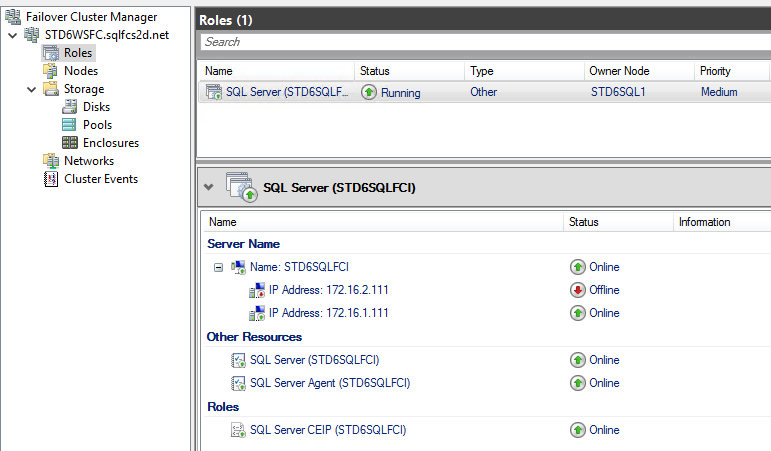

Add Second node
===============

1.  Connect to STDxSQL2 via RDP from STDxADM using the credentials provided.  
2.  The SQL media (iso) will be in `c:\ClusterStorage\Volume1`
	- Now simply double click or right click and mount the iso.  

  
3.  Launch the SQL setup.  
4.  From the Installation Menu, Select “Add node to a SQL failover cluster”  

  
5.  Specify a Free Edition "Developer", no product key. Click Next  
6.  Accept the License Terms and Click Next  
7.  Skip checking for updates (Do not check the box) Click Next  
8.  Review the Cluster rules have passed (warnings are okay) Click Next  
9.  The SQL failover cluster instance STDxSQLFCI will be found and selected, click next.  
10.  Select the 172.16.2.x network, deselect the DHCP box, and enter in the secondary IP provided for STDxSQL2, click next  

  
11.  A message will pop up asking if you would like to proceed with a multi-subnet failover cluster configuration, click yes.  
12.  Provide the credentials for the SQL Service Account, Click Next  
13.  Review the configuration and Click Install  
14.  The Install should take roughly 5 minutes. If everything was configured correctly, you will see success.  
15.  Go back to the Cluster Manager, Select roles and verify the STDxSQLFCI is online and running.  

