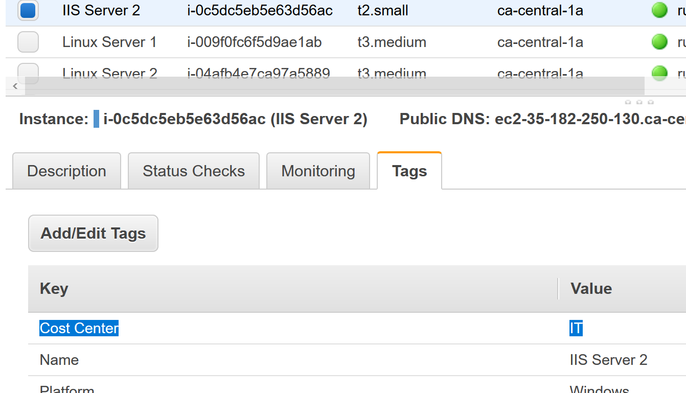
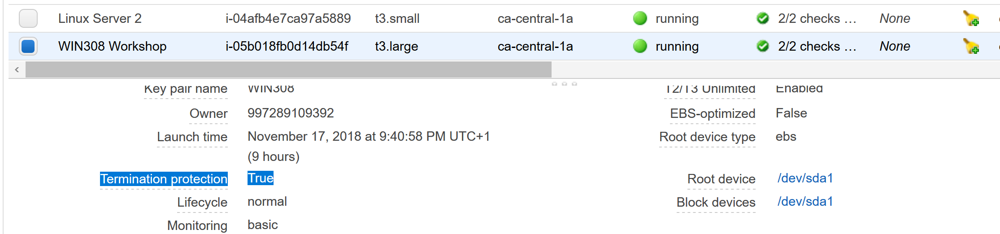

# Challenge  1: Configuring resources using AWS Tools for Windows PowerShell


## Task 1 : All instances are missing the tag "Cost Center : IT"

In order to make this change we need to create a list of instances which don’t
have the tag “Cost Center”, create the tag “Cost Center : IT” and then assign
this tag to our group.


```powershell
# list all instances without the tag "Cost Center"
$instancelist = (Get-EC2Instance).Instances | ? {$_.Tag.key -ne "Cost Center"}

# Create a new tag "Cost Center : IT"
$tag = New-Object Amazon.EC2.Model.Tag
$tag.Key = "Cost Center"
$tag.Value = "IT"

# assign the tag "Cost Center : IT" to instances
$instancelist | % {New-EC2Tag -Resource $_.InstanceId -Tag $tag}
```


We can now verify our change by listing all instances which this time has the
tag “Cost Center : IT”


This can be confirmed from the tag tab on any of the instances:



## Task 2: All instances without the tag "Tier : WebServer" should be protected against termination

```powershell
#list all instances without the tag "Tier : WebServer"
$instancelist = (Get-EC2Instance).Instances | ? {!($_.Tag.key -eq "Tier" -and $_.Tag.Value -eq "WebServer")}

#protecting against termination
$instancelist | % {Edit-EC2InstanceAttribute -InstanceId $_.InstanceId -DisableApiTermination $true}
```


You can verify the termination protection from the ec2 console



