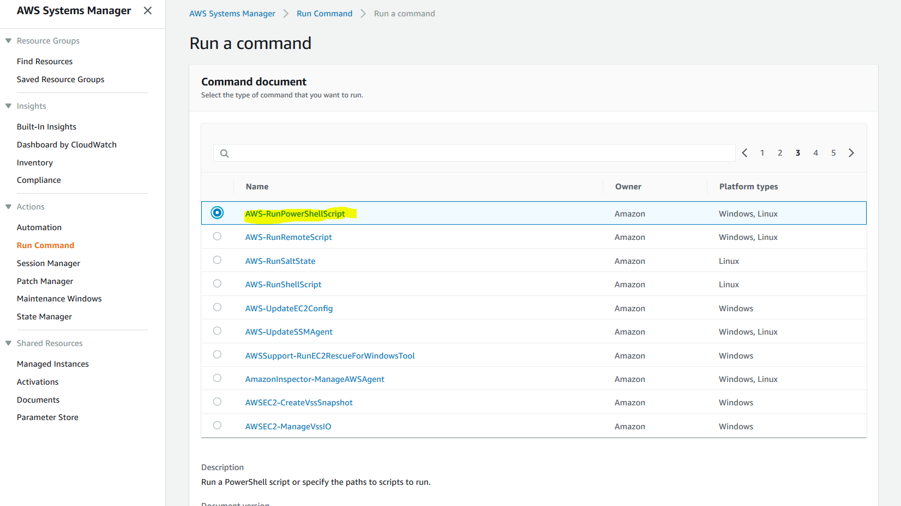

#Challenge 2

They want to make sure that IIS is installed on all the
Instances that have `Role` tag as with value of `Frontend`. For
this they want to use AWS SSM run command. 

1.  Make sure all the instances are meeting AWS SSM
    [requirements](https://docs.aws.amazon.com/systems-manager/latest/userguide/systems-manager-prereqs.html).

2.  From AWS Systems Manager console, click on Run command.

    

3.  Look for AWS-RunPowerShellScript in the Document list.

    

4.  Under command Parameters, enter the following Powershell code to
    install IIS.

```
Install-WindowsFeature -Name Web-Server -IncludeManagementTools
```


5.  For Targets select Specifying a tag and then for the tag key put
    'Role' and for the value specify 'Frontend' and hit Add.
    

6.  Click on Run

7.  Wait for the command to finish and view the command output to make
    sure IIS was insatlled successfully.

**Alternate method: **

```
Send-SSMCommand -DocumentName "AWS-RunPowerShellScript" -Parameter
@{commands = "Install-WindowsFeature -Name Web-Server
-IncludeManagementTools"} -Target @( @{Key="tag:Role";
values="Frontend"})
```
