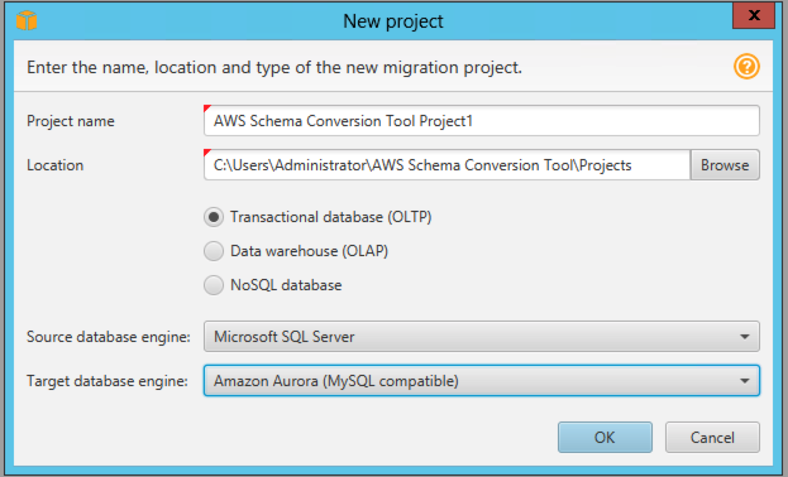
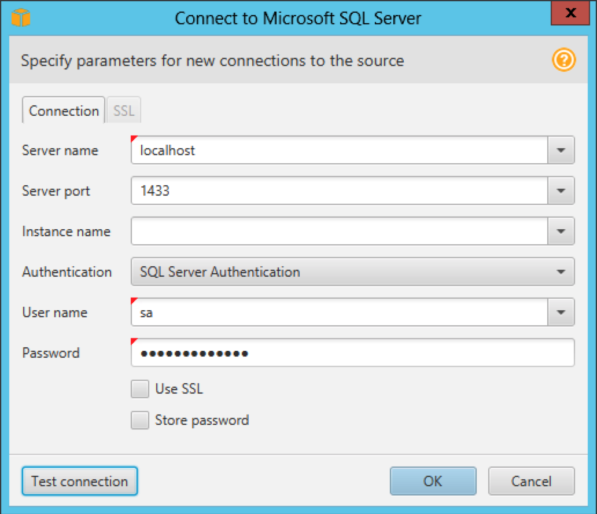

# Refactor

This is an opportunity to explore other options besides SQL Server. While there are many AWS services you could choose from, we will assume Amazon Aurora running MySQL. In this case, you will need to migrate both the schema and data from SQL Server to MySQL.

# Proposed Solution

**Spoiler Alert** Before you read the proposed solution spend time talking with your team members.

## Log into the on-prem SQL Server

0. Log into your account using the credentials provided.

0. Change the region to **Ireland** from the menu in the top left corner.

0. Choose EC2 from the list of services, and click on **Instances**.

0. Select the server named **ONPREM**, and click the **Connect** button at the top of the screen.

0. Download the Remote Desktop File and connect as **Admin@example.com** and the password provided. 

## Run AWS Schema Conversion Tool

0. Click the start button. *This is Windows 2012, so you need to find that magic pixel in the bottom left corner.*

0. Launch the **AWS Schema Conversion Tool**.

0. From the **File** menu, choose **New Project**.

0. Change the **Source Database Engine** to **Microsoft SQL Server**.

0. Change the **Destination Database Engine** to **Amazon Aurora (MySQL Compatible)**.

0. Compare to the diagram below and click **OK**.

## Connect to Microsoft SQL Server

0. Choose **Connect to Microsoft SQL Server** from the menu bar.

0. Fill in the dialog box as shown below and click **OK**. 

*Note: If you are prompted for a driver path, use C:\Program Files\AWS Schema Conversion Tool\drivers\sqljdbc42.jar*.

## Generate a report

0. Select **dms_sample** from the tree.

0. Right click and choose **Create report**.

## Review the report 

0. Review the report as a team. *Notice that schema conversion is expected to be easy, but there is work to do on the stored procedures.*

0. Switch to the **Action Items** tab. Review the issues found as a team. 

0. On the right side, expand **Issue 692: MySQL doesn't support cursor variables".

0. Click on one of the impacted procedures to see the DDL.

0. Based on the findings would you recommend moving to MySQL?

## Repeat these steps for PostgreSQL

0. Rerun the above steps for **Amazon Aurora (PostgreSQL Compatible)**.

0. Notice that the schema conversion is much easier this time.

0. Based on the findings would you recommend moving to PostgreSQL?