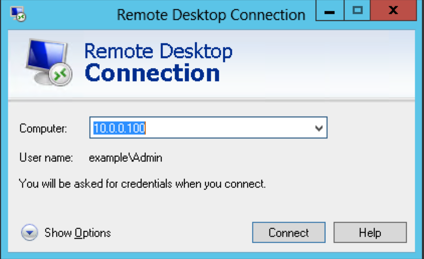
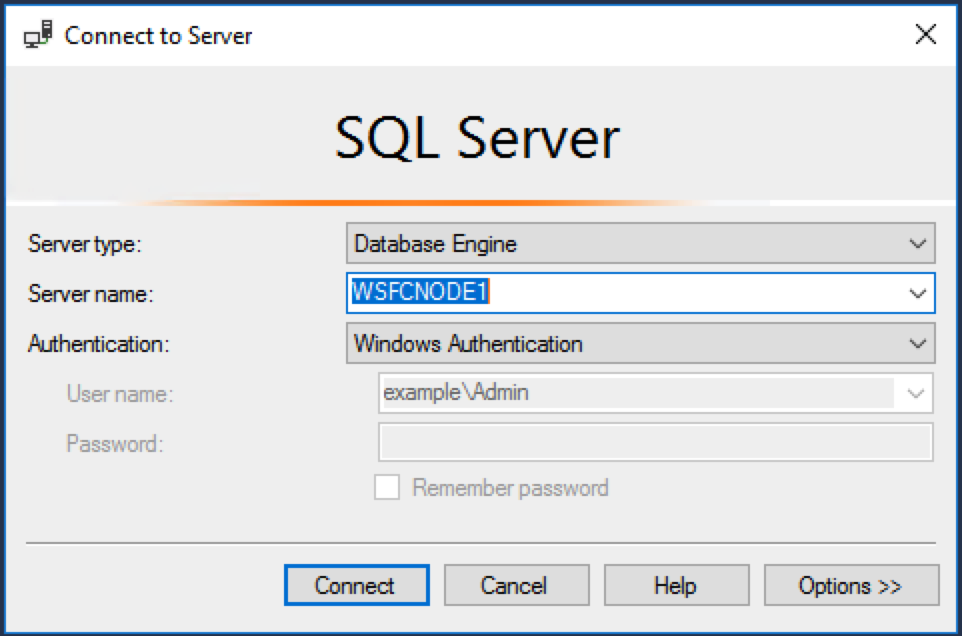
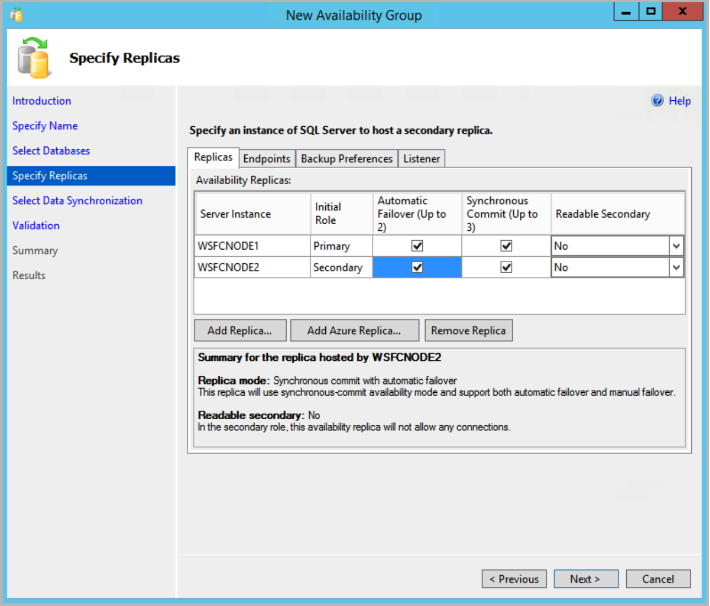

# Rehost

Rehost is essentially a lift-and-shift. In this case you will run SQL Server on Amazon Elastic Compute Cloud (EC2). This will be a relatively easy migration, but you will need to address a few issues. For example, EC2 does not allow shared storage, therefore you will need evaluate new options. Most likely Always On Availability Groups. You will also need to decide how to migrate data.

# Proposed Solution

**Spoiler Alert** Before you read the proposed solution spend time talking with your team members.

## Log into ONPREM

*NOTE: we are using ONPREM as a jump box (e.g. bastion host)*

0. Log into your account using the credentials provided.

0. Change the region to **Ireland** from the menu in the top left corner.

0. Choose EC2 from the list of services, and click on **Instances**.

0. Select the server named **ONPREM**, and click the **Connect** button at the top of the screen.

0. Download the Remote Desktop File and connect as **Admin@example.com** and the password provided. 


## Log into the WSFCNode1

0. Click the start button. *This is Windows 2012, so you need to find that magic pixel in the bottom left corner.*

0. Launch **Remote Desktop Connection**.

0. Enter **10.0.0.100** as the computer name.

	

0. Log in as **Admin@example.com** and the password provided. 

## Download the backup file 

0. Start a new PowerShell session as an administrator.

0. Run the following command to download the file. This will take a few minutes. 

	```
	Read-S3Object -BucketName win310 -Key MSSQL2008R2_01.bak -File F:\MSSQL\Backup\MSSQL2008R2_01.bak
	```

## Set up Permissions for the Cluster Object

1. Run Windows PowerShell as an administrator, and use the following command to install Active Directory Management Services:

	```
	Add-WindowsFeature RSAT-ADDS-Tools
	```

2. Open **Active Directory Users and Computers** 

3. In the navigation bar, choose **View, Advanced Features** to see the advanced features for Active Directory Users and Computers.

4. Right click on Computers (see below) and click **Properties**. 

	

6. On the **Security** tab, choose **Advanced**.

7. In the Advanced Security Settings dialog box, choose **Add**.

8. Next to Principal, choose Select a principal.

9. Choose **Object Types**, select **Computers**, and then choose OK.

10. Type **WSFCLUSTER1**, choose Check Names, and then choose OK.

12. Add the **Create Computer objects** permission to this principal, and then choose OK.

13. In the Advanced Security Settings for Computers screen, choose OK.

14. In the Computer Properties screen, choose OK.

## Connect to SQL Server 

0. Click the start button. 

0. Right click on **Microsoft SQL Server Management Studio**, and **Run as a different user**.

0. Run as **sqlsa@example.com** with the password provided.

0. On the Connect to Server dialog, leave the defaults and click **Connect**.

	

*Note: we are connecting as **sqlsa** because the domain admin does not have access to the database instance. It is generally a good idea to keep these roles separate.*

## Restore the Backup File 

1. In Object Explorer, right click on **Databases** and choose **Restore database**.

2. Find the file you downloaded earlier and restore it. For example:

	

## Create an Availability Group

1. In Object Explorer, right-click **AlwaysOn High Availability** and launch the **New Availability Group** wizard.


3. On the Introduction page, choose **Next**.

4. On the Specify Availability Group Name page, type **SQLAG1**, and then choose **Next**.

0. On the Select Databases page, choose the database you created or attached in the previous section, and then choose **Next**.

0. On the Specify Replicas page, add the second cluster node **WSFCNode2**, and then choose Automatic Failover. It should look like this.

	

0. On the Listener tab, choose **Create an availability group listener**, and provide a Listener DNS Name **AG1-Listener**.

0. Then specify the TPC port used by this listener as **1433**. 

0. Add the two private subnets the cluster nodes were deployed into and a corresponding IPv4 address. The results should look like this:

	.

0. Click **Next**

0. On the Select Initial Data Synchronization page, choose **Full database and log backup**. 

0. In the shared network location box, type **\\\\WSFCFileServer\replica**. 

0. Choose **Next**.

0. On the Validation page, choose **Next**.

0. On the Summary page, choose Finish, and then close the wizard.

## Simulate a Failover

1. In Object Explorer, click **Connect** and then **Database Engine**. *Leave the existing connection open.*

2. Enter **AG1-Listner** as the server name and click **Connect**.

3. Navigate to **Always on High Availability** > **Availability Groups**.

4. Right click on **SQLAG1** and choose **Failover**.

5. Click **Next** and **Next** again.

6. On the Connect to Replica screen, click **Connect**. 

7. On the Connect to Server dialog, click **Connect**.

8. Click **Next** and then **Finish**.

## Test the Replica

1. You should still have **WSFCNode1** in the object explorer.

2. Expand **WSFCNode1** > **Databases** > **dms_sample**.

3. You should get an error because the database is now running on WSFCNode2.

4. Expand **AG1-Listner** > **Databases** > **dms_sample**.

5. You can still access the database because **AG1-Listner** always points to the active node.