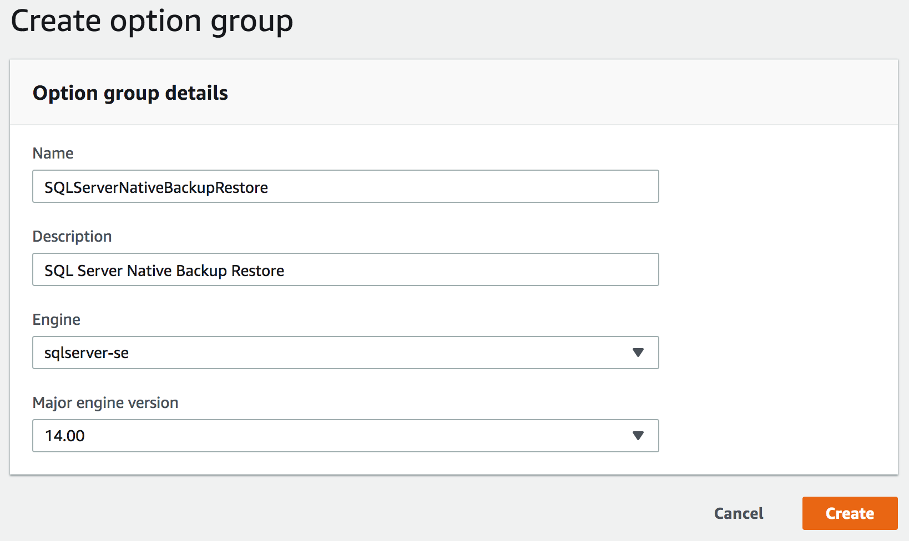
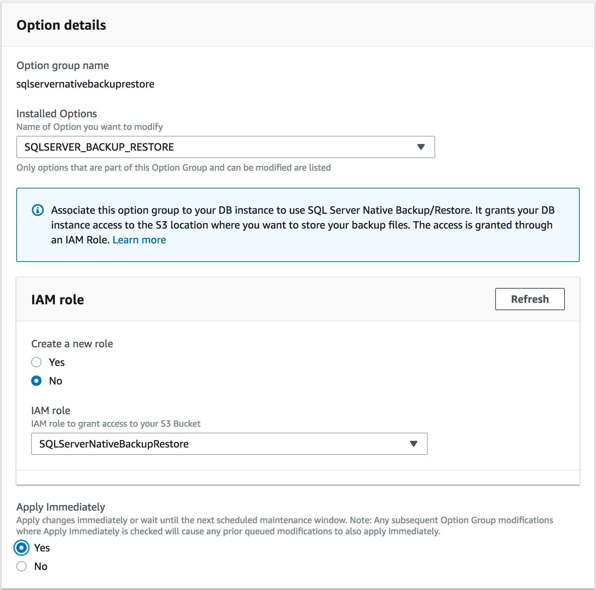
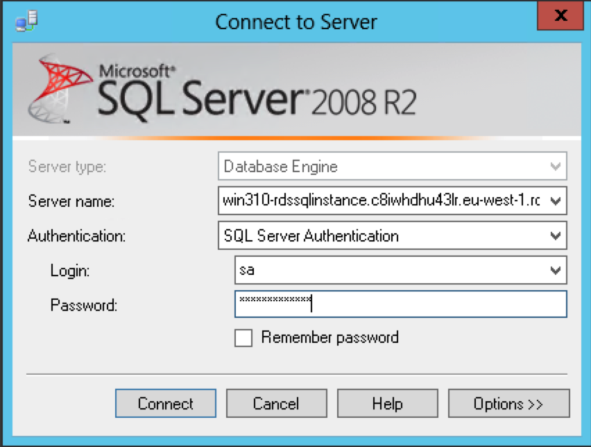

# Replatform

In this case you will migrate to Amazon Relational Database Service (RDS) running SQL Server 2017. RDS makes it easy to set up, operate, and scale a relational database in the cloud. Again, you will have a few issues to address. Most notably, RDS does not support database mail. Therefore, you will need to find another option to send email notifications. Again, you will need to decide how to migrate data.

# Proposed Solution

**Spoiler Alert** Before you read the proposed solution spend time talking with your team members.


## Create an S3 Bucket

0. Log into your account using the credentials provided. 

0. Change the region to **Ireland** from the menu in the top left corner.

0. Choose S3 from the list of services

0. Click on **Create bucket**. 

0. Name the bucket and click **Create**. *Note: You will need the name later*

## Configure RDS for Native Backup/Restore

0. Choose RDS from the list of services, and click on **Option groups**.

0. Click the **Create Group** button.

0. Fill out the form as shown below and click **Create**.

	

0. Click the check box next to the group you just created and click **Add Option**.

0. Ensure that **SQLSERVER_BACKUP_RESTORE** is selected in the option dropdown.

0. Under **IAM Role**, select the **No** radio button.

0. Choose the **SQLServerNativeBackupRestore** IAM Role.

0. Choose **Yes** under the Apply Immediately and click **Add Option**.

	

## Modify the Instance

0. Click on **Instance** from the left navigation.

0. Click radio button next to **win310-rdssqlinstance**.

0. From the **Instance Actions** menu choose **Modify**.

0. Find the **Database Options** section.

0. Change the **Option Group** to **sqlservernativebackuprestore**.

	

0. Scroll down and click the **Continue** button.

0. Choose **Apply Immediately** and click **Modify DB Instance**.

## Copy the RDS Endpoint

0. Click on **Instance** from the left navigation.

0. Click the **win310-rdssqlinstance** link.

0. Find the **Connect** section and copy the **Endpoint**. You will need this below.

## Log into the on-prem SQL Server

0. Choose EC2 from the list of services, and click on **Instances**.

0. Select the server named **ONPREM**, and click the **Connect** button at the top of the screen.

0. Download the Remote Desktop File and connect as **Admin@example.com** and the password provided. 

## Copy a backup to S3

*Note: there is a recent backup in the root of the C drive.*

0. Start a new PowerShell session.

0. Run the following command to upload the file. *Replace YOUR-BUCKET with the bucket you created earlier*

	```
	Write-S3Object -BucketName YOUR-BUCKET -Key MSSQL2008R2_01.bak -File C:\MSSQL2008R2_01.bak
	```

## Connect to RDS

0. Click the start button. *This is Windows 2012, so you need to find that magic pixel in the bottom left corner.*

0. Launch **Microsoft SQL Server Management Studio**.

0. In the **Connect to Server** dialog enter the endpoint you copied above.

0. Use **SQL Server Authentication**.

0. Use the username **sa** and the password provided.   

	

*Note, we are using SQL Credentials (e.g. sa) here because our domain admin account has not been granted access to the database. However, this RDS instance has been joined to the example.com domain and you could use Windows credentials if you wanted. Just add a new login to the database instance.*

## Restore the sample database

0. Click "New Query" from the toolbar.

0. Execute the following SQL. *NOTE: replace YOUR-BUCKET with the bucket you created above.*

	```
	exec msdb.dbo.rds_restore_database 
	  @restore_db_name='dms_sample', 
	  @s3_arn_to_restore_from='arn:aws:s3:::YOUR-BUCKET/MSSQL2008R2_01.bak';
	```       

0. It will take a few minutes to restore the database. You can run the following SQL to check the status.      

	```
	exec msdb.dbo.rds_task_status @db_name='dms_sample';
	```