# Deploy an app to EC2 using Azure DevOps (VSTS)

## Introduction

This article will demonstrate a .Net application deployment to AWS Ec2 using AWS CodeDeploy, GitHub, and Azure DevOps.

### Prerequisites
* Complete the [Lab Setup](setup.md)

### Architecture

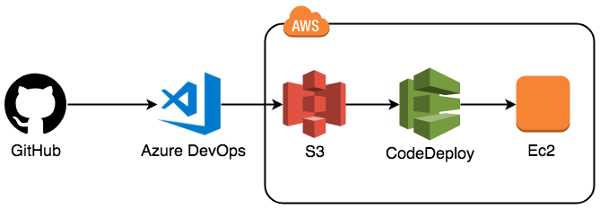

### Modules

1. Import Code into Azure DevOps
2. Setup AWS CodeDeploy
3. Integrate Azure DevOps and AWS CodeDeploy
4. Test the Deployment

## Import code into Azure DevOps
In this module we will pull a .NET application from GitHub to be used in our deployment.

<ol>
<li>Go to https://dev.azure.com/ and login to your Azure DevOps account.</li>
<li>Click New Project</li>
</ol>

   

<ol start="3">
    <li>Fill in the name, description and take the default setting for the other options.
   <ol type="a">
    <li>Visibility: Private</li>
    <li>Version Control: Git</li>
    <li>Work item Process: Agile</li>
   </ol>
   </li>
</ol>

   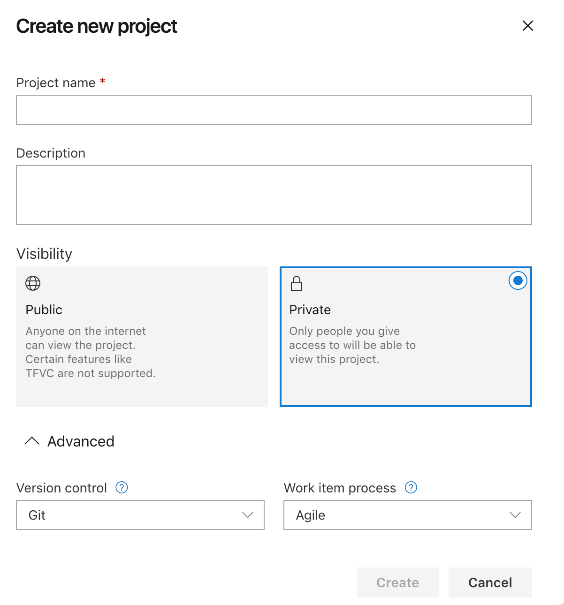

<ol start="4">
    <li>Click Create.</li>
    <li>Next, we will import the code. Select the Repos tab on the left and then click the import button under “or Import a repository.”</li>
</ol>

   

<ol start="6">
    <li>Put https://github.com/StevenDavid/ASPDotNetMVC in the Clone URL input box. Click Import.</li>
</ol>

   

<ol start="7">
    <li>Once import is complete, you will see a confirmation screen and then be refreshed to the code view. Your code is now in Azure DevOps.</li>
</ol>

## Create CodeDeploy IAM Role
In this step we will create the role to be used by CodeDeploy.

<ol start="1">
    <li>From the AWS Console search for IAM.</li>
</ol>

 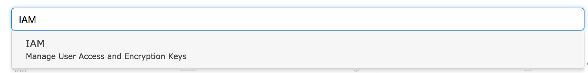

<ol start="2">
    <li>Click on "Roles" in the left hand menu.</li>
</ol>

 

 <ol start="3">
    <li>Click on the "Create role" button.</li>
</ol>

 

 <ol start="4">
    <li>Make sure "AWS Service" is selected and click on CodeDeploy in the "Choose the service that will use this role" section.</li>
</ol>

 

 <ol start="5">
    <li>Scroll down and in the "Select your use case" section, select the top "CodeDeploy" option. Click "Next:Permissions"</li>
</ol>

 

 <ol start="6">
    <li>Wait for the "AWSCodeDeployRole" permissions to load then click "Next:Tags"</li>
</ol>

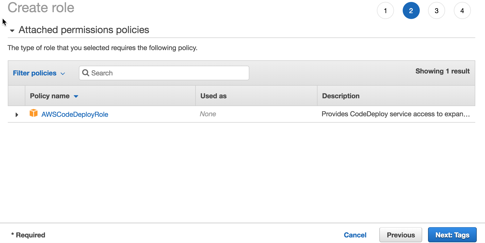

<ol start="7">
    <li>Add whatever tags you want and then click "Next:Review"</li>
</ol>

<ol start="8">
    <li>Name the Role something like "CodeDeployRole" and then click "Create role"</li>
</ol>

## Setup AWS CodeDeploy
In this step we will create an application in CodeDeploy and a deployment group.

<ol start="1">
    <li>From the AWS Console search for CodeDeploy.</li>
</ol>

   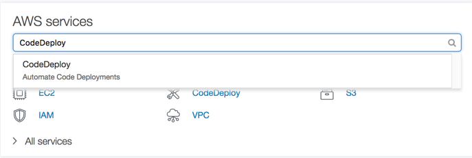

Note: It will take you to the new version of the interface. Click the "Return to the old experience" in the bottom left hand side of the screen.

<ol start="2">
    <li>Click the Get Started Now button
    <ul><li>Note: if you are on the new version of the CodeDeploy interface. Use the link, in the blue bar, at the top of the page to revert to the old version and select the <b>"Sample Deployment Wizard"</b> from the right hand side of the page.</li></ul></li>
</ol>

   

<ol start="3">
    <li>Chose the Sample Deployment and click Next.</li>
</ol>

   

<ol start="4">
    <li>Choose In-place deployment and click Next.</li>
</ol>

   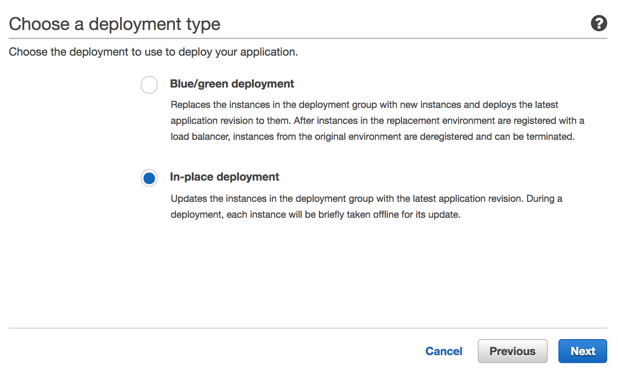

<ol start="5">
    <li>Change the instance type to Windows, select or create a key pair and click Launch instances.</li>
</ol>

   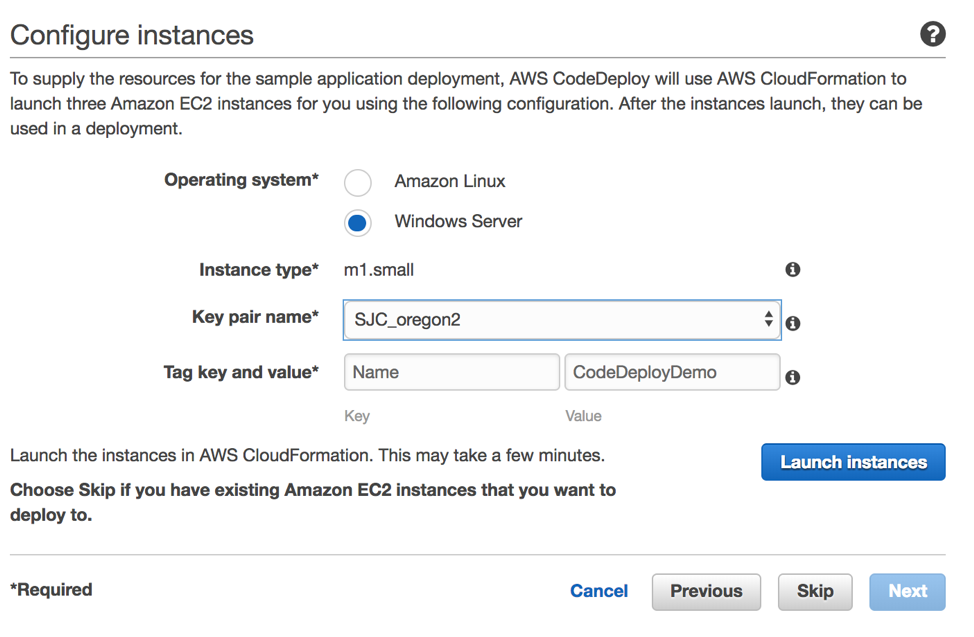

<ol start="6">
    <li>Name your CodeDeploy Application. Click Next.</li>
</ol>

   

<ol start="7">
    <li>Select the sample application for Windows. This will deploy a generic sample application to your servers. We will overwrite it with the code we checked into Azure DevOps. Click Next.</li>
</ol>

   

<ol start="8">
    <li>Create a Deployment Group. Click Next.</li>
</ol>

<ol start="9">
    <li>We will select the role we created earlier. Click Next.</li>
</ol>

   

<ol start="10">
    <li>For the Deployment Configuration we will use the default. Click Next. </li>
</ol>

   

<ol start="11">
    <li>Review the Deployment details and click Deploy. CodeDeploy will do the initial deployment and is ready to receive our application.</li>
</ol>

## Create S3 bucket

<ol start="1">
    <li>From the AWS Console search for S3.</li>
</ol>

  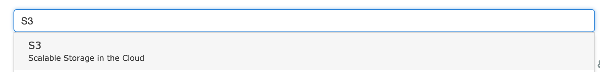

  <ol start="2">
    <li>Click Create bucket.</li>
</ol>

  

<ol start="3">
    <li>Name the bucket some thing unique, chose the region you are using for codedeploy (Canada is our recommendation) and click next until you create the bucket.</li>
</ol>

  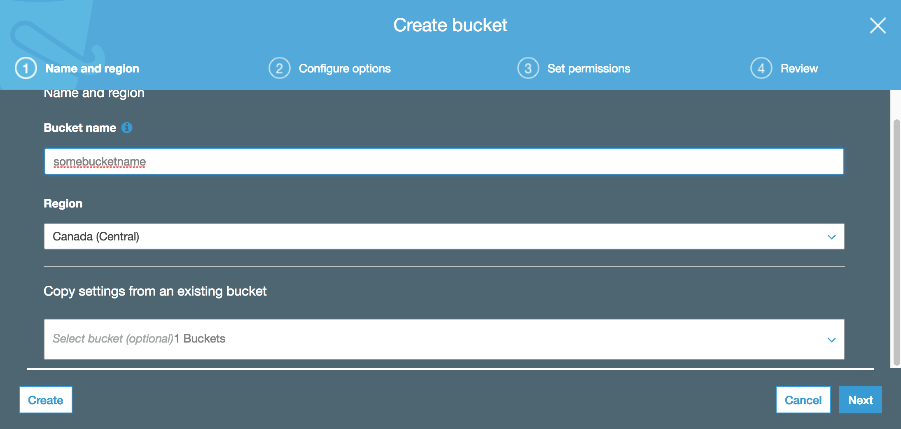

## Integrate Azure DevOps and AWS CodeDeploy
In this step we will create a Azure DevOps build job that will deploy our application to EC2 instances via CodeDeploy.

<ol start="1">
    <li>Open our project in Azure DevOps and click on the Pipelines tab. Click New Pipeline.</li>
</ol>

   

<ol start="2">
    <li>Azure Repos Git is our source repo and we want to publish the master branch. Click Continue.</li>
</ol>

   

<ol start="3">
    <li>Choose the ASP.NET template and click Apply.</li>
</ol>

   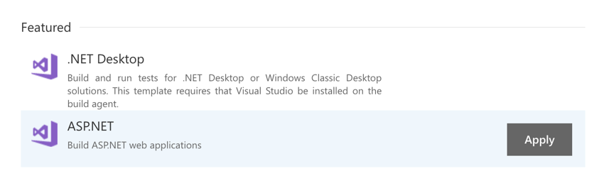

<ol start="4">
    <li>Click the + symbol to add a new task.</li>
</ol>

   

<ol start="5">
    <li>Search for the Copy files task and click Add. The task will go to the bottom of the list on the left.</li>
</ol>

   

<ol start="6">
    <li>Click the Copy files task and update the parameters. <ul>
    <li>Source Folder: ASPDotNetMVC</li>
    <li>Target Folder: $(Build.ArtifactStagingDirectory)\\publish</li>
    </ul>
    </li>
</ol>

   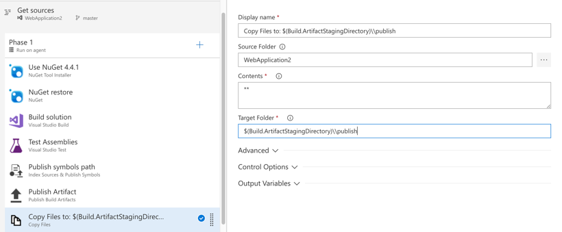

<ol start="7">
    <li>Click the + symbol to add a new task. Search for the CodeDeploy task and click Add. The Task will go to the bottom of the list on the left. Update the parameters.</li>
</ol>

   

Note: Your first time you will need to install the AWS Azure DevOps toolkit from the Marketplace.

<ol start="8">
    <li>Configure the Code Deploy task.
    <ul><li>Note: Application name has to match the CodeDeploy Application name. Same is true for Deployment Group Name.</li></ul>
    </li>
</ol>

   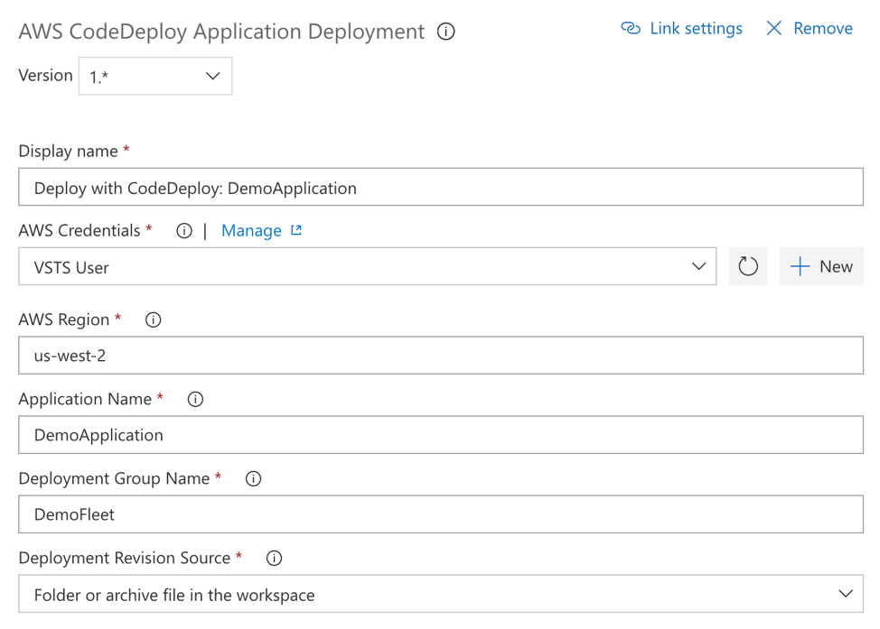
   

<ol start="9">
    <li>Click Triggers and enable Continuous integration.</li>
</ol>

   

<ol start="10">
    <li>Save the build.</li>
</ol>

## Test the deployment
In this module, we will deploy the code to the EC2 instances.

<ol start="1">
    <li>Make a change to your code and check it into Azure DevOps which initiates a build. Once the build is complete you will be able to click through the various steps in the process.</li>
</ol>

   

<ol start="2">
    <li>You can view your deployed application by getting the public DNS or IP address for the EC2 instance and to navigate to the site in a browser.</li>
</ol>

   

<ol start="3">
    <li>You now have a working CI/CD pipeline that deploys an ASP.NET application from source control to EC2.</li>
</ol>
