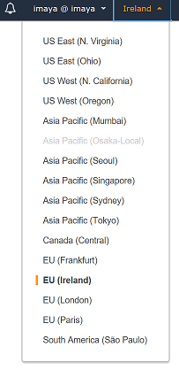

# Deploy a .Net Core application on Amazon ECS Fargate using Azure DevOps (VSTS)
> In this lab we will create a CICD pipeline on Azure DevOps using AWS Tools for VSTS.
## Prerequisites
* Complete the [Lab Setup](setup.md).
* Validate access to the sample source code repository in Github by browsing to this url [https://github.com/awsimaya/ECSFargate.git](https://github.com/awsimaya/ECSFargate.git) .
* It is necessary to follow the instructions carefully to ensure successful completion of the lab.

## Environment Setup
> In this section we will configure the environment baseline to get started.

### Create a new IAM User for Azure DevOps
> In this section, we will create a new IAM user account that will be used by your Azure DevOps service to deploy resources in your AWS Account.

* If you already have Access Key ID and Secret Access Key of an IAM User account to be used with Azure DevOps then you can skip this section.
* Click on IAM Service
* In the navigation pane, choose **Users** and then choose **Add user**.
* Type the user name for the new user. This is the sign-in name for AWS.
* Select only programmatic access. This creates an access key for each new user. You can view or download the access keys when you get to the Final page.
* Click on **Next: Permissions**.
* Select Attach existing policies directly.
* Select Administrator Access.
> Note: This is not a best practice to provide Administrator Access. Its recommended to follow least access privilege and limit permissions to the resources that would be required from AzureDevOps account. This could vary depending upon your use case and scenarios. Example you may chose to create different IAM User account for Non-Prod Vs Prod and appropriately provide the  necessary permissions following least access privilege principle.

* Click on **Next: Review**
* Review the settings and Click on **Create User**.
* Save the **Secret Access Key** and **Access Key ID** to be used later in this lab.

### Install AWS Tools for VSTS aka Azure DevOps
> In this step, we will install AWS Tools for Azure DevOps aka Visual Studio Team Services (VSTS) to your account. This will allow us to leverage the powerful features that this add-on provides to create CICD tasks on AWS

* Login to your Azure DevOps (formerly VSTS) account
* Navigate to [Visual Studio Marketplace](https://marketplace.visualstudio.com/items?itemName=AmazonWebServices.aws-vsts-tools) and click on **Get it free** button as shown in the image below

* If you're logged in to Azure DevOps already, you will be taken to your Azure DevOps account where you can select the Organization as shown below.

* Once you click, AWS Tools for VSTS will be installed on the organization successfully. You will screen like the below if the the process was successful. Click **Proceed to organization**

### Import Sample Application code & Create Azure DevOps project
> In this step, we will clone an existing sample .Net Core Application code available in a public Github repository to Azure DevOps Git repository. We will be deploying this application code to Amazon ECS Fargate environment.

* On your Azure DevOps home page, go ahead and create a project. Use default settings.
* You can create a new Azure DevOps project and/or repository to start from scratch.
* To create new project, go to home page in Azure DevOps and select **+ Create Project**. To create new repository in existing project, you can select the **Import repository** from the Repos screen by providing the sample application code's Github repository link [https://github.com/awsimaya/ECSFargate.git](https://github.com/awsimaya/ECSFargate.git). Now Azure DevOps will clone the project from GitHub into its own git repo.
* if you already have a project created, then navigate to **Repos** page on the left navigation section. The screen should look similar to this below

* Click on **Import** under **or Import a repository**
* Enter the Github URL [https://github.com/awsimaya/ECSFargate.git](https://github.com/awsimaya/ECSFargate.git). Click **Import**.
* Now Azure DevOps will clone the project from GitHub into its own git repo.

### Setup AWS Service Connection for Azure DevOps project
> In this step, we will create a service connection to AWS on Azure DevOps. This will allow us to easily execute AWS specific tasks by simply selecting the service connection within the task itself. If you already have this configured in your Azure DevOps account then you can skip this step and go to next step.

* Under Azure DevOps Project Settings > Service connections, click on **New Service connections** and select **AWS** from that list
* You will see a window similar to the screenshot below. Give a connection name, enter the Access Key Id and Secret Access Key of the IAM User Account to be used by Azure DevOps. Click **OK**

* You will see a screen like the one below once this process is complete

## Create Azure DevOps Build pipeline
> In this section, we will configure build and release pipelines on Azure DevOps environment using tasks from AWS Tools for VSTS. We will build a docker container image that contains our application and also push it to AWS Elastic Container Repository.

* Under **Pipelines**, click **Builds** . On this page, click **New Pipeline**
* Your page should look like the one below. Click **Use the visual designer** link under **Where is your code?** section

* In the next step, select the repo you want to connect to.
* Click **Continue**.
* On the **Select a template** screen, select **Empty Job** as shown in the screenshot below and click **Apply**

* Now you should be on the **Tasks** tab inside the Build pipeline. Here, to the right hand side for the drop down **Agent Pool** under **Agent job**, select `Hosted Ubuntu 1604`. More information on Microsoft-hosted agents in Azure DevOps can be found [here](https://docs.microsoft.com/en-us/azure/devops/pipelines/agents/hosted?view=vsts&tabs=yaml).
* Leave other fields to their default values.
* Add a task by click on the **+** sign next to **Agent job 1** on the left hand side. Type **Command** on the search bar on the right hand side. You should see the **Command Line** task as shown below and click **Add**.

* Once added, name the task **Build Docker Image** and enter the command `docker build -t hellofargate ./HelloFargate` in the **Script** field as shown below.

> This command will tag the resulting docker image with _'hellofargate'_ (case sensitive) and provides _HelloFargate_ folder in the repository as the build context (path to the Dockerfile). Syntax of the command is `docker build [OPTIONS] PATH | URL | -`. More details on docker build command can be found [here](https://docs.docker.com/engine/reference/commandline/build/).

* Once again click on the + symbol next to  **Agent job 1**. Type _aws_ on the search field which will list all **AWS** tasks.
* Select `AWS Elastic Container Registry Push` task and click **Add**
* Name the image `Push Image to ECR`. Select the name of the AWS Credentials you setup earlier under **AWS Credentials** drop down. Select _EU (Ireland) [eu-west-1]_ as Region. Select _Image name with optional tag_ for Image identity field. Enter `hellofargate` for the **Source Image Name** field. Enter `latest` for **Source Image tag** field. Enter `hellofargaterepo` for the **Target Repository Name** field (or if you named your ECR repository differently then use that name). Enter `latest` for the **Target Repository Tag** field. Now click on **Save pipeline** to save your changes. The screenshot below shows all the settings for easier understanding.
* Its important to select the checkbox at the bottom **Create repository if it does not exist**

* You can rename the build pipeline by just clicking on `HelloFargate-CI` at the top and typing a name as shown below

* Click on **Save and Queue** to save the build pipeline configurations and also queue a build.
> It might take around 2 minutes or so for the image to be published to the repository. Go ahead and start the next step (_Create Amazon ECS Task Definition_) till this gets completed.

* Go to the AWS ECS console, browse to the Amazon ECR section and click on **hellofargaterepo** repository and make sure there is a new entry and the **Pushed at** column reflects the latest timestamp

## Build target Amazon ECS environment to deploy application
> In this section, we will first create the target AWS environment where the application code will be deployed, and then configure steps in Azure DevOps to configure automated deployment to this target AWS infrastructure.

### AWS Region Selection
* Login to AWS Console using an IAM identity which has admin privileges.
* Set the AWS region we are going to work on  _EU-WEST-1 (Ireland)_. See picture below and ensure your setup is set right.

### Create Amazon ECS Task Definition
> In this step, we are going to create a Amazon Elastic Container Service _Task Definition_ that will be used to create the container instances in the cluster. A task definition is the core resource within ECS. This is where you define which container images to run, CPU/Memory, ports, commands etc.

* Navigate to Elastic Container Service home page
* Go to **Repositories** under **Amazon ECR** and click on the **hellofargaterepo** repository
* Select the value of **Repository URI** and press **Ctrl+C** or **Cmd+C** if you're using a Mac. You will need this in the next step
* Select **Task Definitions** and click on **Create new Task Definition**
* On the next screen, select **FARGATE** launch type and click **Next**
* On the next screen, give the Task Definition a name. For this exercise we will call it `MyNextTaskDefinition`.
* Leave **Task Role** and **Network Mode** fields to their default values.
* Select `0.5 GB` for Task memory and `0.25 vCPU` for Task CPU dropdowns respectively
* Your screen should look similar to the one below

* Click **Add Container**
* Name the container as `hellofargatecontainer`
* Copy and paste the Repository URL from ECR and paste into **Image** textbox. Make sure you add the tag `:latest` to the end of the string. Ensure there are no white spaces at the end.
* Ignore the **Private repository authentication** and **Memory Limits (MiB)** fields
* Add `80` to Port mappings
* Ignore the **Advanced container configuration section**
* Click on **Add** button on bottom right corner
* Your screen should look similar to the one below

* Now click **Create**
* Your Task definition is created successfully
* Your screen should look similar to the one below

### Create Amazon ECS Cluster
> In this section we are going to create a Amazon Elastic Container Service cluster. A cluster typically has one or more nodes , which are the workermachines that run your containerized applications and other workloads. This will be deployed in a VPC.

* Click on **Clusters** on the ECS home page

* Click on **Create Cluster**
* Select **Networking Only** option and click **Next step**
* Name the cluster as `hellofargatecluster`
* Check the **Create VPC** checkbox
* Type a CIDR range to allocate to your VPC and subnet. You may use online tools to validate subnet CIDR allocation (example [https://cidr.xyz/](https://cidr.xyz/) , [https://www.site24x7.com/tools/ipv4-subnetcalculator.html](https://www.site24x7.com/tools/ipv4-subnetcalculator.html))
* Delete Subnet 2 by clicking the _x_ to the right and leave other values to default
* Click **Create**
> This step will take about a minute to complete. In the background, AWS is creating a [CloudFormation](https://aws.amazon.com/cloudformation/) stack with all the input settings.

* Amazon ECS cluster is created sucessfully
> **Important:** Once complete, make sure you take a note of the VPC name that we just created, since we will use it in the future steps
* Click on **View Cluster** to see the cluster

### Create Amazon ECS Service
> In this step, we will create the Amazon ECS service with Fargate Launch type & manually deploy the latest application docker image (available in Amazon ECR) to this service.

* On the newly created cluster page, under **Services** tab, click on **Create**.
* Select **FARGATE** for **Launch type** option
* Make sure the Task Definition and the Clusters are selected to the ones you just created
* Enter `hellofargateservice` for **Service name** field
* Enter `1` for Number of tasks field and leave everything else as is. Click **Next step**
* Make sure the VPC drop down has the name of the VPC you just created
* Click on the **Subnets** drop down and select the subnet that comes up
* Click on **Edit** for **Security groups** and ensure the **Inboud rules for security group** has Port 80 selected. Look at the image below for clarity. Click cancel to exit the **Configure security groups** page

* Select `None` for Load balancing
* Under **Service Discovery (optional)** section uncheck the **Enable service discovery integration** checkbox as this is not required for this lab and click **Next Step**
* Leave the **Set Auto Scaling** to _Do not adjust the service's desired count_ as it is
* Do a quick review of the **Review** screen and click **Create service**
* The cluster service is now created successfully
* Click on **View Service**
* Go to the **Tasks** tab and check the **Last status** column. It will refresh its status to **RUNNING** and turn green once the provisioning is complete
* The current screen should look similar to the one below. Notice that the **Last status** column says _PROVISIONING_ which means the taks is currently being executed

* Once the value on **Last status** column says **RUNNING** and is green, click on the task name under **Task** column
* Copy and paste the value of **Public IP** under **Network** on to a new browser tab and press Enter
* You should see the home page of the your new application running on Amazon ECS Fargate

## Create a new Azure DevOps Release pipeline
>In this step, we will setup automated deployment process to update the Amazon ECS Service with the docker image built by the build pipeline.

* Go to **Releases** page on your Azure DevOps project
* Click **New pipeline**
* Select **Empty job** under **Select a template**
* Enter `Prod` for Stage name field
* Change the name of the pipeline to `Release to Prod`.
* Now your screen should look similar to the below screenshot

* Hover your mouse over **1 job, 0 task** link and click on the + sign that becomes visible. This will allow you to add new tasks to the pipeline.
* In the next screen, under **Agent job**, select `Hosted 2017` for **Agent pool** drop down
* Now click on the + sign next to **Agent job** and type _Command_ in the search field. Select the **Command Line** task and click **Add**
* Name the task `Install AWS CLI` and enter `pip install awscli` in the **Script** field
* Click on the + sign next to **Agent job**. Type **aws** in the search field. Select **AWS CLI** task and click **Add**
* Name the new task `Update ECS Service`. Select the name of the AWS credential you configured earlier.
* Select `EU (Ireland) [eu-west-1]` as region
* Enter `ecs` in the **Command** field.
* Enter `update-service` in the **Subcommand** field.
* Enter `--cluster hellofargatecluster --service hellofargatecontainer-service --force-new-deployment` in the **Options and parameters** field

* Save the changes.

## Deploy application to Amazon ECS Fargate & validate
> In this step, we will create a release using the release pipeline we created in the previous step. Doing this will deploy the container into the cluster using the task definition it is configured to.

* Go to **Releases** and select the release pipeline you created earlier.
* You should see a screen similar to the one below. Click **Create a release**

* Select `Prod` in the drop down for **Stages for a trigger change from automated to manual** and click **Create**
* In the next screen, click on **Release-1** that appears on the green bar

* Your next screen will look similar to the one below. Hover the mouse arrow on **Prod** stage rectangle. Click on **Deploy** button.

* Simply click **Deploy** in the pop-up screen
* The job will be queued and will be picked up once an agent gets free. After its complete, your screen should look like the one below

## Final Steps
* Now you have a fully functional Build and Deploy pipeline setup for your application running on Amazon Elastic Cluster Service
* Go ahead and make some simple change to the project and do a git push to the repo.
* Queue a Build and a Release to see your changes reflecting successfully on your target environment
