

<h1>WIN315<h1>

<h2>Building a Serverless .NET app on AWS using the AWS Toolkit for Visual Studio<h2>

# Introduction

In the early days of the World Wide Web, the only option for hosting Web
applications was to dedicate a server to the task. This not only
required the up-front investment of capital to acquire the necessary
hardware, but also the continual cost of operating and maintaining this
infrastructure. In addition, the architects of these applications would
need to perform a great deal of work to forecast the expected load on
the servers to ensure sufficient capacity. Quite often this was little
more than an educated guess and, in many cases, systems were
dramatically over- or under-provisioned for the actual load encountered.

The AWS Lambda service allows developers to write code that runs in
response to an event; the Lambda service performs the infrastructure and
capacity management necessary to run this to meet the event load, and
developers need only pay for the actual capacity used as the demand
grows or shrinks, eliminating that up-front investment to provision
servers to meet some forecast. In addition, the Amazon API Gateway
service supports Web requests as an event that can be handled by a
Lambda. When combined with other fully-managed services such as Amazon
S3, developers are able to build fully-functional applications without
the overhead of managing their own compute and storage infrastructure.
Because of this freedom from server management, this type of application
architecture has come to be known as Serverless Computing.

In this Builder Session, we will use Visual Studio and the AWS Toolkit
for Visual Studio to create a Serverless application that hosts an
ASP.NET Web application for managing blog articles uploaded to an S3
bucket. We will then deploy this application into your AWS environment
using a CloudFormation template that describes how our application code
is accessed from API Gateway and creates the Lambda function that hosts
the code. Finally, we will make use of a cloud-native, fully-managed AWS
service that automatically translates blog entries from the original
English to Spanish, German, and French whenever new blog posts are
uploaded to S3.

# Requirements

  - A laptop computer running Windows, OSX, or Linux
  
  - An AWS Account. For this Builder Session, an AWS Account has been provisioned for you.

  - Access to a machine with Visual Studio 2017 that has the AWS Visual Studio Toolkit for Visual Studio installed. For this Builder Session, an EC2 instance with Visual Studio 2017 Community Edition and the AWS Toolkit for Visual Studio has been provisioned for you, and the login credentials for this machine have been provided.

  - A Remote Desktop Services client.
    - If you are running Windows, you will already have one installed.
    - If you have a Mac, you may need to install a client. You can download the Microsoft Remote Desktop Services client by clicking
    [here](https://itunes.apple.com/us/app/microsoft-remote-desktop-10/id1295203466)
    (or navigate to
    <https://itunes.apple.com/us/app/microsoft-remote-desktop-10/id1295203466>).
    - If you are running a Linux distribution, you may need to install a client using your Linux distribution's package manager.

# Instructions

## Connecting to Your Visual Studio Instance

For this session, we have provisioned an AWS account containing an EC2
machine running Windows Server 2016 with Visual Studio 2017 Community
Edition installed. We will follow the instructions below to establish a
Remote Desktop session and control the instance from your laptop.

1.  You will have been provided account details by the Builder Session
    staff; this information contains an AWS account ID, a username and
    password to connect to the account, as well as remote desktop login
    details. Locate this information; if you do not have this information,
    indicate to the session staff that you need assistance.

2.  Using your remote desktop client of choice, connect to your Visual
    Studio instance. The address of the EC2 instance will be the one provided for you, the username will be "Administrator", and the password will be the one provided for you. You can retrieve your credentials by entering the code provided to you in the form below and clicking the "Go" button:

    

    <label>Code:<input id="code" type="text" size="10" style="padding:2px;margin:4px;font-size: 16px;border-bottom: 1px solid black;" name="code" onkeydown="handleKey(event)"></input><input type="submit" name="Go" value="Go!" style="font-size: 16px;font-weight:bold;border: 1px solid black;" onClick="showCredentials(this)"></input></label>
    
    

## Disabling IE Enhanced Security Configuration
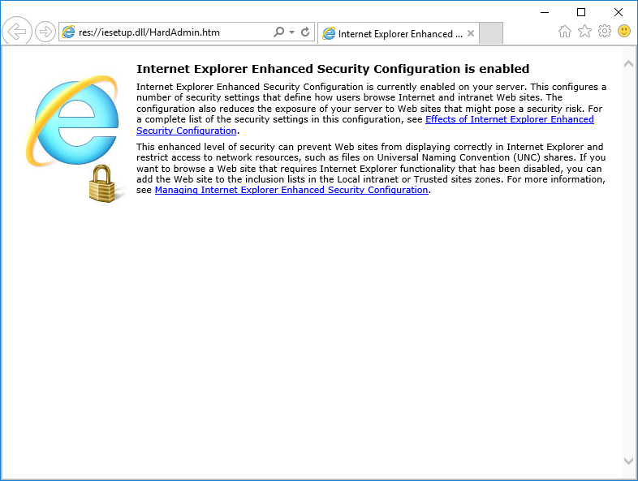
Your EC2 instance may be configured with Internet Explorer's Enhanced Security Configuration set to the enabled state. This is normally a best practice on production servers as it disables Javascript execution in the browser, but since this Builder Session will be using this machine for development, we will disable this feature so that we can run our Web application and access AWS Console features.

1. First, click the gear Icon on the toolbar to access Internet Options.
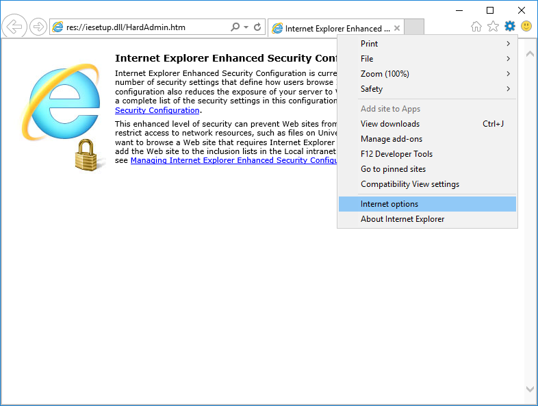
2. In the dialog that appears, select the Advanced tab and click the Reset button.
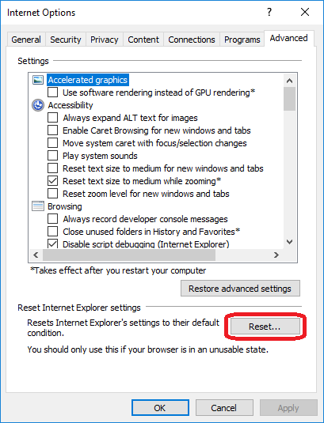
3. In the dialog that appears, ensure that "Delete Personal Settings" is checked and click "Reset"
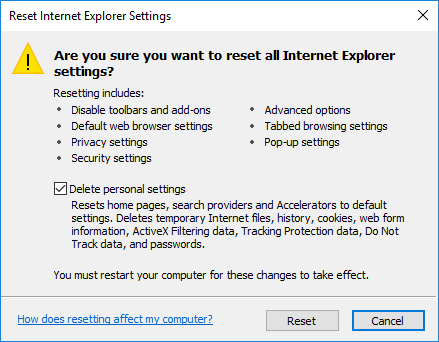
4. Finally, after the deletion has completed click the Close button.
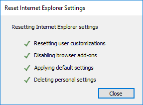
5. Close and re-open your browser, and you should see that IE Enhanced Security hsa been disabled. If you encounter any issues, notify the session staff for assistance.
 
## Opening the Sample Project

For this session, we have provided a sample ASP.NET Core MVC application
based on one of the project templates installed by the AWS Toolkit for
Visual Studio. However, it is useful to walk through the steps that were
used to create the scaffolding for this application.

If you click the “File-\>New-\>Project” menu item, you will be presented
with a list of project templates. If you choose “AWS Lambda” on the list
of project types on the left-hand side, you will see a list of templates
for creating Lambda/Serverless applications. In this case, we chose “AWS
Serverless Application (.NET Core).”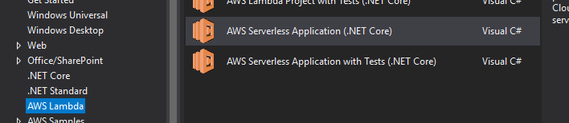

We were then presented with a list of project templates. In our case, we
chose “ASP.NET Core Web App;” this template includes the scaffolding for
an ASP.NET Web Core application that renders views using Razor Pages.  
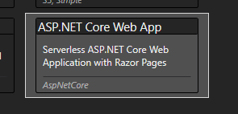

After you followed the above steps, you would be able to publish it as a
Serverless Web application, but for the purposes of this Builder Session
we have added a bit more functionality. The changes that we have made to this application added the ability to list blog posts stored in an S3 bucket and includes the ability to add new posts to the bucket. You can see the code used to list the contents of the bucket in the layout and code-behind for `Index.cshtml`, and the code to add new posts in the layout and code-behind for `NewPost.cshtml` (both of these are contained in the Pages folder).

In the next set of steps, we will use Team Explorer to connect to a Git repository and download this modified project to your development environment.

### Cloning the Sample Project Repository

1.  Open Visual Studio 2017 from the Start menu.

2.  On the View menu, click Team Explorer. The Team Explorer window will
    appear (by default, this will be on the right-hand side of your
    Visual Studio window).

3.  In the Team Explorer window, click the “Connect” icon. This will
    look like a power plug icon:
    
    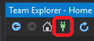

4.  In the view that appears, look for the “Local Git Repositories” area
    and click the “Clone” link:  
    

5.  You will then be prompted for the location of the repository you
    would like to clone locally. Enter
    <https://github.com/awsimaya/SuperBlogLambda> and note the location
    of the local copy. This will copy the source code for your Web
    application locally.  
    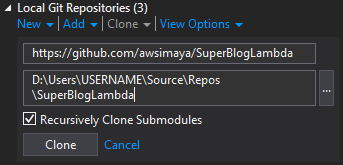

6.  After the cloning process has completed, Visual Studio will
    automatically open the solution. At this point, you can explore the
    source code for the application. If you are already familiar with
    the structure of ASP.NET MVC applications, you may notice a few
    additional items that have been added to this project:

<!-- end list -->

  - appsettings.json: defines application
    configuration, including the name of the S3 bucket used to host blog
    posts

  - LocalEntryPoint.cs: provides an entry point that can be used to run
    your application from your development environment

  - LambdaEntryPoint.cs: provides the
    method that will be invoked by AWS Lambda

  - serverless.template: a CloudFormation
    template that defines the Lambda that executes the handler as well
    as the API Gateway resource that provides an HTTPS endpoint

  - aws-lambda-tools-defaults.json:
    provides default values for the deployment wizard inside Visual
    Studio

## Preparing your AWS Environment

In order for our application to run properly, we will need to create an S3 bucket to host the blog posts. We will then be able to run the Web application locally to verify it works properly, we will deploy it as a Serverless application using the Visual Studio Toolkit, and then we will test it.

### Creating an S3 Bucket to Host our Blog Posts

1.  Navigate to the S3 dashboard by either searching for S3 in the list
    of AWS services or by navigating your browser to
    <https://console.aws.amazon.com/s3>.

2.  Create a bucket to host our blog posts by clicking the “Create
    Bucket” button on the console:  
    

3.  You will be presented with a dialog to provide a unique bucket name
    as well as the region in which this bucket will be hosted. The
    bucket name must only use lowercase alphanumeric characters or the
    dash character and must be unique across all AWS accounts. It is
    recommended that you use a name such as “superbloglambda-\<your
    name\>” and record the name you used, as we will be using it later.
    For the purposes of this session, we will use the “Canada (Central)”
    region:  
    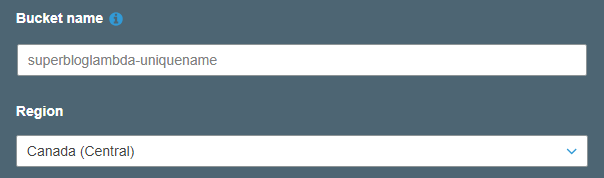

4.  Now that we have created our bucket, let’s update the configuration
    of our application in appsettings.json to reflect the new bucket
    name; change the value of the BUCKETNAME setting to your new bucket
    name.  
    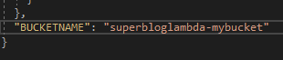

### Testing our Application

At this point, we can run our application from within Visual Studio by
either pressing F5 or clicking the “Run” button on the toolbar. The
LocalEntryPoint.cs file defines an entry point that can be used to run
the application from your local machine, and this creates a local Web
hosting environment. Verify the application starts and that you see the
user interface of the Web Application.

### Deploying our Application as a Serverless Application

We are now ready to publish our Web application to Lambda\! As mentioned
before, this project includes a file named serverless.template. This
file contains an AWS CloudFormation template using the Serverless
Application Model (SAM) to define an API Gateway endpoint and the Lambda
that runs our application code. Let’s take a moment to examine this
file.

The file created by the project template is a JSON file defining the
resources that are provisioned to host your application code as a Lambda
function. This resource is using a type defined by SAM as an
AWS::Serverless::Function. In this resource, we indicate that it is a
function that uses the .NET Core 2.1 execution environment through the
“Runtime” property, and we indicate that the function’s entry point is
the FunctionHandlerAsync method (this method is defined in the base
class of the LambdaEntryPoint class). In addition, we specify event
types that can cause our Lambda function to be invoked. In both cases,
they are configured to be sourced from API Gateway: any request for the
root resource of the API (“/”) as well as a “proxy” resource that
forwards all requests to the Lambda to allow ASP.NET MVC’s routing
engine to handle all requests below the root path (“/{proxy+}”).
Finally, we also specify which IAM policies the Lambda will be granted
to determine the permissions it will have when accessing AWS services in
the “Policies” property; in this case, we have granted the Lambda full
access to S3 as well as “read-only” access to Amazon Translate.

### Publishing our Lambda

We are now ready to publish our Lambda function\! Since we already have
the Visual Studio Toolkit installed, we can deploy directly from the
Solution Explorer. The publication process uses CloudFormation to deploy
our Lambda to our AWS account. To do this, we must provide the region
into which it will deploy our Lambda, a name for the CloudFormation
stack, and the name of an S3 bucket that we will copy our Lambda’s
executable code for CloudFormation to use during the Lambda creation
process.

1.  Right-click the SuperBlogLambda project in the Solution Explorer

2.  From the context menu that appears, choose Publish to AWS Lambda; a
    dialog will then appear requesting additional information for the
    publication process.  
    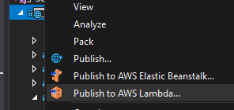

3.  For the Region drop-down select the Canada (Central) region.

4.  Ensure the Release configuration has been selected, and that the
    target Framework is .NET Core 2.1 (netcoreapp2.1).

5.  Enter a name for our new CloudFormation Stack, such as
    “SuperBlogLambda.”

6.  In the S3 Bucket dropdown, choose the name of the S3 bucket we
    created in the bucket creation steps above.  
      
    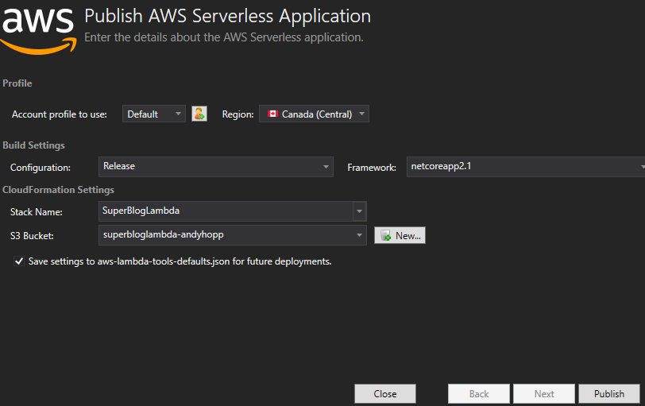

7.  Click the “Publish” button. This will start the creation of our
    Serverless CloudFormation stack, and open a view displaying the
    progress of the deployment.

8.  After the deployment of our stack has completed, the “AWS Serverless
    URL” field will display the URL of the API gateway used to reach our
    Serverless application. Click the URL to open it in your Web
    browser.  
    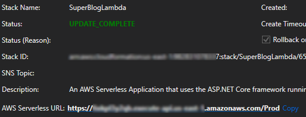

9.  We can then view the list of blog posts we have added to our S3
    bucket. If you haven’t already, add a new blog post by clicking “New
    Post” on the menu bar of the application. Provide a title and some
    content, and click the Submit button to post our new entry.

10. After we create our post, we can view the post in our S3 bucket.
    Open your AWS console at <https://console.aws.amazon.com/s3>, and
    click on the name of the bucket we created to view its contents.

11. Note that we now have two folders in the bucket: a folder named “EN”
    that contains the English text of our blog posts, and another named
    “SuperBlogLambda” that was created during the CloudFormation stack
    deployment process. Click the “EN” folder to view our posts.  
    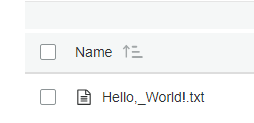

## Adding Translation through Amazon Translate

The Web site we have created now works, but it only supports users who
can read English. We’d like to change that\! As it happens, Amazon Web
Services has a service named Amazon Translate that is capable of
translating text from one language to another, and we’d like to use that
service to translate our blog posts for us. In addition, we’d like for
this translation to occur automatically, and without having to
complicate the code of our Web application.

In the example above, we created a Lambda that responds to events
triggered by Web requests against an API Gateway to serve content. Just
as Lambda functions can be executed for that type of event, we can have
other events trigger execution, and one of the trigger types supported
by Lambda is events that occur in an S3 bucket. As we have seen, the
SuperBlog Web app already performs PUTs to an S3 bucket, so we can use
the creation of a blog post as a trigger to have Lambda call an Amazon
Translate API to perform translation.

1.  If it is not already open, open Visual Studio 2017 from the Start
    menu.

2.  On the View menu, click Team Explorer. The Team Explorer window will
    appear (by default, this will be on the right-hand side of your
    Visual Studio window).

3.  In the Team Explorer window, click the “Connect” icon. This will
    look like a power plug icon:
    
    

4.  In the view that appears, look for the “Local Git Repositories” area
    and click the “Clone” link:  
    

5.  You will then be prompted for the location of the repository you
    would like to clone locally. Enter
    <https://github.com/awsimaya/TranslateBatch> and note the location
    of the local copy. This will copy the source code for your Web
    application locally.  
    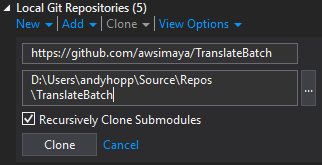

6.  After the cloning process has completed, Visual Studio will
    automatically open the solution. At this point, you can explore the
    source code for the application. If you are already familiar with
    the structure of ASP.NET MVC applications, you may notice a few
    additional items that have been added to this project:

<!-- end list -->

  - serverless.template: a CloudFormation
    template that defines the Lambda that contains the code that
    performs translation

  - aws-lambda-tools-defaults.json:
    provides default values for the deployment wizard inside Visual
    Studio

<!-- end list -->

7.  Open Function.cs to review the source code for our handler.

8.  On line 23, note that we define an array containing the list of
    languages we would like to target. In this case, we would like to
    translate to Spanish (ES), German (DE), and French (FR)  
    

9.  On line 52, we have defined our Lambda’s handler. There are two
    things of note on this line. The first is that this handler is using
    .NET’s native async/await support, which can make asynchronous code
    significantly easier to write. The second is that the event type is
    using a class that represents S3 events:  
    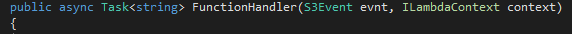

10. Follow the steps we used to publish the SuperBlogLambda project
    above to publish our TranslationBatch Lambda.

11. Once the deployment has completed, open your AWS Console at
    <https://console.aws.amazon.com/lambda> to view your list of
    published Lambdas.

12. Click the TranslateBatch Lambda to open the configuration view for
    this Lambda.

13. Next, we will configure a trigger for our Lambda. In the list of
    triggers (under “Designer”), choose S3. 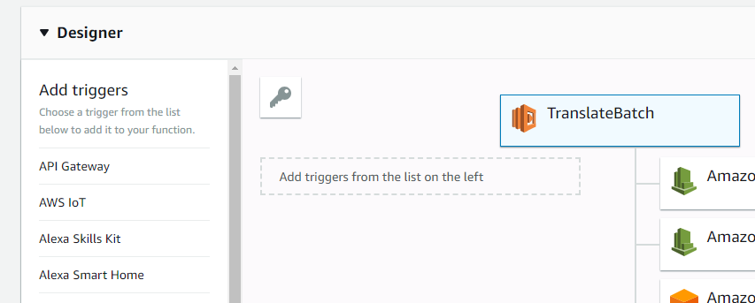

14. This event type requires some additional configuration; for the
    bucket that is the source of events, choose our bucket from above.
    For the “Event type” dropdown, choose “PUT.” Finally, configure the
    “Prefix” to “EN/” (note: this step is
    important)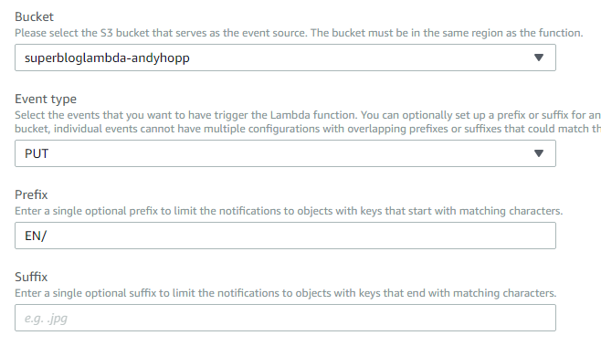

15. Click the “Add” button on the trigger configuration dialog.

16. Scroll back to the top of this view, and click “Save” to persist our
    changes.  
    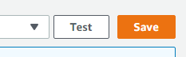

17. Now that we have added translation capabilities, let’s see it in
    action. Re-open our Web application from the Serverless URL from
    above. If you have closed the tab, you can open the AWS Explorer
    (from the menu bar, click View-\>AWS Explorer) and expand the
    CloudFormation node to view the list of stacks you have deployed. If
    you open the SuperBlogLambda stack, you will see the Serverless URL

18. Add text to “new post” form and submit

19. Navigate to S3 bucket, note new posts

# Review

Congratulations! You have now successfully deployed a Serverless Web application in your AWS account. In this workshop, we took an ASP.NET Core blog server backed by S3 and packaged it for use as an AWS Lambda function using a Serverless Application Model (SAM) template. We also added translation capabilities to the blog without needing to modify the original application by creating a Lambda that is triggered by the creation of new objects in an S3 bucket and leverages Amazon Translate to perform translation from English to French, German, and Spanish.

Thank you for joining us for this Builder Session! We hope you found this workshop useful, and can't wait to see what you build on AWS.