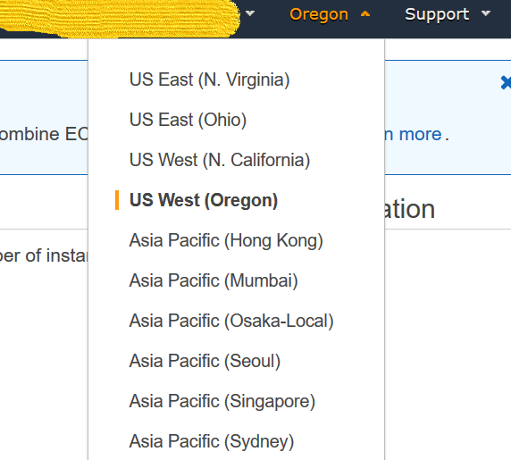
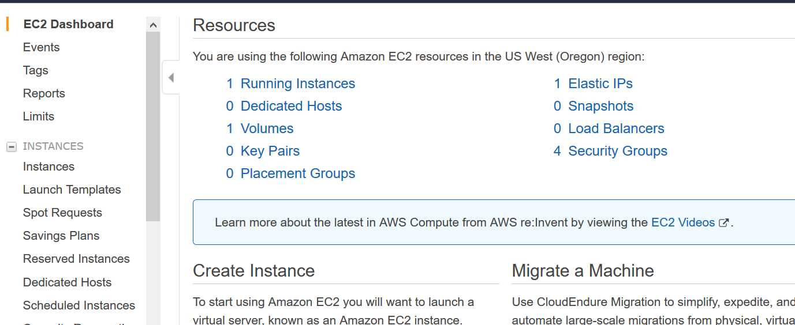
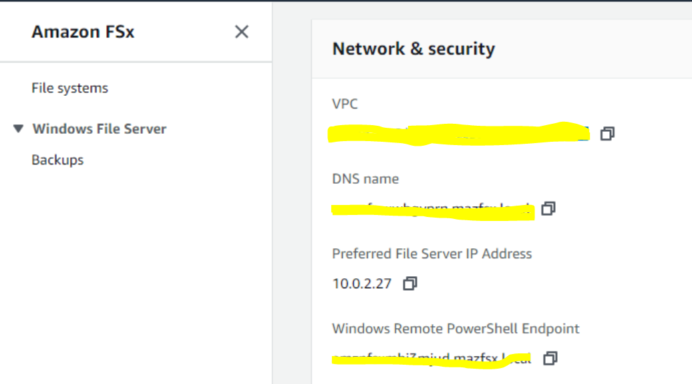

In this session we will explore the performance characteristics of the multi-AZ
FSx File system for Windows Server.

We will also deploy the CloudWatch FSx performance dashboard and use it to
monitor historical performance of the FSx file system.

We will then deploy the Continuously Available File Share (CAFS) and compare its
performance to the non-CAFS on certain types of operations.

Connect to the Windows Server and Perform Drive Mappings
--------------------------------------------------------

### Obtain the DNS name and ID of the FSx for Windows File System

1.  Sign in to the AWS Management Console and open the IAM console
    at <https://console.aws.amazon.com/fsx/>.

2.  In the top right corner of the screen make sure that you have selected the
    us-west-2 (Oregon) region.

1.  In the AWS Management Console – FSx open the list of the FSx file systems
    deployed in your account by clicking

    

    in the upper left corner of the screen and selecting **File Systems**:

1.  Please note the File System ID displayed next to the file system name (
    starts with fs-xxxxxxxx) Click on the File System name to open the file
    system details:

1.  Click on the **Network and Security** tab and make a note of the File
    System’s DNS name:

Deploy CloudWatch FSx Performance Dashboard
-------------------------------------------

1.  Open the CloudFormation service in AWS Management Console:
    <https://console.aws.amazon.com/cloudformation>

1.  Click on Create stack button and select **With new resources (standard)**

1.  Specify template source [link](https://awsentworkshops.com/reinvent2019/STG324/fsx-dashboard.yaml "CloudFormation Template") and click **Next**

>   Note: you will need to download the template to the local drive, then select
>   **Upload a template file:**

1.  On **the Specify Stack Details** screen provide the stack name (eg.
    FSx-dashboard) and the file system ID recorded earlier and click **Next**:

1.  On the **Configure Stack Options** screen click **Next**

2.  On the **Review** screen click **Create Stack**

3.  The stack creation takes a few seconds. Wait until it is completed.

1.  Open the CloudWatch console: <https://console.aws.amazon.com/cloudwatch/>
    and click on Dashboards in the upper left corner of the screen:

1.  Open the FSx performance console by clicking on the console name:

>   We have successfully deployed the CloudWatch console that we will be using
>   to visualize the performance of the FSx file system later in the session.

### Log in to the Windows Server 

1.  Open the EC2 console: <https://console.aws.amazon.com/ec2> and select
    **Running Instances** in the **Resources** pane:

1.  Click Connect to Demo-EC2JumpServer instance

1.  Click on Download Remote Desktop file and open it with RDP application:

2.  On the Enter Your Credentials screen (Windows) click More choices and Use a
    different Account:

1.  Log into the instance using the credentials below:

>   User Name: stg324\\admin

>   Password: @STG324@

### Explore the default FSx share and mapping the drive

1.  When logged into the Windows server launch File Management snapin from the
    Run menu:

    

2.  When logged into the Windows server open the File Explorer by clicking the
    folder icon on the Windows tool bar and select **This PC – Computer – Map
    Network drive**:

1.  Map the drive to the FSx share using the FSx DNS name recorded earlier:

### DiskSpd Read Tests

1.  From the remote desktop session to **Windows Server**, *open* a PowerShell
    window.

| Important | This section assumes that **Amazon FSx for Windows File Server** is mapped as the **Z:/** drive. If your **Windows Instance**  does not have a mapped **Z:/** drive, map **Amazon FSx for Windows File Server** as the **Z:/** drive (see the previous section for step-by-step instructions). |
|-----------|------------------------------------------------------------------------------------------------------------------------------------------------------------------------------------------------------------------------------------------------------------------------------------------------|

2.  *Run* the script below to create a 100 GB sparse file

3.  $random = $(Get-Random)

>   fsutil file createnew Z:\\${env:computername}-$random.dat 100000000000

1.  Run the DiskSpeed script below to test read performance of the
    mapped **Z:** drive

>   C:\\Tools\\DiskSpd-2.0.21a\\amd64\\DiskSpd.exe -d120 -w0 -r -t1 -o32 -b64K
>   -Su -L Z:\\${env:computername}-$random.dat

>   While the script is running, open **Task Explorer** and monitor network
>   performance (e.g. Task Explorer \>\> Performance (tab) \>\> Ethernet).

-   What was the peak read throughput you achieved?

-   What was the P99 (99th %-tile) of your test?

1.  Experiment with different DiskSpd parameter settings. Use the table below as
    a guide. Test with different block sizes (-b), number of outstanding I/O
    requests (-o), number of threads per file (-t), and enable/disable software
    caching (-Su).

| **Parameter**        | **Description**                                                                                                                                                                               |
|----------------------|-----------------------------------------------------------------------------------------------------------------------------------------------------------------------------------------------|
| \-b\<size\>[K\|M\|G] | Block size in bytes or KiB, MiB, or GiB (default = 64K).                                                                                                                                      |
| \-o\<count\>         | Number of outstanding I/O requests per-target per-thread. (1 = synchronous I/O, unless more than one thread is specified with by using -F.) (default = 2)                                     |
| \-r\<size\>[K\|M\|G] | Random I/O aligned to the specified number of \<alignment\> bytes or KiB, MiB, GiB, or blocks. Overrides -s (default stride = block size).                                                    |
| \-s\<size\>[K\|M\|G] | Sequential stride size, offset between subsequent I/O operations in bytes or KiB, MiB, GiB, or blocks. Ignored if -r is specified (default access = sequential, default stride = block size). |
| \-t\<count\>         | Number of threads per target. Conflicts with -F, which specifies the total number of threads.                                                                                                 |
| \-Su                 | Disable software caching.                                                                                                                                                                     |

-   What different parameters did you test?

-   How did the different parameter options alter the results?

### DiskSpd Write Tests

1.  From the remote desktop session to **Windows Server**, *open* a PowerShell
    window.

| Important | This section assumes that **Amazon FSx for Windows File Server** is mapped as the **Z:/** drive. If your **Windows Instance** does not have a mapped **Z:/** drive, map **Amazon FSx for Windows File Server** as the **Z:/** drive (see the previous section for step-by-step instructions). |
|-----------|-----------------------------------------------------------------------------------------------------------------------------------------------------------------------------------------------------------------------------------------------------------------------------------------------|

2.  Run the DiskSpeed script below to test write performance of the
    mapped **Z:** drive

3.  $random = $(Get-Random)

>   C:\\Tools\\DiskSpd-2.0.21a\\amd64\\DiskSpd.exe -d120 -c2G -s64K -w100 -t1
>   -o32 -b64K -Sh -L Z:\\${env:computername}-$random.dat

>   While the script is running, open **Task Explorer** and monitor network
>   performance (e.g. Task Explorer \>\> Performance (tab) \>\> Ethernet).

-   What was the peak write throughput you achieved?

-   What was the P99 (99th %-tile) of your test?

1.  Experiment with different DiskSpd parameter settings. Use the table below as
    a guide. Test with different file sizes (-c), different block sizes (-b),
    number of outstanding I/O requests (-o), number of threads per file (-t),
    random I/O (-r) or sequential I/O (-s), and enable/disable software &
    hardware write caching (-Sh).

| **Parameter**        | **Description**                                                                                                                                                                               |
|----------------------|-----------------------------------------------------------------------------------------------------------------------------------------------------------------------------------------------|
| \-d\<seconds\>       | Duration in seconds.                                                                                                                                                                          |
| \-b\<size\>[K\|M\|G] | Block size in bytes or KiB, MiB, or GiB (default = 64K).                                                                                                                                      |
| \-c\<size\>[K\|M\|G] | Create files of the specified size. Size can be stated in bytes or KiBs, MiBs, GiBs, or blocks.                                                                                               |
| \-r\<size\>[K\|M\|G] | Random I/O aligned to the specified number of \<alignment\> bytes or KiB, MiB, GiB, or blocks. Overrides -s.                                                                                  |
| \-s\<size\>[K\|M\|G] | Sequential stride size, offset between subsequent I/O operations in bytes or KiB, MiB, GiB, or blocks. Ignored if -r is specified (default access = sequential, default stride = block size). |
| \-o\<count\>         | Number of outstanding I/O requests per-target per-thread. (1 = synchronous I/O, unless more than one thread is specified with by using -F.) (default = 2)                                     |
| \-t\<count\>         | Number of threads per target. Conflicts with -F, which specifies the total number of threads.                                                                                                 |
| \-Sh                 | Disables both software caching and hardware write caching.                                                                                                                                    |

-   What different parameters did you test?

-   How did the different parameter options alter the results?

### CloudWatch Dashboard

1.  Open the [Amazon
    CloudWatch](https://console.aws.amazon.com/cloudwatch/) console.

2.  Make sure you are in the same AWS Region where you created* *your workshop
    environment.

3.  Select **Dashboards** from the left navigation pane.

4.  *Select* the link of the dashboard created as a part of the workshop
    environment.

| Tip | The name of the dashboard should be the region name (e.g. us-east-1), dash (-), file system id of **Amazon FSx for Windows File Server** (e.g. us-east-fs-0123456789abcdef). |
|-----|------------------------------------------------------------------------------------------------------------------------------------------------------------------------------|

5.  Scroll* *through the dashboard and review all the widgets and their
    settings.

6.  Notice how the vertical time line is in sync across all widgets. This makes
    it easy to correlate different metric values for a given point in time.

7.  Zoom in on a widget by clicking* *and dragging over a period of time. Notice
    all widgets also zoom in for the period of time selected.

8.  Reset zoom by clicking the blue magnifying glass in the top right of any
    widget.

### Create Continuously Available File Share 

1.  From the Powershell console execute the following script:

*$Username = 'STG324\\admin'*

*$Password = '@STG324@'*

*$pass = ConvertTo-SecureString -AsPlainText $Password -Force*

*$MyCreds = New-Object -TypeName System.Management.Automation.PSCredential
-ArgumentList $Username,$pass*

*invoke-command -computername "Windows Remote Powershell Endpoint”
-credential $MyCreds -configurationname FSxRemoteAdmin -scriptblock {
new-fsxsmbshare -name CAFS -path D:\\ -credential $Using:MyCreds
-ContinuouslyAvailable $True }*

where "Windows Remote Powershell Endpoint" is the management endpoint for
the multi-AZ FSx file system.

1.  Map the drive to the Continuously Aavailable File Share.

>   From the command prompt:

>   Net use \* "File System DNS name"\\CAFS

### Compare the Write Performance of Continuously Available and Not Continuously Available File Systems

Test the Write performance of the non-Continuously available File Share with
write-back caching enabled:

1.  From the remote desktop session to **Windows Server**, *open* a PowerShell
    window.

| Important | This section assumes that **Amazon FSx for Windows File Server Share** is mapped as the **Z:/** drive. If your **Windows Instance** does not have a mapped **Z:/** drive, map **Amazon FSx for Windows File Server** as the **Z:/** drive (see the previous section for step-by-step instructions). |
|-----------|-----------------------------------------------------------------------------------------------------------------------------------------------------------------------------------------------------------------------------------------------------------------------------------------------------|

2.  Run the DiskSpeed script below to test write performance of the
    mapped **Z:** drive with write-back caching enabled

3.  $random = $(Get-Random)

>   C:\\Tools\\DiskSpd-2.0.21a\\amd64\\DiskSpd.exe –d60 -c2G -s64K -w100 -t1
>   -o32 -b64K -L Z:\\${env:computername}-$random.dat

Note the results of the test in terms of IOPS and latency.

Test the Write performance of the Continuously Available File Share with
write-back caching enabled:

1.  From the remote desktop session to **Windows Server**, *open* a PowerShell
    window.

| Important | This section assumes that **Amazon FSx for Windows File Server Share CAFS share** is mapped as the **Y:/** drive. If your **Windows Instance** does not have a mapped **Y:/** drive, map **Amazon FSx for Windows File Server** as the **Y:/** drive (see the previous section for step-by-step instructions). |
|-----------|----------------------------------------------------------------------------------------------------------------------------------------------------------------------------------------------------------------------------------------------------------------------------------------------------------------|

2.  Run the DiskSpeed script below to test write performance of the
    mapped **Y:** drive with write-back caching enabled

3.  $random = $(Get-Random)

>   C:\\Tools\\DiskSpd-2.0.21a\\amd64\\DiskSpd.exe –d60 -c2G -s64K -w100 -t1
>   -o32 -b64K -L Y:\\${env:computername}-$random.dat

Note the results of the test in terms of IOPS and latency.

-   Was there any difference in performance between non-CAFS and CAFS?

-   If yes, why?
