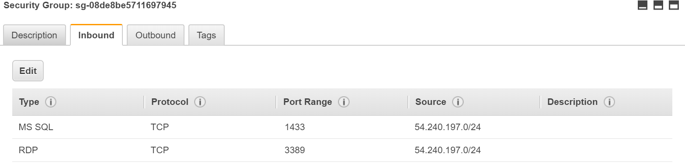
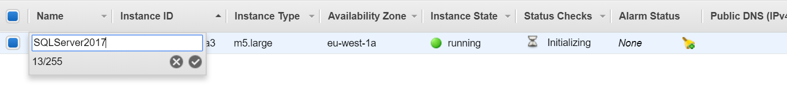
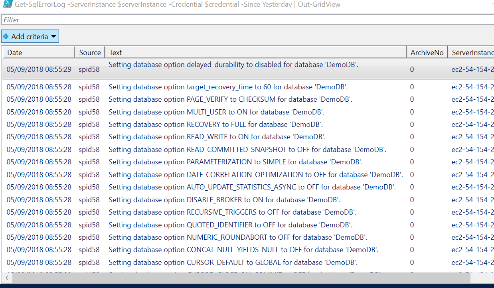

Author: Anil Erduran

Draft version 0.1

Abstract

In this lab, you will configure your AWS Account and create a new EC2 SQL Server
instance. Once you create all the requirements and instance itself, you will
connect this SQL instance remotely using SQL Management Studio and PowerShell
Remote.

Introduction

Microsoft and Amazon have jointly developed a set of Amazon Machine Images
(AMIs) for some of the more popular Microsoft solutions. For the all available
Windows AMIs please refer to: <https://aws.amazon.com/windows/resources/amis/>

Amazon Web Services offers you the flexibility to run Microsoft SQL Server for
as much or as little time as you need. You can select from a number of versions
and editions, as well as choose between running it on Amazon Elastic Compute
Cloud (Amazon EC2) or Amazon Relational Database Service (Amazon RDS).

Using SQL Server on Amazon EC2 gives you complete control over every setting,
just like when it’s installed on-premises. Amazon RDS is a fully managed service
that takes care of all the maintenance, backups, and patching for you. To see
what versions and editions are available, read below for EC2 and go here for
RDS. You can choose AWS license-included options on Amazon EC2 instances and
Amazon RDS or choose to bring your own license on Amazon EC2.

Lab Overview

In this lab, you will configure pre-requirements in your AWS account. Once the
requirements are set, you will be launching a Windows Server 2016 with SQL
Server 2017 Standard instance in a VPC. Then you will enable remote access to
your SQL Server EC2 instance and try to access SQL instance through SQL
Management Studio and PowerShell for administrative tasks such as creating a
database, creating tables and viewing logs.

Prerequisites

To complete the lab, you need the following requirements:

1.  [SQL Management
    Studio](https://docs.microsoft.com/en-us/sql/ssms/download-sql-server-management-studio-ssms?view=sql-server-2017)
    installed on your local computer.

2.  An AWS Account

3.  A Virtual Private Cloud (VPC) in your AWS account that has an Internet
    Gateway attached and routes configured.

4.  An AWS IAM user with privileges to create/modify EC2 instances and Security
    Groups.

Configuring Network

Before launching a new instance, it’s recommended to setup required network
configuration including VPC Setup and Security Groups.

1.  In AWS console, navigate to VPC and make sure you have a VPC created in the
    selected region for this lab. You will use this VPC and IPv4 CIDR to deploy
    SQL EC2 instance. VPC should have a public subnet which has required routes
    to internet. This subnet will be used to provision EC2 SQL Instance.

1.  Navigate to EC2 console and select Security Groups. Select “Create Security
    Group”.

2.  Give a name to your Security Group (e.g. SQL_Ext_Access). For the VPC field,
    select the VPC you would like to use for this lab.

3.  Add a description.

4.  Select “Add Rule” button and provide below details

    1.  Type -\> MS SQL

    2.  Protocol -\> TCP

    3.  Port Range -\> 1433

    4.  Source -\> Select My IP and record the populated IP Address. Then switch
        back to “custom” and extend the range. For instance, if your IP address
        is 54.240.197.221/32, then convert this to 54.240.197.0/24 and add as a
        custom source. This will help to provide external access to the entire
        subnet of your network. (in case your IP address changes during the lab)

5.  Select “Add Rule” button again and provide below details

    1.  Type -\> RDP

    2.  Protocol -\> TCP

    3.  Port Range -\> 3389

    4.  Source -\> Select My IP and record the populated IP Address. Then switch
        back to “custom” and extend the range. For instance, if your IP address
        is 54.240.197.221/32 then convert this to 54.240.197.0/24 and add as a
        custom source. This will help to provide external access to the entire
        subnet of your network. (in case your IP address changes during the lab)

6.  Click “Create”

Create EC2 Instance with Microsoft SQL Server Pre-Installed

In this task, you will create a Windows Server 2016 with SQL Server 2017 Express
EC2 instance.

-   Navigate to EC2 Console and click “Launch Instance”

-   Scroll down and select “Microsoft Windows Server 2016 with SQL Server 2017
    Standard”

-   On Step 2, Select M5.Large and click “Next: Configure Instance Details”

-   On Step 3,

    -   For “Network” select your VPC and Subnet.

    -   For “Auto-Assign Public IP”, select Enable. This option will request a
        Public IP from Amazon so that your instance will be reachable from the
        internet. Please note that in production most of the time you don’t
        assign a public IP address to your SQL instance and make them accessible
        from the internet. The recommended approach is to setup Remote Desktop
        Gateway environment as jump box for internet access and then access SQL
        environment using private IPs. For this lab, we are assigning Public IP
        to access the SQL environment from our local computers.

-   Click “Next: Add Storage”

-   Click “Next Add Tags”

-   Click “Next Configure Security Groups”

-   On Step 6, Click “Select an existing security group” and Choose the Security
    you created on the previous task. Click “Launch”

You will be prompted to select a key pair for authentication. If you have an
existing key pair, you can select it from the list. You can also create a new
key pair directly from the same screen. Click “Launch Instances”

-   Go back to EC2 console and click the pencil icon next to the Name column for
    the new instance to add a tag (e.g. SQL Server 2017)

Once the “Status Checks” shows “2/2 checks passed” your instance will be ready
to connect.

Now you have launched a new Windows Server 2016 EC2 instance with a
pre-installed SQL Server 2017 environment.

,

Changing SA Password

To connect SQL Server remotely, we have to verify that SA Login is enabled and
password set. For this:

-   Connect to the newly created EC2 instance using RDP and provided keys.

To change security authentication mode:

1.  In SQL Server Management Studio Object Explorer, right-click the server, and
    then click Properties.

2.  On the Security page, under Server authentication, select the new server
    authentication mode (SQL Server and Windows Authentication Mode), and then
    click OK.

3.  In the SQL Server Management Studio dialogue box, click OK to acknowledge
    the requirement to restart SQL Server.

4.  In Object Explorer, right-click your server, and then click Restart.

To enable the sa login

1.  In Object Explorer, expand Security, expand Logins, right-click sa, and then
    click Properties.

2.  On the General page, enter password “Password!”

3.  On the Status page, in the Login section, click Enabled, and then click OK.

Remote Management – SQL Management Studio

In this task, you will be connecting your EC2 SQL instance using locally
installed SQL Management Studio.

-   Launch SQL Server Management Studio on your local computer.

-   On the “Connect to Server” popup, provide EC2 instance public DNS Name and
    select SQL Server Authentication

-   For the Login enter sa, for the Password enter “Password!” that you created
    in the previous task.

You should be able to connect your SQL instance. Now you can simply right click
instance name and create a new database. Please create a few databases and
tables before proceeding to the next exercise.

Remote Management – PowerShell Remote

To use PowerShell Remote feature for SQL, you need to Import SQLServer module on
your local computer.

Please enter your SQL EC2 instance public DNS name for \$serverInstance variable
in the below code piece.

Following PowerShell commands will initiate the connection to remote SQL Server

Import-Module SqlServer \#make sure to have SQL Management Studio Installed

\$serverInstance = "ENTER_PUBLIC_DNS_NAME" \#Provide EC2 instance DNS name

\$credential = Get-Credential \#Provide credentials for SA account

\# Load the SMO assembly and create a Server object

[System.Reflection.Assembly]::LoadWithPartialName('Microsoft.SqlServer.SMO') \|
out-null

\$server = New-Object ('Microsoft.SqlServer.Management.Smo.Server')
\$serverInstance

\# Set credentials

\$server.ConnectionContext.LoginSecure=\$false

\$server.ConnectionContext.set_Login(\$credential.UserName)

\$server.ConnectionContext.set_SecurePassword(\$credential.Password)

\# Connect to the Server and get a few properties

\$server.Information \| Select-Object Edition, HostPlatform, HostDistribution \|
Format-List

After the last command, you should get an output like below:

Now you can run additional operational PS commands. The following command will
output all SQLErrorLogs since yesterday into a grid table.

Get-SqlErrorLog -ServerInstance \$serverInstance -Credential \$credential -Since
Yesterday \| Out-GridView

Congratulations. You have successfully created a new EC2 SQL Server 2017
instance and remotely connected it using SQL Management Studio and PowerShell
Remote.
