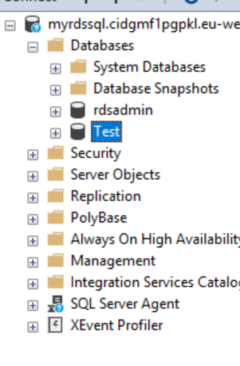
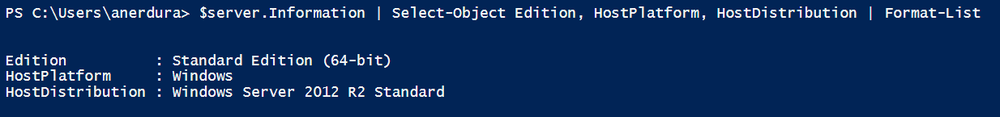
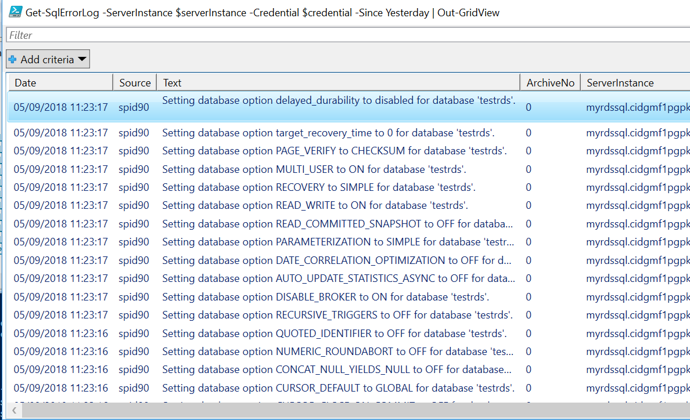

Author: Anil Erduran

Draft version 0.1

Abstract

In this lab, you will configure your AWS Account and create a new RDS SQL Server
instance. Once you create all the requirements and instance itself, you will
connect this SQL instance remotely using SQL Management Studio and PowerShell
Remote.

Introduction

Amazon Relational Database Service (Amazon RDS) is a web service that makes it
easier to set up, operate, and scale a relational database in the cloud. It
provides cost-efficient, resizable capacity for an industry-standard relational
database and manages common database administration tasks.

Amazon RDS supports DB instances running several versions and editions of
Microsoft SQL Server. The most recent supported version of each major version is
shown following. For the full list of supported versions, editions, and RDS
engine versions, see [Version and Feature Support on Amazon
RDS](https://docs.aws.amazon.com/AmazonRDS/latest/UserGuide/CHAP_SQLServer.html#SQLServer.Concepts.General.FeatureSupport).

-   SQL Server 2017 RTM CU3 14.00.3015.40, released per KB4052987 on 4 January
    2018.

-   SQL Server 2016 SP1 CU7 13.00.4466.4, released per KB4057119 on 4 January
    2018.

-   SQL Server 2014 SP2 CU10 12.00.5571.0, released per KB4052725 on 16 January
    2018.

-   SQL Server 2012 SP4 GDR 11.00.7462.6, released per KB4057116 on 12 January
    2017.

-   SQL Server 2008 R2 SP3 GDR 10.50.6560.0, released per KB4057113 on 6 January
    2018. Not available in US East (Ohio), Canada (Central), and EU (London)

For information about licensing for SQL Server, see [Licensing Microsoft SQL
Server on Amazon
RDS](https://docs.aws.amazon.com/AmazonRDS/latest/UserGuide/SQLServer.Concepts.General.Licensing.html).
For information about SQL Server builds, see this Microsoft support article
about [the latest SQL Server
builds.](https://support.microsoft.com/en-us/help/957826)

Prerequisites

To complete the lab, you need the following requirements:

1.  [SQL Management
    Studio](https://docs.microsoft.com/en-us/sql/ssms/download-sql-server-management-studio-ssms?view=sql-server-2017)
    installed on your local computer.

2.  An AWS Account

3.  A Virtual Private Cloud (VPC) in your AWS account that has an Internet
    Gateway attached and routes configured.

4.  An AWS IAM user with privileges to create/modify RDS instances and Security
    Groups.

Create RDS SQL Instance with Microsoft SQL Server Pre-Installed

In this task, you will create a new RDS SQL Server 2017 Instance.

-   Navigate to RDS Console -\> Instances and click “Create database”

-   On Step 1, select “Microsoft SQL Server” and “SQL Server Standard Edition”
    then click “Next”.

-   On Step 2, select “Dev/Test” and click “Next”

-   On Step 3 – Instance Specifications:

    -   License Model: license-included

    -   DB engine version: SQL Server 2017 14.00.3015.40.v1

    -   DB instance class: db.m4.large

    -   Multi-AZ deployment: No

-   On Step 3 – Settings:

    -   DB instance identifier: myrdssql

    -   Master username: student

    -   Master password: Password!

-   Click Next.

-   In the Network & Security section:

    -   VPC: Default: VPC

    -   Subnet Group: Default

    -   Public Accessibility: Yes

    -   VPC Security Group: Create new VPC security group

-   Leave other options as default and click “Create Database”

If you click “View DB instance details”, here you will be able to monitor the
progress of your DB instance. Usually, creating a new RDS instance can take
around 20 minutes.

Configuring Remote Access

As you will be accessing your RDS instance via a local SQL Server Management
Studio and PowerShell Remote, it’s important to verify required rules in
Security Groups.

-   Navigate to “Instances” and under “Connect – Security Group” click inbound
    rule.

This is a Security Group created by the RDS wizard. Click the inbound tab and
make sure that your IP address has entry for port 1433 TCP.

Remote Management – SQL Management Studio

In this task, you will be connecting your RDS SQL instance using locally
installed SQL Management Studio. Please wait for the SQL RDS instance to be
created.

-   Launch SQL Server Management Studio on your local computer.

-   Navigate RDS console – Instances and scroll down to “Connect” pane. Here
    copy the endpoint URL.

-   On the “Connect to Server” popup in SQL Server Management Studio, provide
    copied URL and select “SQL Server Authentication”

-   For the Login enter “student”, for the Password enter “Password!”

You should be able to connect your SQL instance. Now you can simply right click
instance name and create a new database. Please create a few databases and
tables before proceeding to the next exercise.

Remote Management – PowerShell Remote

To use PowerShell Remote feature for SQL, you need to Import SQLServer module on
your local computer.

Please enter your SQL RDS instance public endpoint name for \$serverInstance
variable in the below code piece.

Following PowerShell commands will initiate the connection to remote SQL Server

Import-Module SqlServer \#make sure to have SQL Management Studio Installed

\$serverInstance = "ENTER_PUBLIC_DNS_NAME" \#Provide RDS Public DNS name

\$credential = Get-Credential \#Provide credentials for student account

\# Load the SMO assembly and create a Server object

[System.Reflection.Assembly]::LoadWithPartialName('Microsoft.SqlServer.SMO') \|
out-null

\$server = New-Object ('Microsoft.SqlServer.Management.Smo.Server')
\$serverInstance

\# Set credentials

\$server.ConnectionContext.LoginSecure=\$false

\$server.ConnectionContext.set_Login(\$credential.UserName)

\$server.ConnectionContext.set_SecurePassword(\$credential.Password)

\# Connect to the Server and get a few properties

\$server.Information \| Select-Object Edition, HostPlatform, HostDistribution \|
Format-List

After the last command, you should get an output like below:

Run below command to get the list of RDS SQL databases:

\$server.Databases

You can access to additional information by querying \$server object properties:

Now you can run additional operational PS commands. The following command will
output all SQLErrorLogs since yesterday into a grid table.

Get-SqlErrorLog -ServerInstance \$serverInstance -Credential \$credential -Since
Yesterday \| Out-GridView

Although RDS SQL is a managed service, you can still connect it remotely with
PowerShell and run your daily operational commands.

Congratulations. You have successfully created a new RDS SQL Server instance and
remotely connected it using SQL Management Studio and PowerShell Remote.
