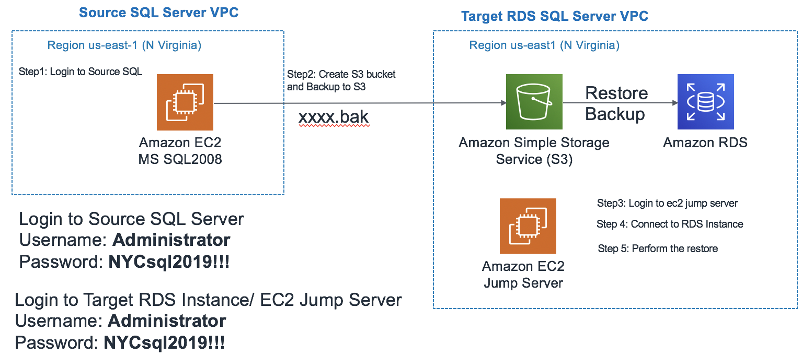
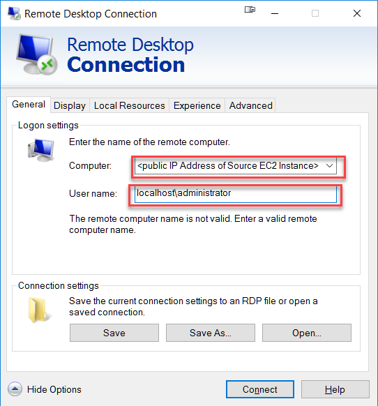
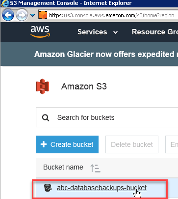
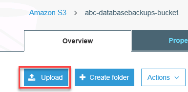
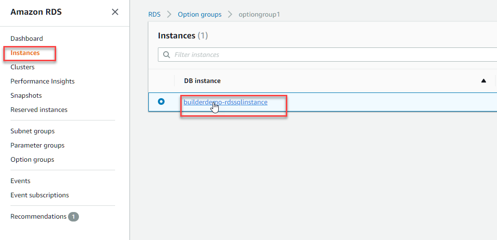
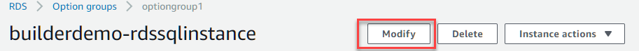
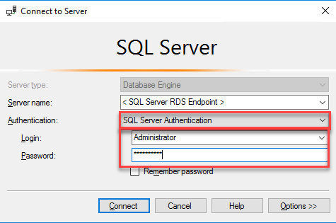
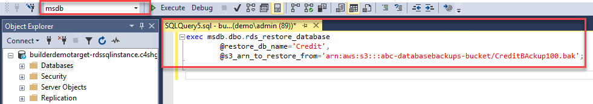

>   **SQL Server Migration Workshop**

>   Lab 1

>   Using SQL Management Studio Microsoft SQL Server Lab

November 2019

Overview 
=========

This lab demonstrates how you can use SQL Management Studio to migrate database
from the source Microsoft SQL Server running on an Amazon EC2 instance to the
target SQL Server running on Amazon RDS.

Source SQL Server VPC will represent your on-prem environment.

**What’s Configured for you**

-   Two VPC’s that represent on-prem(Source SQL) and cloud environment
    (TargetRDS).

-   VPC Peering representing Hybrid Architecture. In a real world scenario, this
    would be Direct Connect or VPN configuration. For the purpose of this lab,
    we have used VPC Peering between two different CIDR blocks.

>   The environment for this lab consists of:

-   A Microsoft SQL Server 2008 running on Windows Server 2008 R2( EC2) instance
    as the source database. This server has Microsoft SQL Server Management
    Studio installed.

-   A Microsoft SQL Server instance running on AWS RDS as the target database.

Connecting to the Environment
=============================

Sign in to your AWS Account provided by your facilitator and review the
CloudFormation stack within N Virginia Region [us-east-1].

>   <https://us-east-1.console.aws.amazon.com/cloudformation>

>   Review the important output values:

1.  SourceSQLPublicIP

2.  RDSJumpServerIP

3.  TargetRDSSQLEndpointDns

>   The following steps provide instructions to migrate existing data from the
>   source Microsoft SQL Server database running on an EC2 instance to a SQL
>   Server database running on Amazon RDS. In this exercise you perform the
>   following tasks:

-   Connect the source SQL Server running on an EC2 instance using RDP

-   Perform backup of the source database using SSMS.

-   Create S3 Bucket and upload backup files.

-   Connect to target RDS instance using EC2 Jump Server in TargetRDS VPC.

-   Perform the restore of SQL Database using SSMS

-   Once the restore completes, validate the database running in Target RDS
    Instance.

Connecting to Source SQL Server on EC2
======================================

1.  Go to **Remote Desktop Connection**

2.  Specify the **Public IP** or **Public DNS** of the Source EC2 Instance as
    the **Computer Name**

3.  Username: *localhost\\administrator*

4.  Password: *NYCsql2019!!!*

5.  Click on **Connect**

>   http://mssql2rds.reinvent-session.com/images/sourceEC2/sourcerdp.png

Connecting to SQL Server 2008 on using SSMS
===========================================

1.  Go and click on the SSMS icon on the Desktop, or go to Start and click on
    the Microsoft SQL Server management studio.

    

2.  The first time you run SSMS, the Connect to Server window opens. If it
    doesn't open, you can open it manually by selecting Object Explorer \>
    Connect \> Database Engine.

    

3.  In the *Connect to Server* window, do the following:

4.  For Server type, select *Database Engine* (usually the default option).

5.  For Server name, enter the name of your SQL Server instance. (For this demo,
    since the DB engine resides in the same server, you can specify
    "**localhost**", "**.**", or the **hostname**).

    

6.  For Authentication, select **Windows Authentication**.

7.  After you've completed all the fields, select **Connect**

8.  Example of successful connection

    

Backing up database using SSMS
==============================

1.  After connecting to the SQL Server instance in **Object Explorer**, click
    the server name to expand the server tree.

2.  Expand **Databases**, and either select a user database
    (**SalesDB** or **Credit**)

3.  Right-click the database, point to **Tasks**, and then click **Back Up**.
    The **Back Up Database** dialog box appears.

>   http://mssql2rds.reinvent-session.com/images/sourceEC2/SSMSBackup.png

1.  In the Database drop-down list, verify the database name. Optionally, you
    can select a different database from the list.

>   http://mssql2rds.reinvent-session.com/images/sourceEC2/SSMSBackupDetail.png

1.  In the **Backup Type** drop-down list, select **Full**.

2.  For **Backup Component**, select the **Database** radio button.

3.  In the **Destination** section, use the **Back Up** to drop-down list to
    select the backup destination. Please keep a note of the backup up location
    as in the next step you have to upload the backup file to S3.

Click OK to take the Full backup of the database

Create S3 Bucket for database backups
=====================================

1.  Sign in to the AWS Management Console and open the Amazon S3 console
    at <https://console.aws.amazon.com/s3/>

2.  Choose **Create Bucket**

    

3.  In the **Bucket Name** field, type a unique DNS-compliant name for your new
    bucket. (The example screen shot uses the bucket name admin-created. You
    cannot use this name because S3 bucket names must be unique.) Create your
    own bucket name using the follow naming guidelines:

4.  The name must be unique across all existing bucket names in Amazon S3.

5.  After you create the bucket you cannot change the name, so choose wisely.

6.  Choose a bucket name that reflects the objects in the bucket because the
    bucket name is visible in the URL that points to the objects that you're
    going to put in your bucket.

7.  For Region, (for the purposes of this demo) **Choose the region where the
    Target RDS SQL Server resides**. (us-east-1)

8.  Choose **Create**

Transferring backup files to S3
===============================

1.  While logged in the Source EC2 Server, sign back in to the AWS Management
    Console and open the Amazon S3 console
    at <https://console.aws.amazon.com/s3/>.

2.  In the **Bucket Name** list, choose the name of the bucket that you want to
    upload your object to:

>   http://mssql2rds.reinvent-session.com/images/sourceEC2/S3BucketChoose.png

1.  Choose Upload

>   http://mssql2rds.reinvent-session.com/images/sourceEC2/S3Upload.png

1.  In the **Upload** dialog box, choose **Add files** to choose the file to
    upload

    

2.  Choose a file to upload *(in this case, our backup file/s .bak)*, and then
    choose **Open**

    

3.  Choose **Upload.**

    

Configure the Target RDS Instance for restore
=============================================

**There are three components you'll need to set up for native backup and
restore.**

-   An Amazon S3 bucket that contains the backup files to be restored (*in the
    same region as the RDS Instance*).

-   An AWS Identity and Access Management (IAM) role to access the bucket.

-   The **SQLSERVER_BACKUP_RESTORE** option added to an option group on your DB
    instance.

**Creating an Option Group for RDS SQL Server**

1.  **Sign In** to the AWS Management Console and open the Amazon RDS console
    at <https://console.aws.amazon.com/rds/>

2.  In the navigation pane, choose **Option Groups**

3.  Choose **Create Group**  
    

    

    >   http://mssql2rds.reinvent-session.com/images/TargetRDS/CreateOptionGroup2.png

4.  In the Create option group window, do the following:

    1.  For **Name**, type a name for the option group that is *Unique* within
        your AWS account. The name can contain only letters, digits, and
        hyphens.

    2.  For **Description**, type a brief description of the option group. The
        description is used for display purposes.

    3.  For **Engine**, choose the DB engine that *matches the target RDS SQL
        Instance*

    4.  For **Major Engine Version**, choose the major version that *matches the
        target RDS SQL Instance*  
        

        

        >   http://mssql2rds.reinvent-session.com/images/TargetRDS/CreateOptionGroup3.png

5.  To continue, choose **Create**

Configuring the Option Group for SQL Native Backup/Restore
==========================================================

1.  Select the **Option Group** that you want to modify, and then choose **Add
    Option**

2.  Add the **SQLSERVER_BACKUP_RESTORE** option to the Option Group  
    

    

    >   http://mssql2rds.reinvent-session.com/images/TargetRDS/ConfigOptionGroup2.png

3.  For **IAM Role**, for the purposes of the demo, **Choose New Role**  
    

    

    >   http://mssql2rds.reinvent-session.com/images/TargetRDS/ConfigOptionGroup3.png

4.  For the **S3 Bucket**, select the bucket that was recently created, that
    stores the backup files. 

>   http://mssql2rds.reinvent-session.com/images/TargetRDS/ConfigOptionGroup4.png

1.  For **Encryption**, you can choose either  
    

    

    >   http://mssql2rds.reinvent-session.com/images/TargetRDS/ConfigOptionGroup5.png

2.  Select **Yes** on *Apply Immediately*, and continue on to **Add Option**  
    

    

    >   http://mssql2rds.reinvent-session.com/images/TargetRDS/ConfigOptionGroup6.png

**Creating an Option Group for RDS SQL Server**

1.  In the RDS navigation pane, choose **Instances**, and then select
    the **Instance** that you want to modify  
    

    

    >   http://mssql2rds.reinvent-session.com/images/TargetRDS/AddOptionGroup1.png

2.  Choose **Modify**. The Modify DB Instance page appears  
    

    

    >   http://mssql2rds.reinvent-session.com/images/TargetRDS/AddOptionGroup2.png

3.  In Option Group section, select the newly created option group

4.  Click **Continue** to proceed to the next page  
    

    

    >   http://mssql2rds.reinvent-session.com/images/TargetRDS/AddOptionGroup4.png

5.  For the purposes of the demo, choose **Apply Immediately** so the changes
    are immediately applied to the **Instance**

6.  Click on Modify DB Instance to Continue. 

7.  If you go back to the **Instances Section**, you would be able to see that
    the status of the Instace is **Modifying**, which should change back
    to **Available** once complete  
    

    

    >   http://mssql2rds.reinvent-session.com/images/TargetRDS/AddOptionGroup6.png

Connect to RDS Instance and perform restore
===========================================

**Use EC2 Jump Server to connect RDS Instance**

1.  Go to **Remote Desktop Connection**

2.  Specify the **Public IP** or **Public DNS** of the Target EC2 Jump Server as
    the **Computer Name**

3.  Username: *localhost\\administrator* 

4.  Password: *NYCsql2019!!!*

5.  Click on **Connect**

**Connecting to RDS via SSMS on Jump Server**

1.  Go and click on the SSMS icon on the Desktop, or go to Start and click on
    the Microsoft SQL Server management studio.

    

2.  The first time you run SSMS, the Connect to Server window opens. If it
    doesn't open, you can open it manually by selecting Object Explorer \>
    Connect \> Database Engine.

    

3.  In the *Connect to Server* window, do the following:

4.  For Server type, select *Database Engine* (usually the default option).

5.  For Server name, enter the name of your RDS SQL Server instance. ( RDS
    Endpoint)

    

6.  For Authentication, select **SQL Authentication** and use
    Administrator/Password

    

7.  After you've completed all the fields, select **Connect**

8.  Example of successful connection

    

**Restoring a Database on RDS via SSMS**

Reference - [Importing and Exporting SQL Server
Databases](https://docs.aws.amazon.com/AmazonRDS/latest/UserGuide/SQLServer.Procedural.Importing.html)

To restore a **Database** from S3, we will be utilizing
the *msdb.dbo.rds_restore_database* stored procedure located under
the **msdb** system database.

For the purposes of the demo, we will be Restoring **without** Encryption  
Syntax:

1.  Please use the following SQL script to perform the restore and monitor the
    task.

| **Perform restore** | exec msdb.dbo.rds_restore_database \@restore_db_name='Credit', \@s3_arn_to_restore_from='arn:aws:s3:::**\<replace_s3_bucket\>/**filename.bak'; |
|---------------------|------------------------------------------------------------------------------------------------------------------------------------------------|
| **Monitor status**  | exec msdb.dbo.rds_task_status \@db_name='Credit';                                                                                              |
| **Monitor task**    | exec msdb..rds_task_status \@task_id= \<**replace_task_id**\> For example : “exec msdb..rds_task_status \@task_id= 1”                          |

2.  Open up a **New Query Window**, and using the example above, execute the
    aforementioned stored procedure under the *msdb* database:

1.  Once executed, the task will be queued, you can then check the status by
    using the *msdb.dbo.rds_task_status* stored procedure:

>   Syntax:  
>   exec msdb.dbo.rds_task_status \@db_name='database_name';

\- To cancel any given task, you can use the *msdb.dbo.rds_cancel_task* stored
procedure  
Syntax:  
exec msdb.dbo.rds_cancel_task \@task_id=1234;  
- Restore times vary (from a few minutes, to around 30 minutes)  
- **For more on the different statuses, please see the Reference link above**

1.  Once the task status shows **SUCCESS**, the Restore is complete. 

    -   To Verify, you can see the new restored database on the **Object
        Explorer** pane on the left  
        

        

        >   http://mssql2rds.reinvent-session.com/images/TargetRDS/SSMSRestore4.png

Summary 
========

>   This lab demonstrated how easy it is to migrate the data from a Microsoft
>   SQL Server running to an Amazon RDS SQL Server using the SQL Server
>   Management Studio (SSMS).

Document revisions
==================

| Date          | Change        |
|---------------|---------------|
| November 2019 | Initial Draft |
