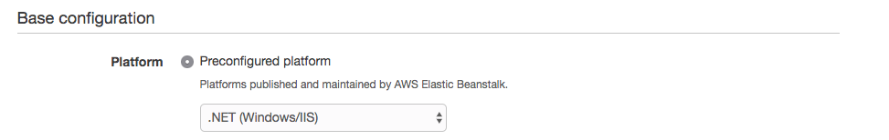
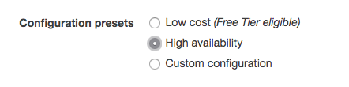
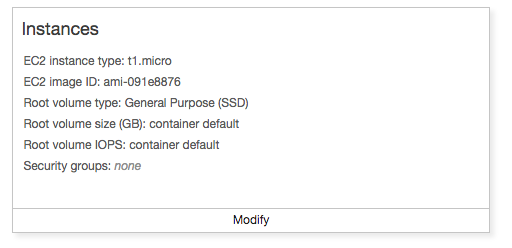
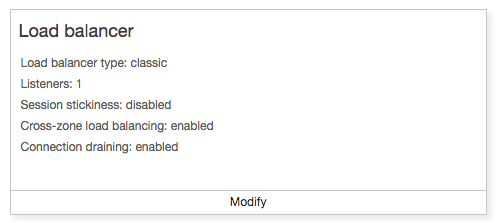
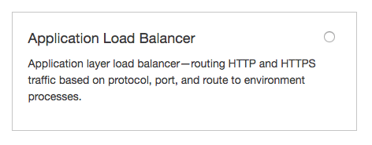
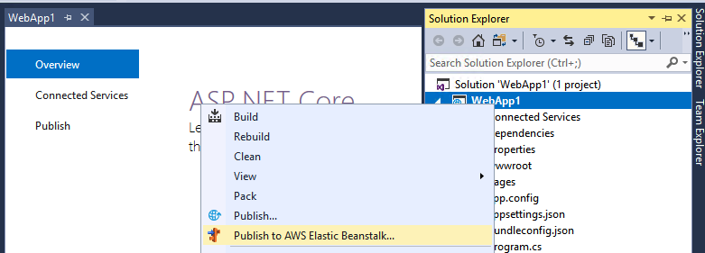
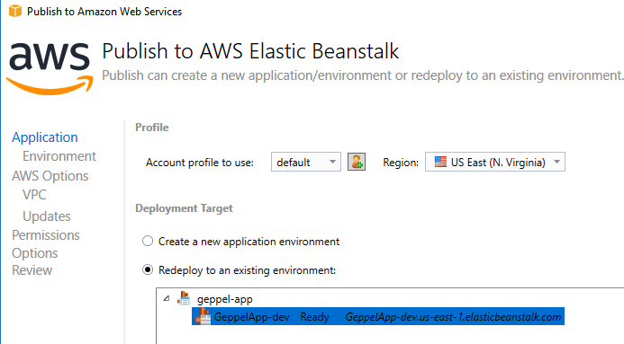
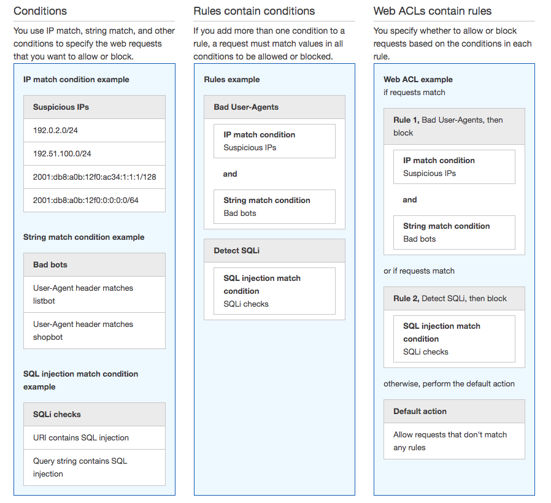

#### Summary

Acme Inc.'s IT department is noticing a lot of malicious looking traffic on a recently released public website. To mitigate this malicious activity they have tasked your team with setting up the AWS WAF in front of the ASP.NET web application to mitigate against a variety of attacks including (but not limited to) SQL injection, geo-based attacks, cross-site scripting. 

#### Suggested Technology

* [WAF](https://docs.aws.amazon.com/waf/latest/developerguide/waf-chapter.html)

* [Elastic Beanstalk](https://aws.amazon.com/documentation/elastic-beanstalk/)

* [Application Load Balancer](https://docs.aws.amazon.com/elasticloadbalancing/latest/application/introduction.html)

**Follow these steps to create the application on your own**

#### Create an ASP.NET Application
   &nbsp; 
   Open Visual Studio and create a new ASP.NET web application, now navigate to the AWS Console and to the Elastic Beanstalk service. Create new Application and then create a new Environment (Web server environment). 
   &nbsp;
   Specify an environment name and chose the .NET platform in the Preconfigured platform dropdown
   &nbsp;
   
   &nbsp;
   Click _Configure more options_ and choose _High  Availability_ under _Configuration Presets_
   &nbsp;
   
   &nbsp;
   &nbsp; Now click _Modify_ under the Instances section and change the EC2 instance type to a t2.large  
   
   
   &nbsp; Now click _Modify_ under the Load Balancer section and change from the _Classic Load Balancer_ to _Application Load  Balancer_ and click Save and then  _Create Environment_. 
   &nbsp;
   
   
   
#### Publish your ASP.NET Application to Elastic Beanstalk

  Now navigate back to Visual Studio and right click on your Web Application and click 'Public to AWS Elastic Beanstalk'

  

  Select your existing environment that you created with the Application Load Balancer (ALB).

  

#### Configure the WAF

**Writing rules for AWS WAF involves the creation of conditions, rules and Web ACLs.**

1) **Conditions** are lists of specific filters (patterns) that are being matched against the HTTP request components processed by AWS WAF. 
&nbsp;
2) **Rules** contain one or more conditions. Each condition attached to a rule is called a predicate. Predicates are evaluated using Boolean logic. 
&nbsp;
3) **Web ACLs** are ordered lists of rules. They are evaluated in order for each HTTP request and the action of the first matching rule is taken by the WAF engine, whether that is to allow, block or count the request. If no rule matches, the default action of the web ACL prevails. 

Multiple web ACLs can reuse the same rules, and multiple rules can reuse the same conditions assuming that is desirable from a change management process point of view for your workloads. This creates effectively a dependency tree between these AWS WAF components.

**Rule Design**

To create a rule, you have to create the relevant match conditions first. This process requires planning for effective rule building. Use the following guiding questions:

1.	What is the intended purpose of the rule?
2.	What HTTP request components apply to the purpose of the rule?
3.	Do you already have conditions targeting those request components that you can reuse? Is that desirable?
4.	How can you define the purpose of the rule in a Boolean logic expression?
5.	What conditions do you need to create to implement the logic?
6.	Are any transformations relevant to my input content type?

For example, we want to build a rule to detect and block SQL Injection in received form input requests. Let’s see how these questions help us plan the implementation of the rule:

**Rule purpose:**
•	Detect SQL Injection in form input HTTP requests, use ‘block’ action in Web ACL

**HTTP request components:**
•	Request Method – form input typically gets submitted using a POST HTTP request method
•	Request Body – form input is typically encoded in the body of the HTTP request 

**Define the purpose of the rule using Boolean logic:**
•	If Request Method = POST and Request Body contains suspected SQL Injection then block

**Conditions to implement:**
•	String Match Condition targeting the request METHOD field, expecting the exact value POST
•	SQL Injection Match Condition targeting the request BODY field

**Relevant transformations:**
•	SQL Injection Match Condition form input is sometimes HTML encoded, so it’s a good idea to apply the HTML_ENTITY_DECODE transformation. Other transformations might also apply, such as URL_DECODE

**Rules to implement:**
•	Rule with 2 predicates matching both the string matching condition and SQL injection condition

#### Configure 

Create a rule for the WAF that blocks traffic based on geo-location and test them agains the .NET Web Application that you deployed to Elastic Beanstalk.

_For a more comprehensive discussion of common vulnerabilities for web applications, as well as how to mitigate them using AWS WAF, and other AWS services, please refer to the Use AWS WAF to Mitigate OWASP’s Top 10 Web Application Vulnerabilities whitepaper: https://d0.awsstatic.com/whitepapers/Security/aws-waf-owasp.pdf_