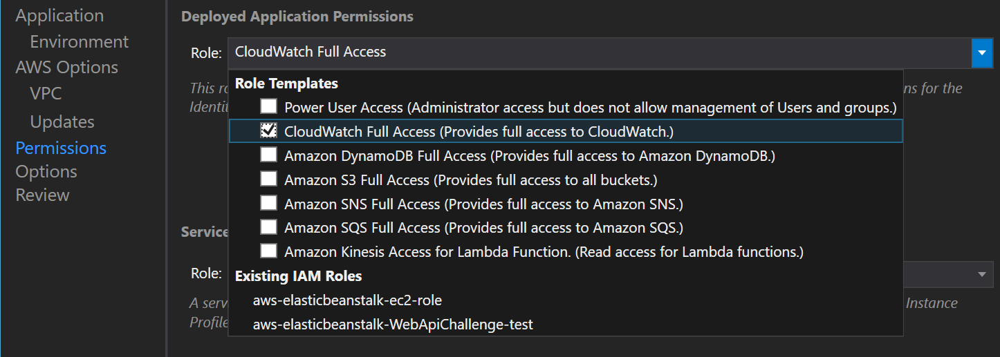

#### Summary:

Your team has recently deployed a .NET Web API that is public facing. After several weeks and increased usage of the API the backend servers have started to buckle under the increased load. After much investigation it appears that a small number of consumers of the API are generating the bulk of the traffic to your API. Instead of scaling your infrastructure to accommodate a small fraction of users you have decided to use the Amazon API Gateway to throttle requests and ensure a consistent experience for all your customers. 

## This challenge uses the following AWS services and tools:

* [EC2 Windows](https://docs.aws.amazon.com/AWSEC2/latest/WindowsGuide/concepts.html)

* [API Gateway ](https://docs.aws.amazon.com/apigateway/latest/developerguide/welcome.html)

* [AWS Toolkit for Visual Studio](https://aws.amazon.com/visualstudio/)

* [AWS Elastic Beanstalk](https://docs.aws.amazon.com/elasticbeanstalk/latest/dg/Welcome.html)

* [Postman](https://www.getpostman.com/apps)

## Challenge Sections:
**1. Create an ASP.NET Web API Project**

**2. Deploy to Amazon EC2 with Elastic Beanstalk**

**3. Test the API with Browser and/or Postman**

**4. Create and Configure API Gateway API**

**5. Confirm Throttling with Load Test Script**

**6. View Application Logs in CloudWatch Logs**

---------------------------
### Create an ASP.NET Web API Project
Follow the steps below to create and customize and ASP.NET Core Web API Project in Visual Studio. AWS fully supports deploying .NET Framework applications on Microsoft Windows with Elastic Beanstalk also, but for this challenge, you'll deploy your project to a Windows EC2 instance. We'll also set up AWS CloudWatch Logs as the default logging target for our application, so we can view the logs in case we need to troubleshoot.

1. In Visual Studio, use File -> New -> Project to open the New Project dialog.
2. Under the _Web_ project node, select the "ASP.NET Core Web Application" template, choose a name for your project, then click the OK button.
3. In the next dialog, select the "API" blueprint, and leave "Enable Docker Support" unchecked, then click the OK button to generate the project.
4. After the project has been generated, install the Nuget package, "**AWS.Logger.AspNetCore**" for the project. See the figure below:

5. Install the Nuget package, "**AWSSDK.Extensions.NETCore.Setup**" for the project.

6. Add the following AWS.Logging configuration node to appsettings.json to configure logging to CloudWatch Logs:

<pre>
 "AWS.Logging": {
    "LogGroup": "HackathonWebApiChallenge",
    "LogLevel": {
      "Default": "Debug",
      "System": "Information",
      "Microsoft": "Information"
    }
  }</pre>

7. Next, configure the Startup class (in Startup.cs) to use the AWS options in the appsettings.json by adding the following code to the ConfigureServices method:
<pre>
services.AddDefaultAWSOptions(Configuration.GetAWSOptions());
</pre>

8. Inject an instance of ILoggerFactory into the Configure method by adding a new argument (after IHostingEnvironment env), "`ILoggerFactory loggerFactory`".

9. Set the AWS logging provider for CloudWatch Logs as the default logger by adding the following code to the Configure method:
<pre>
loggerFactory.AddAWSProvider(Configuration.GetAWSLoggingConfigSection());
</pre>

10. Finally, set up the the ValuesController to log requests to the API methods by adding/updating the following code:
<pre>
`public ValuesController(ILogger<ValuesController> logger)
{
    _logger = logger;   //inject logger
}`</pre>
<pre>
`// GET api/values
[HttpGet]
public IEnumerable<string> Get()
{
    _logger.LogInformation(
        string.Format(
            "ValuesController Get() Request from {0}", 
            Request.HttpContext.Connection.RemoteIpAddress
        )
    );
    return new string[] { "value1", "value2" };
}`</pre>

11. Update the method `Post([FromBody]string value)` to log a message to CloudWatch also, using the same pattern as you did for the Get() method above. Change the message to make it clear in the logs that the Post() method was called.

Ensure your application builds. If you have your AWS credentials configured in the AWS Toolkit for Visual Studio, or else in a local _credentials_ file, you can run the application locally and it will log to CloudWatch Logs. Next, you'll deploy your Web API application to a virtual machine (EC2 instance) running in the AWS cloud.

### Deploy to Amazon EC2 with Elastic Beanstalk
Follow the steps below to deploy the ASP.NET Core Web API application to an Amazon EC2 instance running Windows Server Core.

1. Right-click your project in Solution Explorer, and select "Publish to AWS Elastic Beanstalk" to launch the publishing wizard. See the figure below.
    
    
    
2. Ensure the "Account profile to use" drop-down and "Region" drop-down are set to the profile and region you are using for today's hackathon, and the deployment target is set to, "Create a new application environment".
    
3. On the next step of the wizard, select a name for the application (or leave it set to the default), and then select a name for the environment. The pre-populated list will include environments ending in -dev, -test and -prod (or you can type your own).

4. AWS Elastic Beanstalk application environments are accessible via a public domain name (a subdomain of elasticbeanstalk.com). Choose a subdomain for ACME's Web API application, and check to ensure it's available. See the figure below.
    5. On the next step of the wizard, choose the application stack (called the "container type" in Elastic Beanstalk; it is not a Docker container, however). Choose the lastest version of Windows Server Core running IIS.
6. Choose an instance type, and ensure "single instance environment" is checked. Elastic Beanstalk can also deploy fully load-balanced applications, along with the load-balancer, but for this challenge, you will deploy a single EC2 instance. For this application, the "t2.micro" instance type is sufficient.
    `
7. If you don't already have an EC2 key pair created (in the "Key pair" dropdown), select "\<Create new key pair...\>", and enter a name for the key pair.
    `
    _*Note: The key pair is an cryptographic pair of keys, one public and one private. Windows EC2 Administrator login credentials are encrypted with the public key, which AWS stores, and can only be decrypted with the private key, which you keep. In this case, the AWS Toolkit for Visual Studio will store the private key for you._

8. On the next step of the wizard, you choose the permissions your application will inherit from the EC2 instance it's running on by selecting the IAM Role that the EC2 instance itself will have. In the role dropdown, select check the box next to "CloudWatch Full Access" (under Role Templates) at the top of the drop-down list. This will create a new IAM role that has permissions to write to CloudWatch Logs. See the figure below.

9. The AWS Elastic Beanstalk service itself needs permissions in order to monitor and update your application environment. Select the role, "aws-elasticbeanstalk-service-role" from the Role dropdown under "Service Permissions". 

10. On the next step of the wizard, leave everything set to the defauls, with netcoreapp2.0 showing as the framework version.

22. At the final step of the wizard, review your settings, and then click the "Deploy" button to begin deploying the app. After a few moments, the Elastic Beanstalk evnironment pane should automatically open in Visual Studio. If it doesn't, find your new environment under the AWS Elastic Beanstalk node in the AWS Explorer pane of Visual Studio, and double-click it.

### Test the API with Browser and/or Postman
Once your Elastic Beanstalk environment is deployed and the status shows as "Environment is healthy" on the environment pane, either click the URL shown at the top of the pane to launch a browser, or type in the URL you set earlier ({subdomain}.{region}.elasticbeanstalk.com). Follow the steps below to test out the API with a browser, and then Postman.

1. In your browser, append "/api/values" to the URL to call the default Get() method on the ValuesController. Your browser should display the json for "value1" and "value2" (some browsers may prompt you to download the file first).

2. Next, test the your API with Postman.  Create a simple request in Postman, using the same URL (including /api/values), and test out using GET, POST and PUT requests. For the PUT and POST requests, you will need to add the Content-Type header to your request, with the value set to "application-json" (no quotes). The PUT request requires an id value to be passed in the URL, of the form /api/values/id (where id is an integer).

    _*Note: If you're not familiar with Postman, refer to the [Postman documentation on sending requests](https://www.getpostman.com/docs/v6/postman/sending_api_requests/requests)._

3. Verify that for the GET request, the response includes the same json as when you tested with your browser. The PUT and POST requests won't return any data, but the response HTTP type should be "200 OK".

**Congratulations, the ACME REST API is live!**

### Create and Configure API Gateway API
With the ACME APIs deployed on a t2.micro instance, it's no surprise that the server is easily overwhelmed by heavy traffic. You could set up horizontal scaling to deal with the traffic, or else choose a larger instance type, but ACME has decided to throttle the heaviest users of the API instead. Follow the steps below to configure and deploy an API Gateway API in front of your REST API application.

1. In the AWS Management Console, type "api gateway" into the search box to navigate to the API Gateway console. See the figure below.

2. Create a new API, assigning a meaningful name and description. This API will be regional, rather than edge optimized or private.

When you first create the API, there are no resources (URLs) or methods (GET/POST/PUT/etc) created for it. API Gateway allows you to have different resources (ULRs or paths) and methods assigned to different backend APIs. Since all of the ACME REST APIs are running on one server, however, we'll configure API Gateway to proxy all requests to the same backend, using the [proxy resource and ANY method pattern](https://docs.aws.amazon.com/apigateway/latest/developerguide/api-gateway-set-up-simple-proxy.html#api-gateway-proxy-resource?icmpid=docs_apigateway_console)

3. In the left menu, under the name of the newly-created API, click the "Resources" link to view and create resources for your API.

4. In the center pane, in the Actions dropdown, select "Create resource", and then check the box to configure the new resource as a proxy resource, which will automatically populate the resource name and path (see figure below). Click the create button to create the resource and display the method setup view.

5. In the method setup, choose HTTP Proxy as the integration type, Passthough as the content-handling type, and enter the domain name for the REST API backend, appending "{proxy}" to the end (no quotes) for the endpoint URL. Your URL should look something like http://yourappname-prod.us-west-2.elasticbeanstalk.com/{proxy}. See the figure below. Be sure to include the "http://" part of the URL.

6. After you save your changes, the content pane will show a graphical-like view of the full round-trip path of requests, starting with the client in a box on the left, and the backend resource in a box on the right. In the client box is a "Test" link. Click that link.

7. In the method test view, select "GET" as the method, /api/values as the path, then click the test button. The response body (shown at upper-right of the pane) should show the same json response as we saw in the browser earlier. If you test the POST method, ensure you add "Content-type:application/json" to the headers box (no quotes).

8. Now we'll deploy our API. In the center pane, click the Actions dropdown and select, "Deploy API".

9. In the Deploy API dialog window that appears, select "[New Stage]" in the Deployment stage dropdown, enter "prod" (no quotes) as the stage name, a description for the stage (something like, "ACME API production stage") and a deployment description (something like, "initial deployment"). Then click the deploy button.

    _*Note: The stage editor view will show in the content pane, and the URL to access your API Gateway API will be shown, linked, at the top._

    _**Note: A stage is the actual deployed API endpoint(s) that will be exposed for clients to access._

10. Review the [API Gateway throttling documentation](https://docs.aws.amazon.com/apigateway/latest/developerguide/api-gateway-request-throttling.html?icmpid=docs_apigateway_console) for more information about how throttling works.

11. Change the throttling values to 1 request/second, with a burst rate of 2 requests. This low value will protect the ACME backend server. Save your changes.

12. Copy the Invoke URL, and create a new GET request in Postman for that URL plus "/api/values" (no quotes). Verify that you get back the same json response as earlier. The URL will look something like https://abck123xy.execute-api.us-west-2.amazonaws.com/prod/api/values.

**Congratulations, the API Gateway facace for the ACME REST API is now live!**

### Confirm Throttling with Load Test Script
There are several ways we can confirm that requests are now being throttled. If you're familiar with Postman, you can run multiple iterations using the Collection Runner feature to run multiple iterations with no delay between each request. If you're not familiar with Postman's Collection Runner feature, you can create a simple Powershell script by following the steps below that will demonstrate the throttling feature of the API Gateway API.

1. Copy the below code to a text file, and save it with the extension ".ps1". Make sure you replace {your-api-gateway-invoke-url} with your the actual Invoke URL of your API, so that the URL ends wtih /prod/api/values.
<pre>
Write-Output "Sending GET request to your REST endpoint 10 times"
</pre><pre>
for ($i = 0; $i -lt 10; $i++) {
    Invoke-WebRequest -Uri https://{your-api-gateway-invoke-url}/prod/api/values -Method 'Get'
}
</pre>
2. Open Powershell, and navigate to the folder where you saved the file. Run your Powershell script by typing .\\{file-name}.ps1 where {file-name} is the name you gave the file.

Depending on your network connection, and the speed at which your computer is able to execute the requests, you will see some of the requests succeed with status code 200 and the json payload, while others will fail with the response json, {"message":"Too Many Requests"}.

If you are running the iterations in Postman, you will see that the response HTTP status code is 429 (Too Many Requests).

### View Application Logs in CloudWatch Logs
Finally, view the logs that were generated with the code you added to the ValuesController by following the steps below.

1. In the AWS Management console, navigate to the CloudWatch console.

2. On the CloudWatch console, click Logs in the left-side menu to view the log groups.

3. Find the "HackathonWebApiChallenge" log group. If you have many log groups in your account, you can search for the group by name in the filter box.

4. Click on the HackathonWebApiChallenge log group, and you should see one or more log streams. A log stream represents the sequence of events coming from an application instance or resource that you are monitoring, in this case, the EC2 instance running the Web API application.

5. Click on one of the log streams, and find the log entries written by the ValuesController. 

You should see log entries covering the lifetime of requests to the API, similar to the below. Because the logging in appsettings.json is configured to "information", many events were logged. Look for the messages logged from the code you added, for GET and POST requests.
<pre>
Request starting HTTP/1.1 GET http://webapichallenge-test.us-east-2.elasticbeanstalk.com/api/values
Executing action method WebApiChallenge.Controllers.ValuesController.Get (WebApiChallenge) with arguments ((null)) - ModelState is Valid
ValuesController Get() Request from 52.95.4.22
Executing ObjectResult, writing value Microsoft.AspNetCore.Mvc.ControllerContext
Executed action WebApiChallenge.Controllers.ValuesController.Get (WebApiChallenge)
Request finished in 193.22ms 200 application/json; charset=utf-8
Request starting HTTP/1.1 POST http://webapichallenge-test.us-east-2.elasticbeanstalk.com/api/values
Executing action method WebApiChallenge.Controllers.ValuesController.Post (WebApiChallenge) with arguments () - ModelState is Invalid
ValuesController Post() Request from 52.95.4.22
Executed action WebApiChallenge.Controllers.ValuesController.Post (WebApiChallenge)
Request finished in 47.133ms 200
</pre>

**Congratulations, you have created and deployed an ASP.NET Web API using AWS Elastic Beanstalk, created and configured API Gateway as a proxy in front of your API with throttling, and then confirmed that the throttling is enforced using a PowerShell script! The ACME management team is thrilled!**