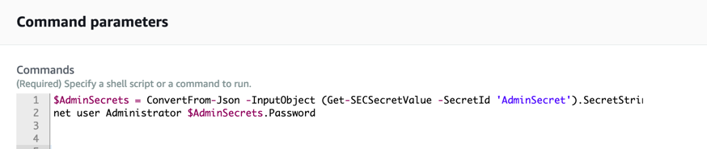
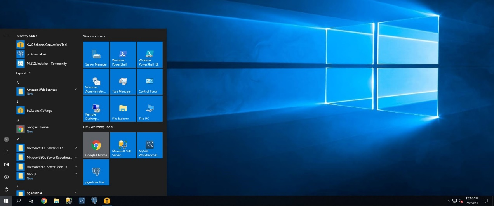
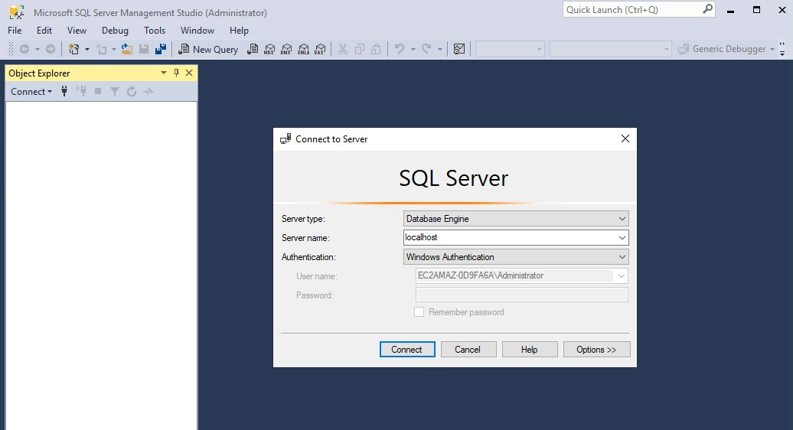
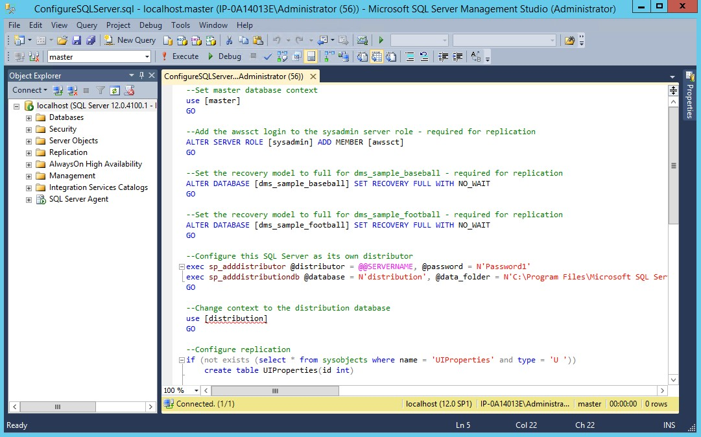
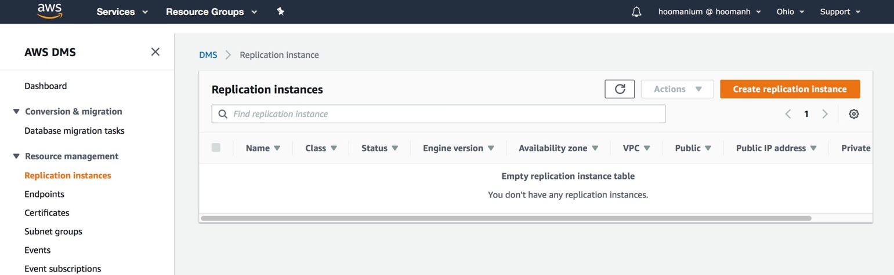
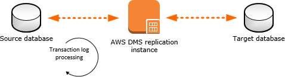
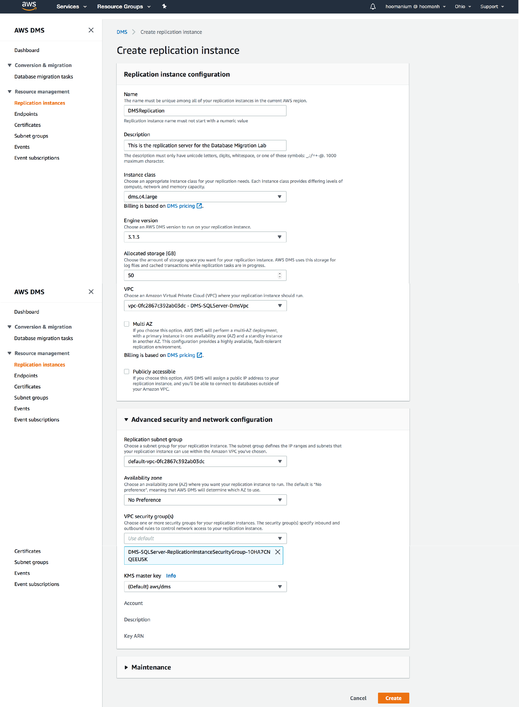
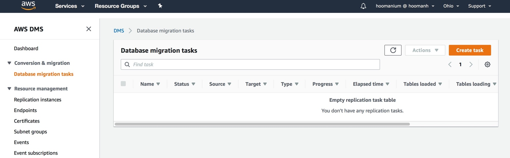
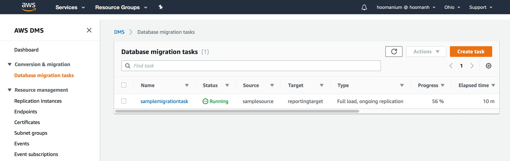

# Re-Platform Lab using AWS Database Migration Service

AWS Database Migration Service (DMS) helps you migrate databases to AWS
easily and securely. The source database remains fully operational during
the migration, minimizing downtime to applications that rely on the
database. AWS DMS can migrate your data to and from most widely used
commercial and open-source databases. The service supports homogenous
migrations such as SQL Server to SQL Server, as well as heterogeneous
migrations between different database platforms, such as SQL Server to
Amazon Aurora MySQL or Oracle to Amazon Aurora PostgreSQL. AWS DMS can also
be used for continuous data replication with high-availability.

This lab demonstrates how you can use AWS Database Migration Service (DMS)
to migrate data from the source Microsoft SQL Server running on an Amazon
EC2 instance to the target SQL Server running on Amazon RDS. Additionally,
you will use AWS DMS to continually replicate database changes from the
source database to the target database.


### Connecting to your Environment

This Lab Environment has been deployed for you, you will need to reset the
password on the instance using the following steps. In this lab you will use the AWS Console and AWS Systems Manager Console. Before we start, let’s first learn a little bit about AWS Systems Manager.

**AWS Systems Manager** - is an AWS service that you can use to view and control
your infrastructure on AWS and On-premise.

Using the Systems Manager console, you can view operational data from multiple
AWS services and automate operational tasks across your AWS resources. Systems
Manager helps you maintain security and compliance by scanning your managed
instances and reporting on (or taking corrective action on) any policy
violations it detects.

**Managed instance** refers to machines managed by AWS Systems Manager whether
on-premises or within AWS. Many customer start out using AWS Systems Manager to
do inventory collection and Patch Management at a low cost.

AWS Systems Manager (SSM) has many [capabilities](https://docs.aws.amazon.com/systems-manager/latest/userguide/features.html) but this lab will focus on one capability:

**Run Command** - remotely and securely manage the configuration of your managed
instances at scale. Use Run Command to perform on-demand changes like updating
applications or running Linux shell scripts and Windows PowerShell commands on a
target set of dozens or hundreds of instances. Run Command uses Command
Documents.

>  Note, in order to use AWS Systems Manager (SSM) you need to have the SSM Agent
installed on the machined you want to manage. You also need to have an IAM Role
attached to the machine to allow the agent to communicate to the AWS Systems
Manager API. In this lab this has been taken care of you, please note the roles
created in the CloudFormation Templates used to build out this lab.

1.  Click on **AWS Systems Manager** under **Management & Governance** to go to
    the Systems Manager Console.


2.  Now click on **Run Command** under Nodes & Instances.

    

3.  Click on the **Run Command** button in the upper right hand corner. 

    

4.  Search for the **AWS-RunPowerShellScript** by clicking the magnifying glass
    and selecting **Document Name Prefix** and then **Equals** and typing in
    **AWS-Run**, this will filter the list of Command Documents. Then select the
    **AWS-RunPowerShellScript** command document.

    

5.  Copy the code from the next code block, and paste it into the command
    parameter box.

```PowerShell
$AdminSecrets = ConvertFrom-Json -InputObject (Get-SECSecretValue -SecretId'AdminSecret').SecretString
net user Administrator $AdminSecrets.Password
```

This command will reset the password for the Administrator user to match the
password stored in AWS Secrets Manager, for more information on AWS Secrets
Manager please visit the [product
page](https://aws.amazon.com/secrets-manager/).



6.  Next, we will manually select our DMSWorkshop instance to run our command
    against. With AWS Systems Manager you can select targets manually as we are
    here, or specify a tag to target many servers.

    

7.  Next, we will choose where we want the logs to be output too. In this case,
    we want to output to CloudWatch Logs. Unselect “Enable writing to an S3
    buck” and select “CloudWatch output.” This will output anything that is
    output to the console. This is a good way to centralize and analyze logs if
    we targeted many managed instances.


8.  Now that we have entered all the needed input, let’s click on the **Run
    Button**. This will execute this command document against our target
    instances, we can monitoring the status after it is executed. Note, use the
    refresh button to update the status.

9.  Once completed we can click on the Instance ID, this will take us to the
    output portion. We can observe the output here or click to CloudWatch Logs
    to observe the logs in CloudWatch Logs once the command has completed
    successfully.

>   **Note** - Here we demonstrated how we can use Run Command to run PowerShell
>   Scripts and commands on an instance and get the output information. AWS
>   Systems Manager is being used by many customers to patch their
>   infrastructure, collect inventory data and have the ability to audit and
>   security operational tasks against their infrastructure for very low cost.

The environment for this lab consists of:

* A Microsoft SQL Server running on an EC2 instance as the source database.
This server is also used run Microsoft SQL Server Management Studio.
* A Microsoft SQL Server instance running on AWS RDS as the target database.

Once you have completed the instructions in the above referenced document,
take special note of the following output values:

* SourceEC2PublicDNS
* SourceEC2PrivateDNS
* TargetSQLSourceEndpoint


## Database Migration Service (DMS)

The following steps provide instructions to migrate existing data from the
source Microsoft SQL Server database running on an EC2 instance to a SQL
Server database running on Amazon RDS. In this exercise you perform the
following tasks:

* Connect the source SQL Server running on an EC2 instance
* Configure the source database for replication
* Configure the target database for migration
* Create an AWS DMS Replication Instance
* Create AWS DMS source and target endpoints
* Create and run your AWS DMS migration task

### Connect to the Source SQL server on EC2

Go to the AWS EC2 located at: <https://amzn.to/2NonMFR> and click on Instances
in the left column.

1.  Select the **WIN306-DMSWorkshop** Instance, and copy its **Public DNS Name**. This is the name we will use to RDP to the Instance. The credentials to login to this instance will be provided to you by the workshop proctor.


2.  Once connected, open **Microsoft SQL Server Management Studio** from the
    **Start Menu**.



3.  Use the following values to connect to your source database.

| **Parameter** | **Value**              |
|---------------|------------------------|
| Server Type   | Database Engine        |
| Server Name   | localhost              |
| Authorization | Windows Authentication |



### Configure the Source SQL Server database for Replication

When migrating your Microsoft SQL Server database using AWS DMS, you can
choose to migrate existing data only, migrate existing data and replicate
ongoing changes, or migrate existing data and use change data capture (CDC)
to replicate ongoing changes.

Migrating only the existing data does not require any configuration on the
source SQL Server database. However, to migrate existing data and replicate
ongoing changes, you need to either enable **MS-REPLICATION**, or
**MS-CDC**.

1.  In this step you are going to execute a .sql script that will configure the
    source database for replication
 * From within **SQL Server Management Studio**, click on **File** menu. Next, select **Open**, and then click on **File**.

2.  Navigate to C:\\Users\\Administrator\\Desktop\\DMS Workshop\\Scripts

3.  Open ConfigSourceSQLServer.sql

4.  **Execute** the script.



>   **Note**: Replication requires a primary key for all tables that are being
>   replicated. If your tables don’t have primary keys defined, consider using
>   CDC instead.*

### Configure Target SQL Server Database

1.  From within **SQL Server Management Studio**, connect to the SQL Server RDS
    instance using the following parameters:

>   **Note**: this step takes place on the SQL Server RDS instance which is
>   different than the previous step.

| **Parameter** | **Value**                         |
|---------------|-----------------------------------|
| Server Type   | Database Engine                   |
| Server Name   | **\< TargetSQLServerEndpoint \>** |
| Authorization | SQL Server Authentication         |
| Login         | awssct                            |
| Password      | Password1                         |

2.  Right Click on the Target Database and select **New Query.**

3.  Run the following script to create a target database **dms_recovery** on RDS
    SQL Server.

```SQL
use master
GO
CREATE DATABASE dms_recovery
GO
```

The target database **(dms_recovery)** has now been created. Please return
to the **AWS Management Console**.



### Create Replication Instance

The following illustration shows a high-level view of the migration process.



An AWS DMS replication instance performs the actual data migration between
source and target. The replication instance also caches the transaction logs
during the migration. The amount of CPU and memory capacity a replication
instance influences the overall time that is required for the migration.

1.  Click on *https://console.aws.amazon.com/dms/* to launch the Database
    Migration Service.

2.  On the left-hand menu click on **Replication Instances**. This will launch
    the Replication instance screen.

3.  Click on the Create replication instance button on the top right side.

4.  Enter the following information for the **Replication Instance**. Then,
    Click on **Create** button.

| **Parameter**                      | **Value**                          |
|------------------------------------|------------------------------------|
| Name                               | DMSReplication                     |
| Description                        | Replication server for the DMS Lab |
| Instance Class                     | dms.c4.2xlarge                     |
| Engine version                     | Leave the default value            |
| Allocated storage (GB)             | 50                                 |
| VPC                                | **\< WIN306-DestVPCStack \>**      |
| Multi-AZ                           | No                                 |
| Publicly accessible                | No                                 |
| Advanced -\> VPC Security Group(s) | default                            |



>   **Note**: Creating replication instance will take several minutes. While
>   waiting for the replication instance to be created, you can specify the
>   source and target database endpoints in the next steps. However, test
>   connectivity only after the replication instance has been created, because
>   the replication instance is used in the connection.*

### Create Source and Target Endpoints

Now that you have a replication instance, you need to create source and
target endpoints for the sample database.

1.  Click on the **Endpoints** link on the left, and then click on **Create
    endpoint** on the top right corner.


2.  Enter the following information to create an endpoint for the source
    **dms_sample** database:

| **Parameter**        | **Value**                                  |
|----------------------|--------------------------------------------|
| Endpoint Type        | Source endpoint                            |
| Endpoint Identifier  | sqlserver-source                           |
| Source Engine        | sqlserver                                  |
| Server Name          | **\< SourceEC2PrivateDns \>**              |
| Port                 | 1433                                       |
| SSL Mode             | none                                       |
| User Name            | awssct                                     |
| Password             | Password1                                  |
| Database Name        | dms_sample                                 |
| VPC                  | **\<VPC ID from Environment Setup Step\>** |
| Replication Instance | DMSReplication                             |

3.  Once the information has been entered, click **Run Test**. When the status
    turns to **successful**, click **Save**.


4.  Create another endpoint for the **Target RDS Database (dms_recovery)** using
    the following values:

| **Parameter**          | **Value**                                    |
|------------------------|----------------------------------------------|
| Endpoint Type          | Target endpoint                              |
| Select RDS DB instance | Check                                        |
| RDS Instance           | **\< Stack Name \>-TargetSQLServer**         |
| Endpoint Identifier    | sqlserver-target                             |
| Source Engine          | sqlserver                                    |
| Server Name            | **\< TargetSqlServerEndpoint \>**            |
| Port                   | 1433                                         |
| SSL Mode               | none                                         |
| User Name              | awssct                                       |
| Password               | Password1                                    |
| Database Name          | dms_recovery                                 |
| VPC                    | **\< VPC ID from Environment Setup Step \>** |
| Replication Instance   | DMSReplication                               |

5.  Once the information has been entered, click **Run Test**. When the status
    turns to **successful**, click **Create endpoint**.


### Create a Database Migration Task

In order to migrate data from source database to target database you need to
create a Transfer Task.

1.  Click on **Database migration tasks** on the left-hand menu, then click on
    the **Create task** button on the top right corner.



2.  Create a data migration task with the following values for migrating the
    **dms_sample** database.

| **Parameter**                       | **Value**                                           |
|-------------------------------------|-----------------------------------------------------|
| Task identifier                     | SampleMigrationTask                                 |
| Replication instance                | DMSReplication                                      |
| Source database endpoint            | sqlserver-source                                    |
| Target database endpoint            | sqlserver-target                                    |
| Migration type                      | Migrate existing data and replicate ongoing changes |
| Start task on create                | Checked                                             |
| CDC stop mode                       | Don’t use custom CDC stop mode                      |
| Target table preparation mode       | Do nothing                                          |
| Stop task after full load completes | Don’t stop                                          |
| Include LOB columns in replication  | Limited LOB mode                                    |
| Max LOB size (KB)                   | 32                                                  |
| Enable validation                   | Unchecked                                           |
| Enable CloudWatch logs              | Checked                                             |

3.  Expand the Table mappings section, and select **Guided UI** for the editing
    mode.

4.  Click on **Add new selection rule** button and enter the following values in
    the form:

| **Parameter** | **Value** |
|---------------|-----------|
| Schema        | dbo       |
| Table name    | %         |
| Action        | Include   |

>   **Note**: If the Create Task screen does not recognize any schemas, make sure to
>   go back to endpoints screen and click on your endpoint. Scroll to the bottom
>   of the page and click on **Refresh Button (⟳)** in the **Schemas** section.

If your schemas still do not show up on the Create Task screen, click on the
Guided tab and manually select **‘**dbo’ schema and all tables.


5.  After entering the values click on **Create task**.

6.  At this point, the task starts running and replicating data from the
    dms_sample database running on EC2 to the Amazon RDS SQL Server instance.



As the rows are being transferred, you can monitor the task progress and view the table statistics to see how many rows have been moved. Click on your task **(samplemigrationtask)** and scroll to the **Table statistics** section. If there is an error, click on **View logs** link for the logs to debug.

>   NOTE: You do not have to wait for all of the data to transfer before moving
>   to the next step.

### Inspect the Content of Target Database

1.  If you already disconnected from the EC2 SQL Server source database server,
    follow steps 1, 2, and 3 to connect (RDP) to your EC2 instance and open
    **Microsoft SQL Server Management Studio**.

2.  Follow the instructions described in step 7 to connect to the **Target RDS
    SQL Server instance**.

3.  Inspect the migrated RDS SQL database **(dms_recovery)** content, and make
    sure the following tables have migrated over. You can do that by opening a
    **New Query** window to execute the following statement. You should see a
    total of 17 tables.
```sql
SELECT *
FROM dms_recovery.INFORMATION_SCHEMA.TABLES; 
GO
```
4.  Next, execute the following query:

```SQL
use dms_recovery
SELECT * FROM dbo.sport_type
```

>   Note that **baseball** and **football** are the only two sports that are
>   currently listed in this table. In the next section you will insert several
>   new records to the source database with information about other sport types.
>   DMS will automatically replicate these new records from the source database
>   to the target database.

### Replicating Changes from Source to the Target

Now you are going to simulate a transaction to the source database by
updating the **sport_type** table. The Database Migration Service will
automatically detect and replicate these changes to the target database.

1.  Use **Microsoft SQL Server Management Studio** to connect to the **Source
    SQL Server** on the EC2 instance (described in steps 1, and 2).

2.  Open a **New Query** window and **execute** the following statement to
    insert 5 new sports into the **sport_type** table:

```SQL
use dms_sample
BULK INSERT dbo.sport_type
FROM 'C:\Users\Administrator\Desktop\DMS Workshop\Scripts\sports.csv' WITH
(
    FIRSTROW = 2, 
    FIELDTERMINATOR = ',', 
    ROWTERMINATOR = '\n', 
    TABLOCK
);
```
3.  This time use **Microsoft SQL Server Management Studio** to connect to the
    **Target SQL Server** running on an Amazon RDS instance. (Described in step
    7)

4.  Open a **New Query** window and execute the following statement:

```SQL
use dms_recovery
SELECT * FROM dbo.sport_type
```


Notice the new records for: basketball, cricket, hokey, soccer, volleyball
that you added to the **sports_type** table in the source database have been
replicated to your **dms_recovery** database. You can further investigate
the number of inserts, deletes, updates, and DDLs by viewing the **Table
statistics** of your **Database migration tasks** in AWS console.

The AWS DMS task keeps the target SQL Server database up to date with source
database changes. AWS DMS keeps all the tables in the task up to date until
it's time to implement the application migration. The latency is close to
zero when the target has caught up to the source.

## Summary

This lab demonstrated how easy it is to migrate the data from a Microsoft
SQL Server running to an Amazon RDS SQL Server using the AWS Database
Migration Service (DMS). Similarly, you observed how DMS automatically
replicates new transactions on the source to target database.

You can follow the same steps to migrate Oracle, MySQL, and PostgreSQL
workloads to Amazon RDS.
